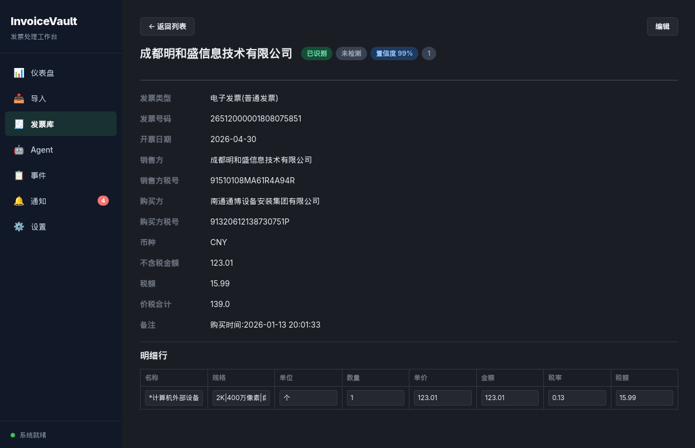

# InvoiceVault

<p align="center">
  
</p>

InvoiceVault 是一个本地优先的跨平台桌面端发票处理 Agent。目标是把 PDF/图片发票导入本地归档，通过 OpenAI-compatible 多模态模型识别成结构化数据，并为后续去重、检索、统计、导出和 Agent 对话打基础。

## 当前状态

已实现：

- Tauri 2 + React + TypeScript 桌面应用骨架。
- Rust 后端模块化结构（含导入、识别、去重、导出、Agent、事件通知和向量能力）。
- SQLite 数据库和内置迁移（当前版本 9）。
- 应用数据目录、RAW 归档目录、缩略图目录初始化。
- PDF/PNG/JPG/JPEG 手动导入、文件选择、拖拽导入和路径导入。
- RAW 文件按 `raw/YYYY/MM/文件名` 保留原始格式归档。
- 数据库记录原始文件名、当前归档文件名和存储路径。
- MD5/SHA256 文件级去重。
- OpenAI-compatible LLM Provider 连接测试。
- 图片发票多模态识别调用链路。
- PDF 发票按页渲染和逐页多模态识别调用链路。
- LLM 输入图片标准化和预览缩略图生成。
- 发票识别 JSON 校验和结构化入库。
- 侧边栏导航：仪表盘、导入、发票库、Agent、事件、通知、设置。
- 发票列表分页、筛选（关键词/日期/金额/状态）和排序。
- 发票详情页（完整字段、明细行、缩略图预览、自定义 Badge 标签）。
- 发票字段和明细行编辑，字段级校验。
- 字段级重复检测（发票代码+号码完全匹配、多字段相似度打分）。
- 重复候选管理（确认/忽略）。
- CSV 和 Excel 导出。
- 目录监听和自动导入（配置监听目录后，文件变化时自动导入，支持防抖和扩展名过滤）。
- Dashboard 统计面板（发票总数/金额汇总/月度趋势/类型分布/状态分布/供应商排名图表）。
- ChromaDB 向量索引 + 语义搜索 + 语义去重（可配置 ChromaDB sidecar 和 embedding provider）。
- Agent 聊天窗口基础闭环：会话管理、工具调用、查询、详情、统计、CSV/Excel 导出、字段更新确认和审计日志。
- 事件和通知中心，支持导入、识别、导出、配置变更等操作记录。
- 设置页支持 LLM、Embedding、ChromaDB、识别并发、监听目录、依赖检查、日志导出、存储清理和自定义 Badge 配置。
- Linux/KDE 托盘集成：启动时显示托盘，关闭窗口隐藏到托盘，托盘菜单支持“工作台”、版本信息和退出。

尚未完成：

- 批量 PDF/图片按模板导出。
- Agent 流式输出、任务取消和更丰富的工具集。
- 编辑历史完整 UI、数据库/RAW 加密和跨平台安装包验收。

详细需求和计划见：

- [docs/PRD.md](docs/PRD.md)
- [docs/PLAN.md](docs/PLAN.md)
- [TODO.md](TODO.md)

## 技术栈

- 桌面端：Tauri 2
- 后端：Rust
- 前端：React + TypeScript + Vite
- 数据库：SQLite
- LLM：OpenAI-compatible Chat Completions，当前图片识别使用 `image_url` data URL 输入

## 开发环境

需要本机安装：

- Node.js
- npm
- Rust toolchain
- Tauri 2 所需系统依赖
- PDF 识别需要 Poppler `pdftoppm`
- 图片标准化和缩略图需要 ImageMagick `magick`

安装前端依赖：

```bash
npm install
```

运行开发版：

```bash
npm run tauri dev
```

前端构建：

```bash
npm run build
```

后端测试：

```bash
cd src-tauri
cargo test
```

后端检查：

```bash
cd src-tauri
cargo check
```

## 使用方式

1. 启动应用。
2. 在导入队列中选择或拖入 PDF/PNG/JPG/JPEG 文件。
3. 在设置页填写 LLM Provider 的 Base URL、Model 和 API Key。
4. 点击“测试连接”确认配置可用。
5. 对已导入的图片或 PDF 文件点击“识别”。
6. 识别成功后，结构化发票会出现在发票库列表。
7. 在发票详情页修正字段、维护明细行、处理重复候选或选择自定义 Badge。
8. 在 Agent 页面通过自然语言查询、统计或导出发票。

当前图片识别支持：

- `image/png`
- `image/jpeg`

PDF 文件会先通过 `pdftoppm` 渲染为 JPEG 页面缓存，再逐页调用多模态识别。当前要求 `pdftoppm` 在 PATH 中可用。

所有图片和 PDF 页面在发送给 LLM 前会通过 `magick` 生成标准化 JPEG，同时生成预览缩略图。RAW 归档文件不会被修改。

## 数据存储

应用数据保存在系统分配的应用数据目录中。后端启动时会创建：

- `invoicevault.sqlite3`：SQLite 数据库。
- `raw/`：原始 PDF/图片归档目录。
- `thumbnails/`：标准化识别图、PDF 页面缓存和预览缩略图目录。
- `logs/`：应用运行日志。
- `llm_config.json`、`embedding_config.json`、`recognition_config.json`、`badge_config.json`：本机应用配置文件。

RAW 文件归档策略：

```text
raw/YYYY/MM/current_name.ext
```

同名文件进入同一月份目录时，会自动追加 `-1`、`-2` 等后缀避免覆盖。数据库中同时保存：

- `original_name`：导入时原始文件名。
- `current_name`：归档后的当前文件名。
- `storage_path`：归档后的实际路径。
- `sha256` 和 `md5`：用于文件级去重。

## LLM 说明

当前 LLM 配置保存在本机应用数据目录，不会写入仓库。不要把 API Key 提交到代码或文档。

图片识别接口使用 OpenAI-compatible `/chat/completions`：

```text
POST {base_url}/chat/completions
```

模型需要支持多模态图片输入，并能返回 JSON。后端会从模型响应中提取 JSON 对象，校验后写入 SQLite。

Agent 对话同样使用 OpenAI-compatible `/chat/completions`，并通过受控工具执行查询、统计、导出和字段更新。导出和更新等写操作会经过 UI 确认。

## 测试

常用验证命令：

```bash
npm run build
cd src-tauri
cargo fmt --check
cargo test
cd ..
npm run tauri build -- --no-bundle
```

真实 LLM 连接测试默认忽略，需要本机环境变量：

```bash
cd src-tauri
RECEIPTIER_LLM_BASE_URL=... RECEIPTIER_LLM_MODEL=... RECEIPTIER_LLM_API_KEY=... \
  cargo test live_llm_connection_from_env -- --ignored
```



## 文档

- [docs/PRD.md](docs/PRD.md)：产品需求、功能范围、非功能需求和数据模型。
- [docs/PLAN.md](docs/PLAN.md)：开发里程碑、模块拆分、测试计划和风险。
- [docs/DEVELOPMENT.md](docs/DEVELOPMENT.md)：当前开发状态和常用命令。
- [TODO.md](TODO.md)：实现目标清单。
