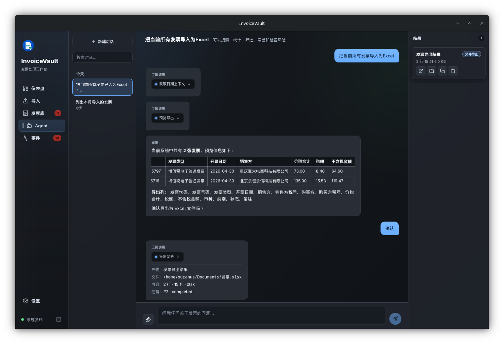
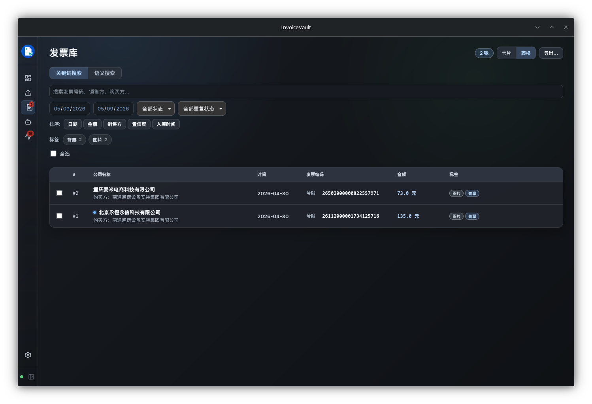

# InvoiceVault

<p align="center">
  
</p>

InvoiceVault 是一个本地优先的跨平台桌面端发票处理 Agent。把 PDF/图片发票导入本地归档，通过多模态 AI 模型识别为结构化数据，支持去重、语义检索、统计分析、批量导出和自然语言对话。

## 功能

- **智能识别**：PDF / PNG / JPG 发票自动识别为结构化数据（发票号、金额、买卖方、明细行等）。
- **去重检测**：字段级精确匹配 + 语义相似度双重去重。
- **语义搜索**：基于向量索引的自然语言发票检索。
- **Agent 对话**：用自然语言查询、统计、导出发票。
- **目录监听**：配置监听目录，文件变化时自动导入。
- **统计仪表盘**：月度趋势、类型分布、供应商排名等可视化。
- **CSV / Excel 导出**：灵活列配置，支持批量导出。

## 技术栈

| 层级 | 技术 |
|---|---|
| 桌面框架 | Tauri 2 |
| 后端 | Rust |
| 前端 | React + TypeScript + Vite |
| 数据库 | SQLite |
| AI | OpenAI-compatible 多模态 Chat Completions / Embeddings |
| 向量库 | ChromaDB |

## 快速开始

**环境依赖**：Node.js、npm、Rust toolchain、[Tauri 2 系统依赖](https://v2.tauri.app/start/prerequisites/)。

PDF 识别额外需要 Poppler `pdftoppm`，图片标准化需要 ImageMagick `magick`。

```bash
# 安装依赖
npm install

# 启动开发版
npm run tauri dev

# 构建前端
npm run build

# 后端测试
cd src-tauri && cargo test
```

启动后在设置页配置 LLM Provider（Base URL、Model、API Key），即可开始导入和识别发票。

## 文档

- [产品需求 (PRD)](docs/PRD.md)
- [开发计划](docs/PLAN.md)
- [开发说明](docs/DEVELOPMENT.md)
- [Agent 工作流](docs/AGENT_WORKFLOW.md)
- [TODO](TODO.md)

## 截图





