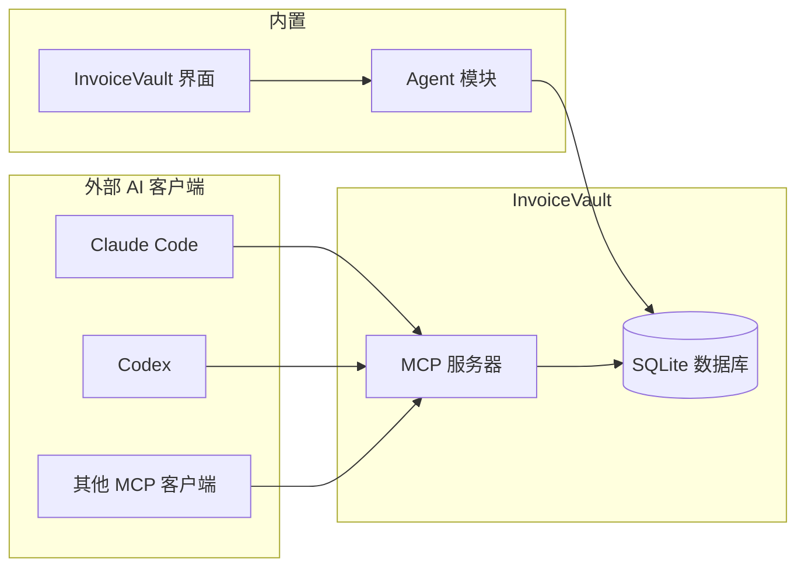
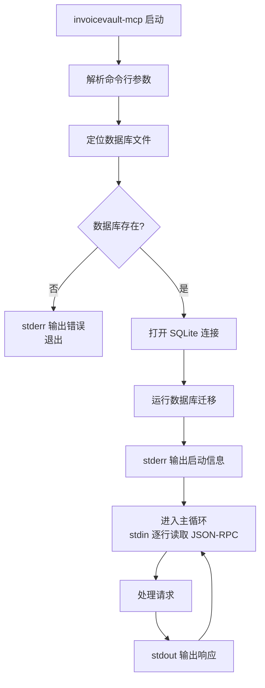

# MCP 服务器

## 什么是 MCP

**MCP（Model Context Protocol）** 是一个开放协议，让 AI 助手能够通过标准化接口访问外部工具和数据源。InvoiceVault 实现了 MCP 服务器，允许 Claude Code、Codex 等外部 AI 客户端直接操作发票数据。

### 为什么需要 MCP

Agent 模块是 InvoiceVault 内置的 AI 助手，只能在应用内部使用。而 MCP 服务器让**外部 AI 工具**也能访问发票数据：



## 协议详情

### JSON-RPC 2.0 over stdio

MCP 服务器使用 **JSON-RPC 2.0** 协议通过 **stdio（标准输入/输出）** 与客户端通信：

- 客户端通过 **stdin** 发送请求（每行一个 JSON 对象）
- 服务器通过 **stdout** 返回响应（每行一个 JSON 对象）
- 服务器通过 **stderr** 输出日志

### 协议版本

InvoiceVault MCP 服务器声明支持的协议版本为 **`2025-03-26`**。

### 支持的方法

| 方法 | 说明 |
|------|------|
| `initialize` | 初始化握手，返回服务器信息和能力声明 |
| `tools/list` | 列出所有可用工具及其参数定义 |
| `tools/call` | 调用指定工具 |
| `notifications/*` | 通知消息（无需响应） |

### 握手流程

```mermaid
sequenceDiagram
    participant Client as MCP 客户端
    participant Server as InvoiceVault MCP

    Client->>Server: {"method": "initialize", "params": {...}}
    Server->>Client: {
      "protocolVersion": "2025-03-26",
      "capabilities": {"tools": {}},
      "serverInfo": {
        "name": "invoicevault",
        "version": "0.5.0"
      }
    }

    Client->>Server: {"method": "tools/list"}
    Server->>Client: {"tools": [...]}

    Client->>Server: {
      "method": "tools/call",
      "params": {
        "name": "search_invoices",
        "arguments": {"date_from": "2026-05-01"}
      }
    }
    Server->>Client: {
      "content": [{"type": "text", "text": "..."}],
      "isError": false
    }
```

## 暴露的工具

MCP 服务器暴露 **21 个工具**。与内置 Agent 的 25 个工具相比，MCP 服务器不包含 `ask_user`、`inspect_spreadsheet`、`list_message_attachments`、`validate_xlsx` 等需要 UI 交互的工具，并且部分工具的参数有所不同（如导出工具需要显式指定 `output_path`）。

### 工具列表

| 工具 | 类型 | 说明 |
|------|------|------|
| `search_invoices` | 只读 | 搜索发票，支持多种筛选条件 |
| `get_invoice_detail` | 只读 | 获取单张发票完整详情 |
| `get_dashboard_stats` | 只读 | 获取仪表盘统计数据 |
| `get_current_date_context` | 只读 | 获取当前日期上下文 |
| `get_invoice_field_catalog` | 只读 | 获取发票字段字典 |
| `export_invoices` | 写入 | 导出发票为 CSV/Excel（需指定 `output_path`） |
| `create_export_preview` | 只读 | 预览导出结果 |
| `update_invoice` | 写入 | 更新发票字段 |
| `merge_invoices` | 写入 | 合并多张发票 |
| `export_pdf_report` | 写入 | 导出 PDF 报表 |
| `get_badge_config` | 只读 | 获取标签配置 |
| `set_badge_config` | 写入 | 设置标签配置 |
| `set_invoice_badge` | 写入 | 设置发票标签 |
| `get_price_config` | 只读 | 获取价格配置 |
| `set_price_config` | 写入 | 修改价格配置 |
| `get_theme` | 只读 | 获取主题设置 |
| `set_theme` | 写入 | 切换主题 |
| `export_logs` | 写入 | 导出日志 |
| `export_backup` | 写入 | 导出备份 |
| `cleanup_storage` | 写入 | 清理存储 |
| `get_app_info` | 只读 | 获取系统信息 |

### 与内置 Agent 的区别

| 特性 | 内置 Agent | MCP 服务器 |
|------|-----------|-----------|
| 工具数量 | 25 | 21 |
| 确认机制 | 有（暂停等待用户） | 无（直接执行） |
| 审计日志 | 有 | 无 |
| 文件附件 | 支持 | 不支持 |
| 流式传输 | 支持 SSE | 不支持 |
| `ask_user` | 支持 | 不支持 |
| `inspect_spreadsheet` | 支持 | 不支持 |
| `validate_xlsx` | 支持 | 不支持 |
| `list_message_attachments` | 支持 | 不支持 |
| `generate_template_plan` | 支持 | 不支持 |
| `export_invoices_with_template` | 支持 | 不支持 |
| 导出路径 | 系统文件选择器 | 显式 `output_path` 参数 |

## 独立二进制文件

MCP 服务器编译为独立的二进制文件 `invoicevault-mcp`，不依赖 Tauri 框架，可以直接在命令行运行。

### 启动方式

```bash
# 使用默认数据目录
invoicevault-mcp

# 指定数据库路径
invoicevault-mcp --db /path/to/invoicevault.sqlite3

# 指定应用数据目录
invoicevault-mcp --app-data /path/to/data/dir

# 同时指定
invoicevault-mcp --db /path/to/db.sqlite3 --app-data /path/to/data
```

### 命令行参数

| 参数 | 说明 | 默认值 |
|------|------|--------|
| `--db <path>` | SQLite 数据库路径 | `{app_data}/invoicevault.sqlite3` |
| `--app-data <path>` | 应用数据目录 | `~/.local/share/com.invoicevault.desktop/` |
| `-h, --help` | 显示帮助信息 | - |

### 默认数据目录

不同操作系统的默认数据目录：

| 操作系统 | 路径 |
|----------|------|
| Linux | `~/.local/share/com.invoicevault.desktop/` |
| macOS | `~/Library/Application Support/com.invoicevault.desktop/` |
| Windows | `C:\Users\{user}\AppData\Roaming\com.invoicevault.desktop\` |

## 与 Claude Code 集成

### 配置方法

在 Claude Code 的 MCP 配置文件中添加 InvoiceVault 服务器：

```json
{
  "mcpServers": {
    "invoicevault": {
      "command": "invoicevault-mcp",
      "args": ["--db", "/path/to/invoicevault.sqlite3"]
    }
  }
}
```

### 使用示例

配置完成后，可以在 Claude Code 中直接使用自然语言操作发票：

- "帮我查一下上个月的所有发票"
- "把 2026 年的增值税发票导出到桌面"
- "发票 #42 的销售方名称有误，帮我改成正确的"

Claude Code 会自动调用 MCP 服务器提供的工具来完成这些任务。

### 快速测试

可以直接通过命令行测试 MCP 服务器：

```bash
echo '{"jsonrpc":"2.0","method":"initialize","id":1}' | invoicevault-mcp
```

## 实现细节

### 请求解析

服务器从 stdin 逐行读取 JSON，解析为 `JsonRpcRequest`：

```rust
struct JsonRpcRequest {
    id: Option<Value>,      // 请求 ID（通知消息无 ID）
    method: String,         // 方法名
    params: Option<Value>,  // 参数
}
```

### 错误处理

| 错误码 | 说明 |
|--------|------|
| `-32700` | JSON 解析错误 |
| `-32601` | 方法不存在 |

工具执行错误不会返回 JSON-RPC 错误，而是通过 `McpToolResult.is_error = true` 返回，保持协议兼容性。

### 数据库访问

MCP 服务器使用 `rusqlite` 直接连接 SQLite 数据库。写入操作（如 `update_invoice`）会打开一个独立的写连接，避免与只读连接冲突。

### 启动流程


