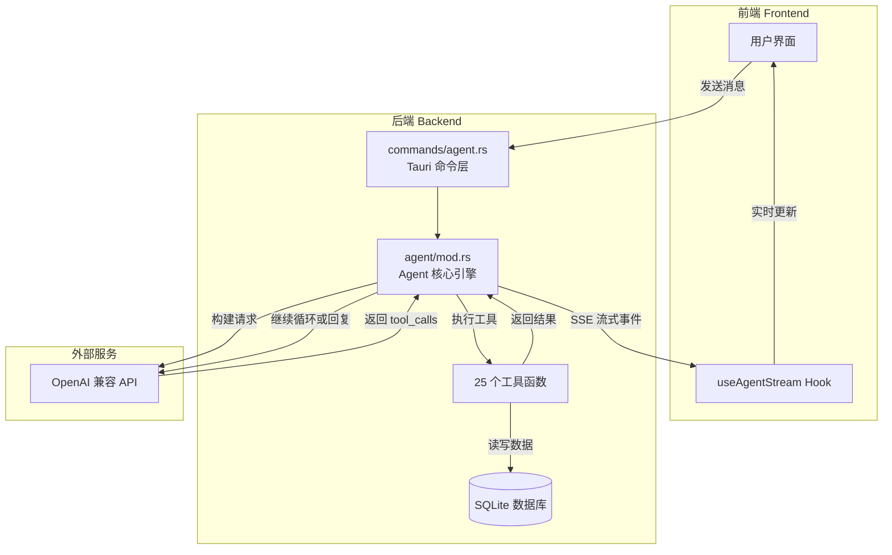
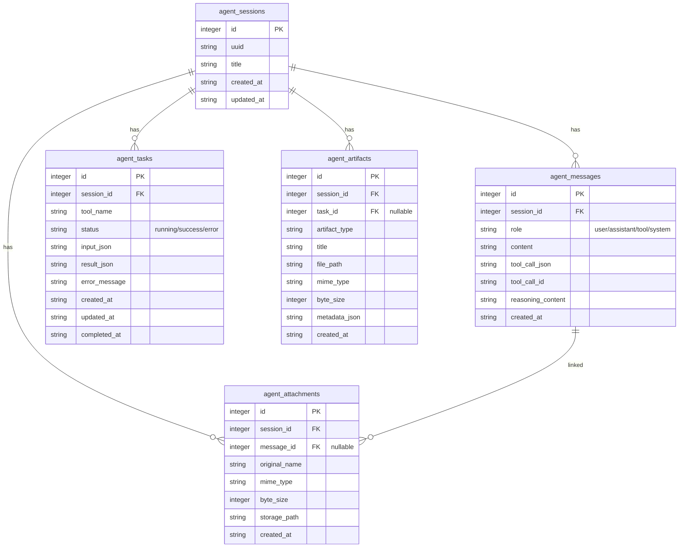

# Agent 模块概览

## 什么是 Agent 模块

InvoiceVault 的 Agent 模块是一个**内置的 AI 助手系统**，让用户可以通过自然语言对话来管理发票。用户不需要记住复杂的菜单操作或筛选条件，只需用日常语言告诉 Agent 想做什么，Agent 就会自动调用合适的工具完成任务。

例如：
- "帮我查一下上个月的所有增值税发票"
- "把今年的发票导出成 Excel"
- "把发票号 12345678 的类别改成办公用品"

## 核心工作原理

Agent 的核心是一个**多轮对话 + 工具调用**循环。它的工作流程可以用一句话概括：

> 用户发消息 → LLM 思考 → 调用工具获取数据 → 将结果反馈给 LLM → LLM 继续思考或回复用户

这个循环最多执行 20 轮（`AGENT_MAX_ITERATIONS = 20`），防止无限循环。

## 架构总览

## 关键概念

### 会话 (Session)

一个 Agent 会话就是一次完整的对话。用户可以创建多个会话，每个会话独立保存聊天历史。会话首次创建时标题默认为"新对话"，发送第一条消息后会自动截取前 30 个字符作为标题。

### 消息 (Message)

每条消息都有一个角色：
- **`system`**：系统提示词，定义 Agent 的行为规则
- **`user`**：用户发送的消息
- **`assistant`**：LLM 的回复（可能包含文字和工具调用请求）
- **`tool`**：工具执行后的返回结果

### 工具 (Tool)

Agent 可以调用的"能力"。每个工具都有名称、描述和参数定义。Agent 拥有 25 个工具，覆盖发票查询、导出、标签管理、系统配置等功能。工具分为两类：
- **只读工具**：不会修改数据（如搜索发票、获取统计）
- **写入工具**：会修改数据（如更新发票、导出文件），需要用户确认

### 任务 (Task)

每次工具执行会创建一条任务记录，记录工具名称、输入参数、执行状态和结果。任务状态包括 `running`、`success`、`error`。

### 产物 (Artifact)

Agent 执行过程中生成的文件（如导出的 Excel、PDF 报表），会作为产物记录保存，方便用户后续查看和下载。

## 数据模型

Agent 模块使用 SQLite 数据库存储所有数据，涉及以下核心表：

### AgentSession

会话表，存储对话的基本信息。

| 字段 | 类型 | 说明 |
|------|------|------|
| `id` | INTEGER | 自增主键 |
| `uuid` | TEXT | UUID 标识符 |
| `title` | TEXT | 会话标题，默认"新对话" |
| `created_at` | TEXT | 创建时间 |
| `updated_at` | TEXT | 最后更新时间 |

### AgentMessageRow

消息表，存储对话中的每一条消息。

| 字段 | 类型 | 说明 |
|------|------|------|
| `id` | INTEGER | 自增主键 |
| `session_id` | INTEGER | 所属会话 ID |
| `role` | TEXT | 消息角色：`user`/`assistant`/`tool`/`system` |
| `content` | TEXT | 消息文本内容 |
| `tool_call_json` | TEXT | 工具调用请求的 JSON（仅 assistant 消息） |
| `tool_call_id` | TEXT | 工具调用 ID（仅 tool 消息） |
| `reasoning_content` | TEXT | LLM 推理过程（思考链） |
| `created_at` | TEXT | 创建时间 |

### AgentAttachment

附件表，存储用户上传的文件（如 Excel 模板）。

| 字段 | 类型 | 说明 |
|------|------|------|
| `id` | INTEGER | 自增主键 |
| `session_id` | INTEGER | 所属会话 ID |
| `message_id` | INTEGER | 关联的消息 ID（可为空） |
| `original_name` | TEXT | 原始文件名 |
| `mime_type` | TEXT | MIME 类型 |
| `byte_size` | INTEGER | 文件大小（字节） |
| `storage_path` | TEXT | 存储路径 |
| `created_at` | TEXT | 创建时间 |

### AgentTask

任务表，记录每次工具执行的详情。

| 字段 | 类型 | 说明 |
|------|------|------|
| `id` | INTEGER | 自增主键 |
| `session_id` | INTEGER | 所属会话 ID |
| `tool_name` | TEXT | 工具名称 |
| `status` | TEXT | 状态：`running`/`success`/`error` |
| `input_json` | TEXT | 输入参数 JSON |
| `result_json` | TEXT | 返回结果 JSON |
| `error_message` | TEXT | 错误信息 |
| `created_at` | TEXT | 创建时间 |
| `updated_at` | TEXT | 更新时间 |
| `completed_at` | TEXT | 完成时间 |

### AgentArtifact

产物表，记录 Agent 生成的文件。

| 字段 | 类型 | 说明 |
|------|------|------|
| `id` | INTEGER | 自增主键 |
| `session_id` | INTEGER | 所属会话 ID |
| `task_id` | INTEGER | 关联的任务 ID（可为空） |
| `artifact_type` | TEXT | 产物类型 |
| `title` | TEXT | 产物标题 |
| `file_path` | TEXT | 文件路径 |
| `mime_type` | TEXT | MIME 类型 |
| `byte_size` | INTEGER | 文件大小 |
| `metadata_json` | TEXT | 元数据 JSON |
| `created_at` | TEXT | 创建时间 |

## 审计日志

除了上述数据表，Agent 模块还会向 `audit_logs` 表写入审计记录，追踪所有工具执行操作：

| 字段 | 类型 | 说明 |
|------|------|------|
| `actor` | TEXT | 操作者（固定为 `"agent"`） |
| `action` | TEXT | 操作名称（如 `"tool:export_invoices"`） |
| `target_type` | TEXT | 目标类型（如 `"invoice"`） |
| `target_id` | INTEGER | 目标 ID |
| `payload_json` | TEXT | 操作详情 JSON |

## 源码结构

Agent 模块的核心代码分布在以下文件中：

| 文件 | 职责 |
|------|------|
| `src-tauri/src/agent/mod.rs` | Agent 核心引擎：工具定义、数据类型、数据库操作、LLM 对话循环、流式处理 |
| `src-tauri/src/commands/agent.rs` | Tauri 命令层：将 Agent 功能暴露给前端 |
| `src-tauri/src/llm/mod.rs` | LLM 客户端：HTTP 请求、审计记录、标题生成 |
| `src-tauri/src/app_core/constants.rs` | 常量定义：超时时间、迭代上限、历史条数等 |

## 系统提示词

Agent 使用一段固定的系统提示词来约束 LLM 的行为。关键规则包括：

1. **尽量自主完成**，减少不必要的用户交互
2. **使用中文回答**，简洁清晰
3. **如实汇报**工具返回的数据，不虚构编造
4. **涉及金额保留两位小数**
5. **Excel 导出后必须调用 `validate_xlsx` 验证**
6. 超出工具能力范围时，如实说明并给出建议
