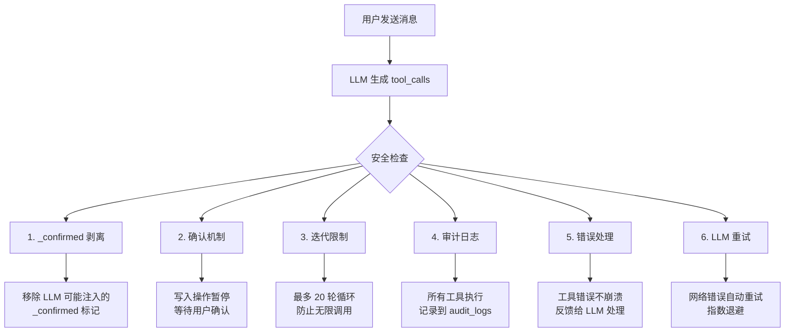
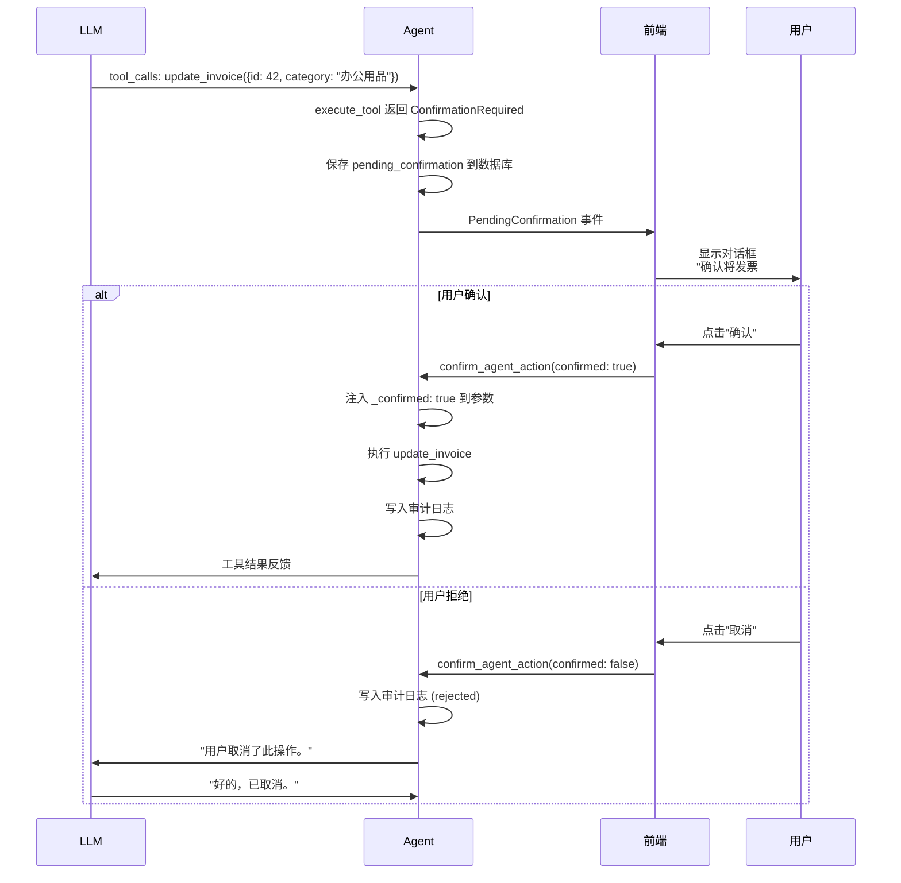
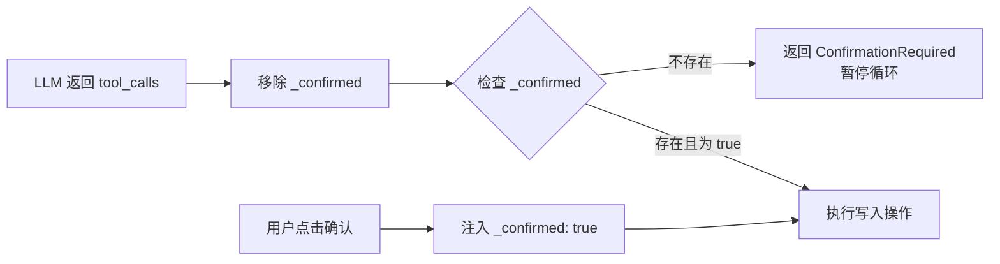
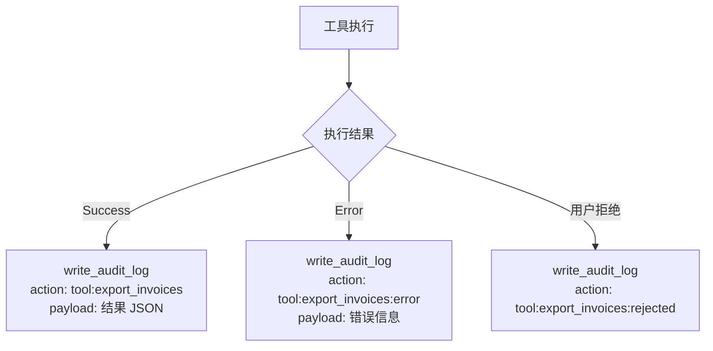
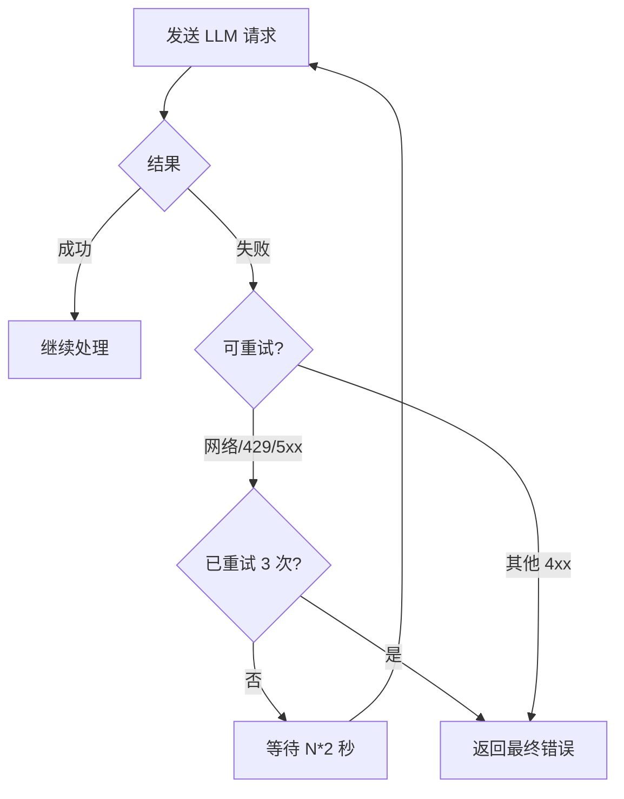
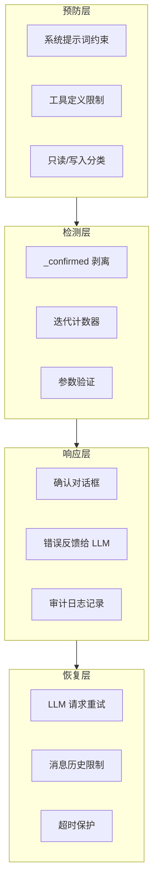

# 安全机制

## 概述

Agent 能够直接操作用户的发票数据和文件系统，因此必须有多层安全防护。InvoiceVault 的 Agent 采用**纵深防御**策略，在多个层面防止误操作和恶意行为。

## 安全检查总览



## 1. 确认机制 (Confirmation-Required)

### 原理

所有写入操作（更新发票、导出文件、修改配置等）都不会直接执行，而是返回 `ConfirmationRequired` 状态，暂停 Agent 循环，等待用户明确确认。

### 哪些操作需要确认

| 类别 | 需要确认的工具 |
|------|---------------|
| 发票操作 | `update_invoice`, `merge_invoices` |
| 导出 | `export_invoices`, `export_invoices_with_template`, `export_pdf_report` |
| 标签管理 | `set_badge_config`, `set_invoice_badge` |
| 配置 | `set_price_config` |
| 系统 | `export_logs`, `export_backup`, `cleanup_storage` |

### 确认流程



## 2. _confirmed 标记剥离

### 攻击场景

LLM 可能在 `tool_calls` 的 `arguments` 中自行注入 `"_confirmed": true`，试图绕过确认对话框直接执行写入操作。

### 防护措施

在执行任何工具调用之前，Agent 会**强制移除**参数中的 `_confirmed` 字段：

```rust
// 在 run_agent_loop_from_inner 中
let mut args: serde_json::Value = serde_json::from_str(&tc.function.arguments)?;
// Strip _confirmed so the LLM cannot bypass confirmation dialogs
if let Some(obj) = args.as_object_mut() {
    obj.remove("_confirmed");
}
```

只有通过正常的确认流程（用户点击确认按钮），`_confirmed` 才会被注入到参数中：

```rust
// 在 continue_agent_turn 中（用户确认后）
let mut final_args = merge_json(args, serde_json::json!({"_confirmed": true}));
```

这样就形成了一个**单向阀门**：
- LLM 无法自行添加 `_confirmed`
- 只有用户的确认操作才能注入 `_confirmed`
- 工具执行函数检查 `_confirmed` 标记来决定是否执行



## 3. 审计日志 (Audit Logging)

### 原理

每一次工具执行都会向 `audit_logs` 表写入审计记录，包括操作者、操作名称、目标和执行结果。这提供了完整的操作追溯能力。

### 记录内容

| 字段 | 示例值 | 说明 |
|------|--------|------|
| `actor` | `"agent"` | 操作者标识 |
| `action` | `"tool:export_invoices"` | 操作名称，格式为 `tool:{工具名}` |
| `target_type` | `"invoice"` | 操作目标类型 |
| `target_id` | `42` | 操作目标 ID |
| `payload_json` | `"{\"file_path\":\"...\"}"` | 操作详情（如工具返回结果） |

### 记录时机

- **工具执行成功**：记录 `tool:{name}`
- **工具执行失败**：记录 `tool:{name}:error`，payload 包含错误信息
- **用户拒绝操作**：记录 `tool:{name}:rejected`



## 4. 最大迭代限制

### 原理

Agent 的工具调用循环最多执行 **20 轮**（`AGENT_MAX_ITERATIONS = 20`）。超过限制后，Agent 会抛出 `TooManyIterations` 错误并终止。

### 为什么需要这个限制

- 防止 LLM 陷入无限循环（例如反复调用同一工具）
- 防止资源耗尽（每轮都会消耗 LLM token 和数据库连接）
- 提供可预测的响应时间

### 常见场景的迭代次数

| 场景 | 预期迭代次数 |
|------|-------------|
| 简单查询（"有多少发票？"） | 2 轮（搜索 + 回复） |
| 带确认的导出 | 3 轮（预览 + 暂停确认 + 导出回复） |
| 模板导出 | 4-5 轮（列目录 + 分析模板 + 导出 + 验证 + 回复） |
| 复杂多步任务 | 5-10 轮 |

## 5. 工具执行错误处理

### 原理

工具执行错误不会导致 Agent 崩溃。错误会被捕获并作为 `tool` 消息反馈给 LLM，让 LLM 决定如何处理。

### 错误处理流程

```mermaid
flowchart TD
    A[执行工具] --> B{执行结果}
    B -->|Success| C[返回成功内容给 LLM]
    B -->|Error| D[格式化错误信息<br/>"Error: {message}"]
    D --> E[作为 tool 消息反馈给 LLM]
    E --> F[LLM 分析错误]
    F --> G{LLM 决策}
    G -->|重试其他工具| H[调用不同工具]
    G -->|告知用户| I[回复用户错误信息]
    G -->|调整参数重试| J[用新参数重新调用]
```

### 示例

用户说"把发票导出为 PDF"，但如果系统没有安装 PDF 渲染库，`export_pdf_report` 可能返回错误。LLM 收到错误后会回复用户："PDF 导出功能暂时不可用，请尝试导出为 Excel 格式。"

## 6. LLM 请求重试

### 原理

当 LLM 请求因网络问题或服务端限流失败时，Agent 会自动重试，而不是立即报错。

### 重试策略

| 参数 | 值 | 说明 |
|------|-----|------|
| 最大重试次数 | 3 | `LLM_REQUEST_MAX_RETRIES = 3` |
| 退避时间 | `attempt * 2` 秒 | 第 1 次等 2s，第 2 次等 4s，第 3 次等 6s |
| 可重试错误 | 网络错误、HTTP 429、HTTP 5xx | 临时性故障 |
| 不可重试错误 | HTTP 4xx（除 429） | 客户端错误，重试无意义 |



## 7. 消息历史限制

Agent 只加载最近 **20 条消息**（`AGENT_HISTORY_LIMIT = 20`）作为 LLM 的上下文。这有两个安全意义：

1. **防止上下文溢出**：避免消息列表过长导致超出 LLM 的上下文窗口
2. **防止历史注入**：旧消息中的工具结果不会影响当前决策

## 8. 系统提示词约束

系统提示词通过自然语言约束 LLM 的行为边界：

- **"只能使用内置工具完成用户的请求"**：限制 LLM 不能执行工具列表之外的操作
- **"如实汇报，不要虚构或编造数据"**：防止 LLM 捏造发票数据
- **"超出工具能力范围时如实说明"**：防止 LLM 越权操作
- **"导出 Excel 后必须调用 validate_xlsx 验证"**：确保输出质量

## 安全层级总结


