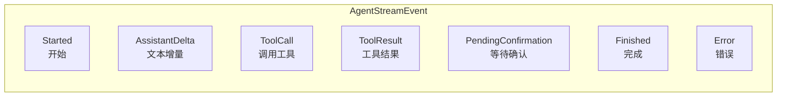
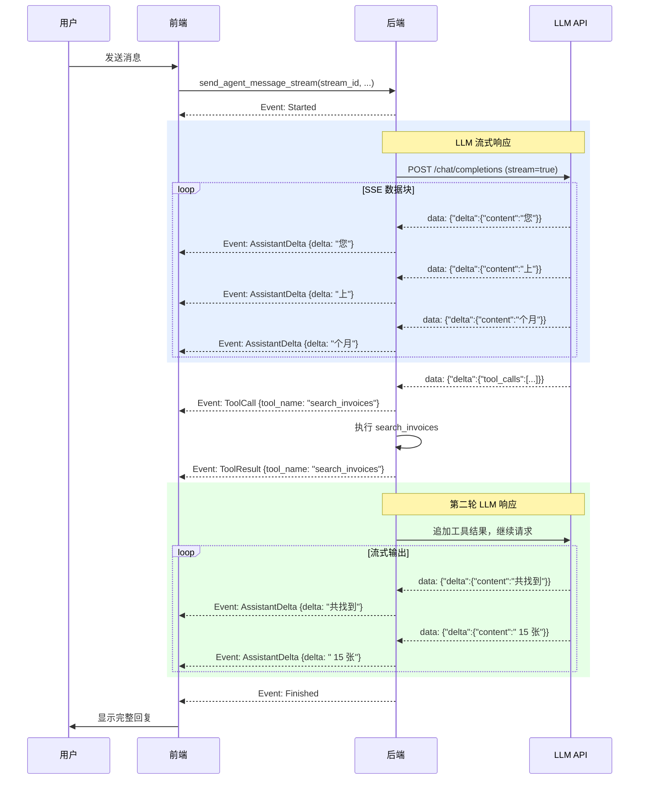

# 流式传输机制

## 概述

Agent 使用 **SSE（Server-Sent Events）** 协议实现流式传输，让用户在 Agent 执行过程中实时看到进展。与等待整个响应完成再显示不同，流式传输会在 LLM 生成文本时逐字显示，在工具执行时实时更新状态。

## SSE 事件类型

Agent 定义了 7 种流式事件，封装在 `AgentStreamEvent` 枚举中：



### 事件详解

| 事件 | 触发时机 | 负载 | 说明 |
|------|----------|------|------|
| `Started` | Agent 开始处理消息 | 无 | 表示一轮对话开始 |
| `AssistantDelta` | LLM 流式输出文本 | `{delta: string}` | 每次携带一小段文本增量 |
| `ToolCall` | Agent 开始执行工具 | `{tool_name: string}` | 通知前端即将调用哪个工具 |
| `ToolResult` | 工具执行完成 | `{tool_name: string}` | 通知前端工具已返回结果 |
| `PendingConfirmation` | 工具需要用户确认 | `{pending_confirmation: PendingConfirmation}` | 携带确认对话框的详细信息 |
| `Finished` | Agent 处理完成 | 无 | 一轮对话结束 |
| `Error` | 发生错误 | `{message: string}` | 错误信息 |

## 流式事件的生命周期



## 后端实现

### 事件发射

后端通过 Tauri 的事件系统 (`app.emit`) 将流式事件发送给前端。事件通道名称为 `"agent://stream"`。

每个事件附带一个 `AgentStreamPayload`，包含：

```rust
struct AgentStreamPayload {
    stream_id: String,    // 本次流的唯一标识
    session_id: i64,      // 会话 ID
    event: AgentStreamEvent, // 具体事件
}
```

`stream_id` 用于前端区分不同的流式请求（例如用户快速发送多条消息时）。

### SSE 解析

当 LLM 返回流式响应时，后端逐块读取 SSE 数据：

1. **缓冲拼接**：将接收到的字节块追加到缓冲区
2. **按 `\n\n` 分割**：SSE 协议用双换行符分隔事件
3. **解析 `data:` 行**：提取 JSON 数据
4. **检测 `[DONE]`**：流结束标记

对于每个 SSE 数据块，解析器处理三种类型的增量：

- **`delta.content`**：文本内容增量，累积并发射 `AssistantDelta` 事件
- **`delta.reasoning_content`**：推理内容增量（思考链），累积但不发射事件
- **`delta.tool_calls`**：工具调用增量，使用 `ToolCallAccumulator` 累积工具名称和参数

### 工具调用累积器

由于工具调用信息可能跨多个 SSE 块到达，后端使用 `ToolCallAccumulator` 逐块累积：

```rust
struct ToolCallAccumulator {
    id: Option<String>,      // 调用 ID
    type_: Option<String>,   // 类型（通常是 "function"）
    name: String,            // 工具名称（逐步拼接）
    arguments: String,       // 参数 JSON（逐步拼接）
}
```

当工具名称首次出现时，发射 `ToolCall` 事件通知前端。

## 前端处理

### useAgentStream Hook

前端通过 `useAgentStream` Hook 监听流式事件。Hook 的核心逻辑：

1. **监听事件**：注册 `agent://stream` 事件监听器
2. **过滤 stream_id**：只处理与当前请求匹配的事件
3. **状态更新**：根据事件类型更新 UI 状态

### 前端事件处理流程

```mermaid
flowchart TD
    A[收到事件] --> B{事件类型?}
    B -->|Started| C[显示加载指示器]
    B -->|AssistantDelta| D[追加文本到消息气泡<br/>实时显示打字效果]
    B -->|ToolCall| E[显示工具执行状态<br/>如"正在搜索发票..."]
    B -->|ToolResult| F[更新工具状态为完成]
    B -->|PendingConfirmation| G[显示确认对话框]
    B -->|Finished| H[移除加载指示器<br/>启用输入框]
    B -->|Error| I[显示错误提示<br/>移除加载指示器]
```

### 实时 UI 更新示例

当用户发送"帮我查上个月的发票"时，UI 的实时更新过程：

1. 用户发送消息后，输入框立即禁用
2. 收到 `Started`：显示加载动画
3. 收到 `AssistantDelta`（多次）：逐步显示 LLM 的回复文字
4. 收到 `ToolCall {tool_name: "search_invoices"}`：显示"正在搜索发票..."
5. 收到 `ToolResult {tool_name: "search_invoices"}`：搜索状态变为完成
6. 收到更多 `AssistantDelta`：逐步显示最终回复
7. 收到 `Finished`：加载动画消失，输入框恢复

### 确认对话框

当收到 `PendingConfirmation` 事件时，前端显示确认对话框。`PendingConfirmation` 结构包含：

```typescript
interface PendingConfirmation {
  tool_name: string;        // 工具名称
  arguments: any;           // 待执行的参数
  message: string;          // 确认提示文字
  options?: ConfirmOption[]; // 自定义选项按钮
}

interface ConfirmOption {
  label: string;    // 按钮文字
  value: string;    // 选项值
  style?: string;   // "primary" | "secondary" | "danger"
}
```

用户做出选择后，前端调用 `confirm_agent_action_stream` 继续执行。

## 非流式回退

Agent 同时支持非流式模式（`send_agent_message`），适用于不需要实时更新的场景。非流式模式会等待整个 Agent 循环完成后一次性返回所有消息。

| 特性 | 流式模式 | 非流式模式 |
|------|----------|------------|
| 实时更新 | 是 | 否 |
| 事件通道 | `agent://stream` | 无 |
| 用户体验 | 逐步显示 | 一次性显示 |
| 适用场景 | 交互式对话 | 后台任务 |
| 前端复杂度 | 较高 | 较低 |
