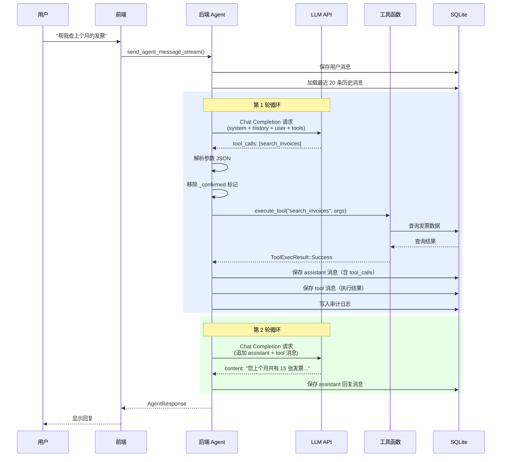
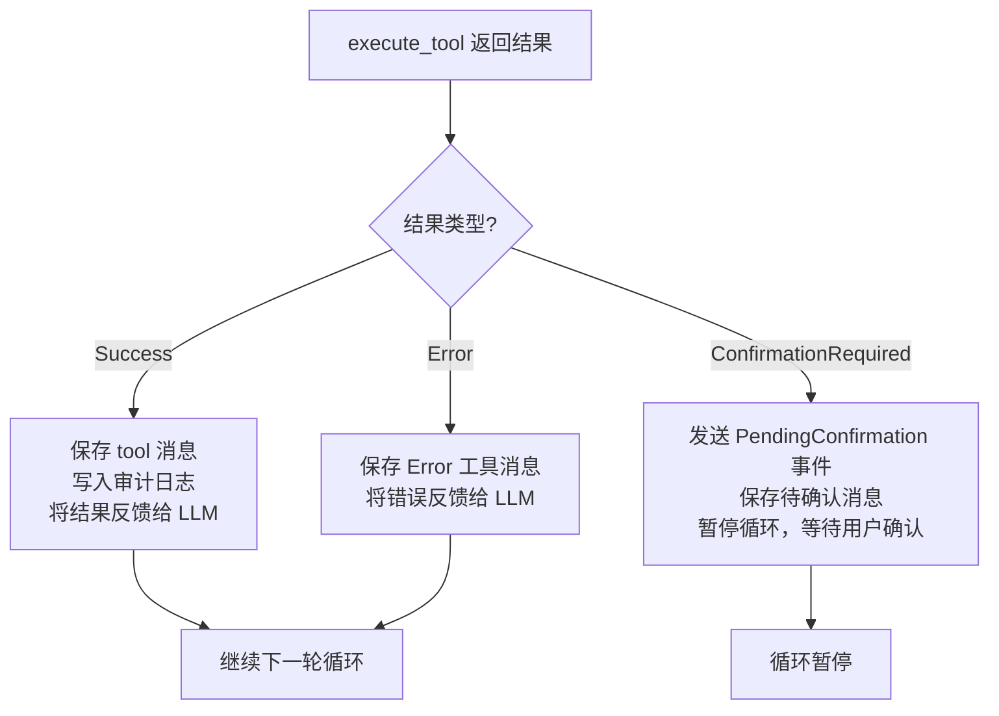
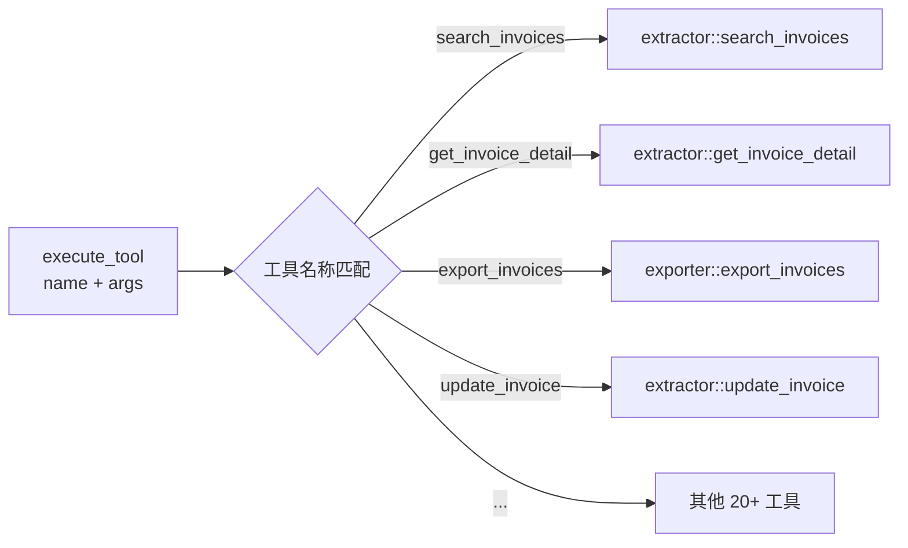
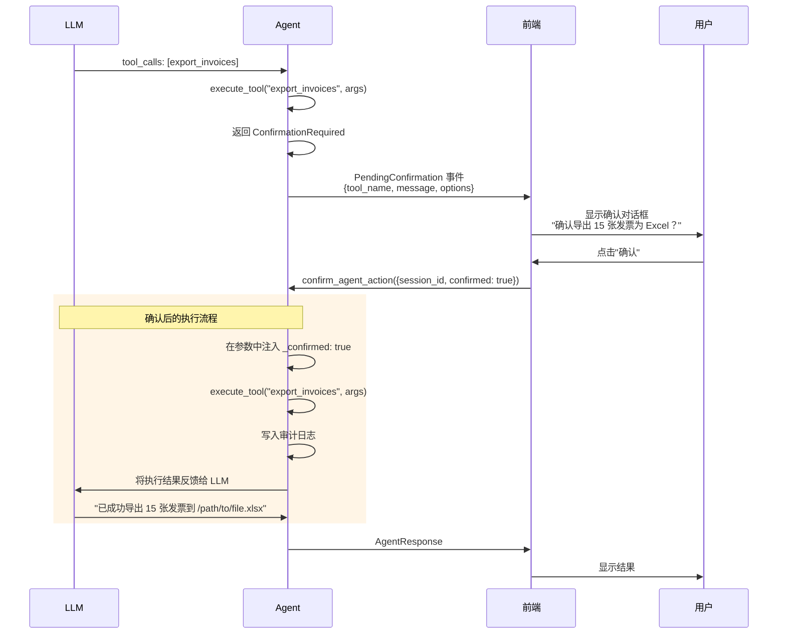
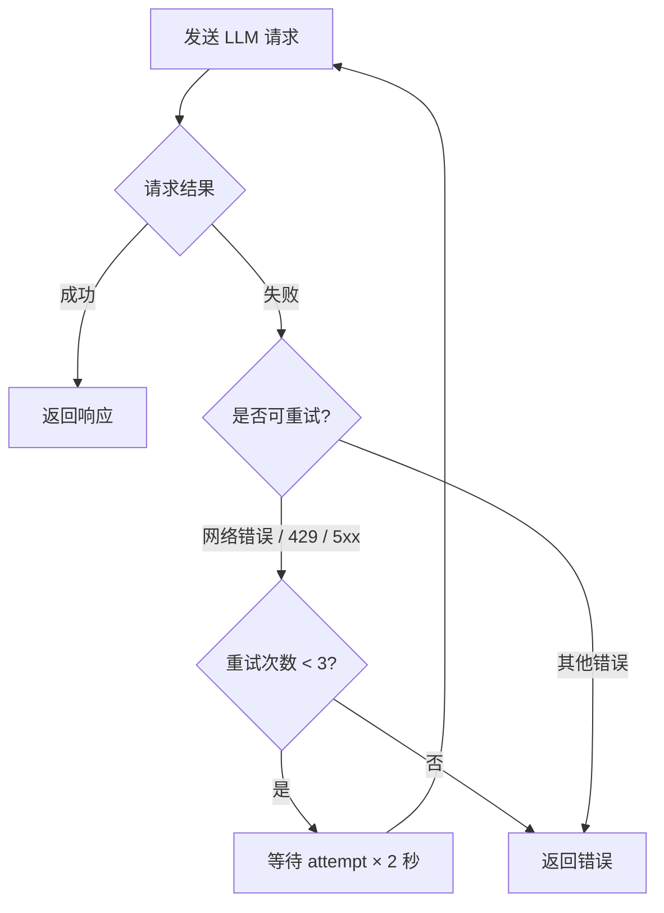

# 工具调用机制

## OpenAI 兼容的 Function Calling

InvoiceVault Agent 使用 **OpenAI 兼容的 Function Calling** 协议与 LLM 交互。这意味着只要 LLM 提供商支持 OpenAI 的 Chat Completions API 格式（包括 `tools` 参数和 `tool_calls` 响应），就可以作为 Agent 的推理引擎。

### 请求格式

每次发送给 LLM 的请求包含：

```json
{
  "model": "gpt-4o",
  "messages": [
    {"role": "system", "content": "你是 InvoiceVault 发票处理助手..."},
    {"role": "user", "content": "帮我查上个月的发票"}
  ],
  "tools": [
    {
      "type": "function",
      "function": {
        "name": "search_invoices",
        "description": "搜索发票，支持关键词、日期范围...",
        "parameters": {
          "type": "object",
          "properties": {
            "date_from": {"type": "string", "description": "开始日期 YYYY-MM-DD"},
            "date_to": {"type": "string", "description": "结束日期 YYYY-MM-DD"}
          }
        }
      }
    }
    // ... 其他 24 个工具
  ],
  "tool_choice": "auto",
  "temperature": 0.0,
  "max_tokens": 8192
}
```

关键参数说明：
- **`tools`**：包含全部 25 个工具的定义，每个工具描述了名称、功能说明和参数 JSON Schema
- **`tool_choice: "auto"`**：让 LLM 自行决定是否需要调用工具
- **`temperature: 0.0`**：使用确定性输出，保证一致性

### 响应格式

LLM 的响应有两种可能：

**1. 纯文本回复**（不需要调用工具）：

```json
{
  "choices": [{
    "message": {
      "role": "assistant",
      "content": "您上个月共有 15 张发票，总金额 12,345.67 元。"
    }
  }]
}
```

**2. 工具调用请求**（需要执行工具）：

```json
{
  "choices": [{
    "message": {
      "role": "assistant",
      "content": null,
      "tool_calls": [{
        "id": "call_abc123",
        "type": "function",
        "function": {
          "name": "search_invoices",
          "arguments": "{\"date_from\":\"2026-05-01\",\"date_to\":\"2026-05-31\"}"
        }
      }]
    }
  }]
}
```

## 工具调用循环

Agent 的核心是一个**最多 20 轮的工具调用循环**。下面的序列图展示了完整的执行流程：



### 循环详解

循环的核心实现在 `run_agent_loop_from_inner` 函数中。以下是每一轮的详细步骤：

**步骤 1：发送 LLM 请求**

将当前消息列表发送给 LLM。消息列表的构成如下：

```
[system_prompt] + [历史消息...] + [当前用户消息]
```

其中历史消息最多加载最近 20 条（`AGENT_HISTORY_LIMIT = 20`），通过 `build_llm_messages` 函数从数据库中构建。

**步骤 2：解析 LLM 响应**

检查 LLM 返回的消息是否包含 `tool_calls`：

- **没有 `tool_calls`**：LLM 直接回复了文本，保存消息并返回，循环结束
- **有 `tool_calls`**：进入工具执行阶段

**步骤 3：执行工具调用**

对于 LLM 请求中的每一个 `tool_call`：

1. 解析 `arguments` JSON 字符串
2. **安全检查**：移除 `_confirmed` 字段（防止 LLM 伪造确认）
3. 调用 `execute_tool` 函数执行工具
4. 根据执行结果分三种情况处理：



**步骤 4：将工具结果反馈给 LLM**

工具执行结果以 `tool` 角色的消息形式追加到消息列表中，然后回到步骤 1 开始新一轮循环。

**步骤 5：循环终止条件**

循环在以下情况终止：
- LLM 返回纯文本（没有 `tool_calls`）：正常结束
- 遇到 `ConfirmationRequired`：暂停等待用户确认
- 达到 20 轮上限：抛出 `TooManyIterations` 错误

## 工具注册与分发

### 工具定义

所有 25 个工具在 `agent_tools()` 函数中注册，每个工具是一个 `ToolDefinition` 结构体：

```rust
pub struct ToolDefinition {
    pub name: &'static str,           // 工具名称
    pub description: &'static str,    // 功能描述
    pub parameters: serde_json::Value, // 参数 JSON Schema
    pub is_read_only: bool,           // 是否只读
    pub requires_confirmation: bool,  // 是否需要用户确认
}
```

### 工具分发 (make_tool_executor 模式)

工具的实际执行通过 `make_tool_executor` 模式实现。在 `commands/agent.rs` 中，Tauri 命令层创建了一个闭包，根据工具名称分发到对应的实现函数：



这个闭包以 `Arc<dyn Fn(&str, &serde_json::Value) -> ToolExecResult>` 的形式传入 Agent 核心，实现了工具执行与 Agent 逻辑的解耦。

## Confirmation-Required 模式

写入操作（如更新发票、导出文件）不会直接执行，而是返回 `ToolExecResult::ConfirmationRequired`，暂停 Agent 循环并通知前端显示确认对话框。

### 工作流程



### 确认过程的关键细节

1. **待确认状态的保存**：当工具返回 `ConfirmationRequired` 时，Agent 会将确认信息以 `__pending_confirmation` 标记保存到数据库的 `tool` 消息中
2. **确认后执行**：用户确认后，`continue_agent_turn` 函数从数据库中找到最后一条待确认的 `tool_call`，注入 `_confirmed: true` 参数后重新执行
3. **拒绝处理**：如果用户拒绝，Agent 会将 "用户取消了此操作。" 作为 tool 消息反馈给 LLM，LLM 会据此回复用户
4. **清理待确认消息**：继续执行前会删除之前的 `__pending_confirmation` 消息，避免上下文污染

## 消息历史构建

`build_llm_messages` 函数负责从数据库消息构建 LLM 可理解的消息列表：

1. 始终以 `system` 提示词开头
2. 遍历历史消息，跳过 `__pending_confirmation` 标记的消息
3. 恢复 `tool_calls` JSON 为结构化数据
4. 保持消息的 `role`、`content`、`tool_call_id`、`reasoning_content` 等字段

## LLM 请求重试机制

当 LLM 请求失败时，Agent 会自动重试：

- **最大重试次数**：3 次（`LLM_REQUEST_MAX_RETRIES = 3`）
- **重试条件**：网络错误、HTTP 429（限流）、HTTP 5xx（服务器错误）
- **退避策略**：指数退避，每次重试等待 `attempt * 2` 秒（2s、4s、6s）
- **不可重试的错误**：HTTP 4xx（客户端错误，如参数错误）会直接返回错误


