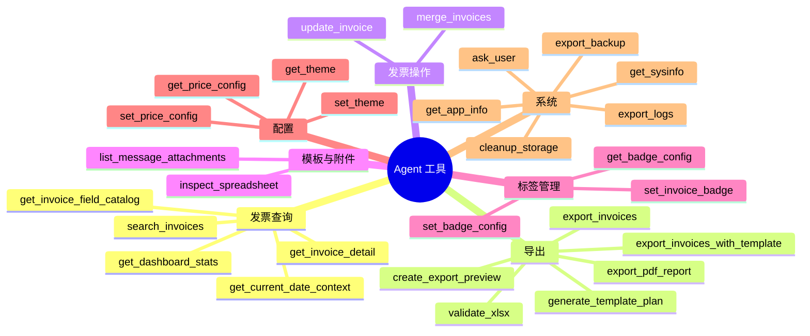

# 工具参考手册

Agent 共有 **25 个工具**，按功能分为 7 个类别。每个工具的定义包含名称、类型（只读/写入）、描述、参数和是否需要用户确认。

## 工具分类总览



## 发票查询工具

这些工具用于查询和获取发票数据，全部为只读操作，不需要用户确认。

### search_invoices

| 属性 | 值 |
|------|-----|
| 类型 | 只读 |
| 需要确认 | 否 |
| 描述 | 搜索发票，支持关键词、日期范围、销售方、发票类型、类别、状态等筛选条件。返回分页结果。 |

**参数：**

| 参数 | 类型 | 必填 | 说明 |
|------|------|------|------|
| `query` | string | 否 | 关键词搜索，匹配销售方、购买方、发票号码、备注等 |
| `date_from` | string | 否 | 开始日期，格式 `YYYY-MM-DD` |
| `date_to` | string | 否 | 结束日期，格式 `YYYY-MM-DD` |
| `seller_name` | string | 否 | 销售方名称 |
| `buyer_name` | string | 否 | 购买方名称 |
| `invoice_number` | string | 否 | 发票号码 |
| `invoice_type` | string | 否 | 发票类型（如增值税普通发票/增值税专用发票） |
| `category` | string | 否 | 消费类别 |
| `status` | string | 否 | 状态：`pending_confirmation`/`recognized`/`reviewed`/`flagged` |
| `duplicate_status` | string | 否 | 重复状态 |
| `amount_min` | string | 否 | 最小金额 |
| `amount_max` | string | 否 | 最大金额 |
| `sort_by` | string | 否 | 排序字段 |
| `sort_order` | string | 否 | `asc` 或 `desc` |
| `page` | integer | 否 | 页码，默认 1 |
| `page_size` | integer | 否 | 每页条数，默认 20 |

**调用示例：**

```json
{
  "name": "search_invoices",
  "arguments": {
    "date_from": "2026-05-01",
    "date_to": "2026-05-31",
    "invoice_type": "增值税普通发票",
    "page_size": 10
  }
}
```

---

### get_invoice_detail

| 属性 | 值 |
|------|-----|
| 类型 | 只读 |
| 需要确认 | 否 |
| 描述 | 获取单张发票的完整详情，包括所有字段和明细行。 |

**参数：**

| 参数 | 类型 | 必填 | 说明 |
|------|------|------|------|
| `invoice_id` | integer | 是 | 发票 ID |

**调用示例：**

```json
{
  "name": "get_invoice_detail",
  "arguments": {"invoice_id": 42}
}
```

---

### get_dashboard_stats

| 属性 | 值 |
|------|-----|
| 类型 | 只读 |
| 需要确认 | 否 |
| 描述 | 获取仪表盘统计数据：发票总数、金额合计、月度趋势、类型分布、状态分布、Top 供应商排名。支持按日期范围筛选。 |

**参数：**

| 参数 | 类型 | 必填 | 说明 |
|------|------|------|------|
| `date_from` | string | 否 | 开始日期 `YYYY-MM-DD` |
| `date_to` | string | 否 | 结束日期 `YYYY-MM-DD` |

---

### get_current_date_context

| 属性 | 值 |
|------|-----|
| 类型 | 只读 |
| 需要确认 | 否 |
| 描述 | 获取当前日期上下文，用于解析"这个月"、"上个月"、"本季度"等相对时间表达。 |

**参数：** 无

返回内容包括 `today`、`current_month`（含 `date_from` 和 `date_to`）、`year`、`month`。

---

### get_invoice_field_catalog

| 属性 | 值 |
|------|-----|
| 类型 | 只读 |
| 需要确认 | 否 |
| 描述 | 获取发票字段字典，包括可导出字段 key、中文名、别名和数据类型。用于把用户说的列名映射为导出字段。 |

**参数：** 无

## 导出工具

这些工具用于将发票数据导出为各种格式的文件。

### export_invoices

| 属性 | 值 |
|------|-----|
| 类型 | 写入 |
| 需要确认 | **是** |
| 描述 | 导出筛选的发票为 CSV 或 Excel 文件。支持自定义导出列和日期范围。需要用户选择保存位置。 |

**参数：**

| 参数 | 类型 | 必填 | 说明 |
|------|------|------|------|
| `format` | string | 是 | 导出格式：`csv` 或 `xlsx` |
| `invoice_ids` | integer[] | 否 | 要导出的发票 ID 列表。为空时按日期范围或全部导出 |
| `columns` | string[] | 否 | 导出字段 key 列表。可先调用 `get_invoice_field_catalog` 获取字段字典 |
| `date_from` | string | 否 | 开始日期 |
| `date_to` | string | 否 | 结束日期 |

**调用示例：**

```json
{
  "name": "export_invoices",
  "arguments": {
    "format": "xlsx",
    "columns": ["invoice_code", "invoice_number", "seller_name", "total_amount"],
    "date_from": "2026-01-01",
    "date_to": "2026-06-07"
  }
}
```

---

### create_export_preview

| 属性 | 值 |
|------|-----|
| 类型 | 只读 |
| 需要确认 | 否 |
| 描述 | 预览一次发票导出，返回匹配行数、导出列和前几行样例。复杂导出前应先使用此工具让用户确认。 |

**参数：**

| 参数 | 类型 | 必填 | 说明 |
|------|------|------|------|
| `invoice_ids` | integer[] | 否 | 要预览的发票 ID 列表 |
| `columns` | string[] | 否 | 导出字段 key 列表 |
| `date_from` | string | 否 | 开始日期 |
| `date_to` | string | 否 | 结束日期 |
| `limit` | integer | 否 | 样例行数，默认 5 |

---

### export_invoices_with_template

| 属性 | 值 |
|------|-----|
| 类型 | 写入 |
| 需要确认 | **是** |
| 描述 | 按上传表格模板的表头列顺序导出发票。保留原格式、样式、合并单元格、公式。需要用户选择保存位置。 |

**参数：**

| 参数 | 类型 | 必填 | 说明 |
|------|------|------|------|
| `attachment_id` | integer | 是 | 模板表格附件 ID |
| `plan` | object | 否 | 导出计划 JSON（来自 `generate_template_plan`）。为空时自动分析模板生成计划 |
| `format` | string | 否 | 导出格式，默认 `xlsx` |
| `invoice_ids` | integer[] | 否 | 要导出的发票 ID 列表 |
| `date_from` | string | 否 | 开始日期 |
| `date_to` | string | 否 | 结束日期 |

---

### generate_template_plan

| 属性 | 值 |
|------|-----|
| 类型 | 只读 |
| 需要确认 | 否 |
| 描述 | 分析 Excel 模板结构，生成字段映射导出计划。返回 JSON 计划，可传给 `export_invoices_with_template` 的 `plan` 参数。只读操作，不修改模板。 |

**参数：**

| 参数 | 类型 | 必填 | 说明 |
|------|------|------|------|
| `attachment_id` | integer | 是 | 模板表格附件 ID |

---

### validate_xlsx

| 属性 | 值 |
|------|-----|
| 类型 | 只读 |
| 需要确认 | 否 |
| 描述 | 验证 Excel (XLSX) 文件的 XML 结构是否合法。导出 Excel 后必须调用此工具验证。如果验证失败，必须分析错误原因、修复问题后重新导出并再次验证，直到验证通过。 |

**参数：**

| 参数 | 类型 | 必填 | 说明 |
|------|------|------|------|
| `file_path` | string | 是 | 要验证的 XLSX 文件绝对路径 |

---

### export_pdf_report

| 属性 | 值 |
|------|-----|
| 类型 | 写入 |
| 需要确认 | **是** |
| 描述 | 将选中发票导出为 PDF 报表。报表包含汇总表和每张发票的详情页（含缩略图）。 |

**参数：**

| 参数 | 类型 | 必填 | 说明 |
|------|------|------|------|
| `invoice_ids` | integer[] | 否 | 要导出的发票 ID 列表 |
| `date_from` | string | 否 | 开始日期 |
| `date_to` | string | 否 | 结束日期 |

## 发票操作工具

这些工具直接修改发票数据，都需要用户确认。

### update_invoice

| 属性 | 值 |
|------|-----|
| 类型 | 写入 |
| 需要确认 | **是** |
| 描述 | 更新发票的字段信息。修改前需要用户确认。 |

**参数：**

| 参数 | 类型 | 必填 | 说明 |
|------|------|------|------|
| `id` | integer | 是 | 发票 ID |
| `invoice_type` | string | 否 | 发票类型 |
| `invoice_code` | string | 否 | 发票代码 |
| `invoice_number` | string | 否 | 发票号码 |
| `issue_date` | string | 否 | 开票日期 `YYYY-MM-DD` |
| `seller_name` | string | 否 | 销售方名称 |
| `seller_tax_id` | string | 否 | 销售方税号 |
| `buyer_name` | string | 否 | 购买方名称 |
| `buyer_tax_id` | string | 否 | 购买方税号 |
| `currency` | string | 否 | 货币 |
| `amount_without_tax` | string | 否 | 不含税金额 |
| `tax_amount` | string | 否 | 税额 |
| `total_amount` | string | 否 | 价税合计 |
| `category` | string | 否 | 消费类别 |
| `remarks` | string | 否 | 备注 |
| `status` | string | 否 | 状态 |

---

### merge_invoices

| 属性 | 值 |
|------|-----|
| 类型 | 写入 |
| 需要确认 | **是** |
| 描述 | 将多张发票合并为一张。用于多页 PDF 识别后将多个页面合并为一张完整发票。要求所有发票属于同一文件。 |

**参数：**

| 参数 | 类型 | 必填 | 说明 |
|------|------|------|------|
| `target_invoice_id` | integer | 是 | 目标发票 ID（合并后的保留对象） |
| `source_invoice_ids` | integer[] | 是 | 要合并到目标的源发票 ID 列表 |

## 模板与附件工具

用于管理用户上传的附件（如 Excel 模板）。

### list_message_attachments

| 属性 | 值 |
|------|-----|
| 类型 | 只读 |
| 需要确认 | 否 |
| 描述 | 列出当前会话中用户上传的附件。用户提到表格、上传文件、模板时，先使用此工具查找附件 ID。 |

**参数：** 无

---

### inspect_spreadsheet

| 属性 | 值 |
|------|-----|
| 类型 | 只读 |
| 需要确认 | 否 |
| 描述 | 检查上传的 CSV/XLSX 表格，返回工作表、表头、列名和前几行样例。用于理解用户提供的导出模板格式。 |

**参数：**

| 参数 | 类型 | 必填 | 说明 |
|------|------|------|------|
| `attachment_id` | integer | 是 | 附件 ID |
| `max_rows` | integer | 否 | 最多读取的样例行数，默认 5 |

## 标签管理工具

用于管理发票的自定义标签（Badge）系统。

### get_badge_config

| 属性 | 值 |
|------|-----|
| 类型 | 只读 |
| 需要确认 | 否 |
| 描述 | 获取当前自定义标签（Badge）配置，包括所有分组名称和可选项。 |

**参数：** 无

---

### set_badge_config

| 属性 | 值 |
|------|-----|
| 类型 | 写入 |
| 需要确认 | **是** |
| 描述 | 设置自定义标签（Badge）配置，替换所有分组和选项。 |

**参数：**

| 参数 | 类型 | 必填 | 说明 |
|------|------|------|------|
| `groups` | array | 是 | 标签分组列表，每组包含 `name`（分组名称）和 `options`（选项列表） |

---

### set_invoice_badge

| 属性 | 值 |
|------|-----|
| 类型 | 写入 |
| 需要确认 | **是** |
| 描述 | 为指定发票设置标签值。`value` 传 `null` 表示取消该标签。 |

**参数：**

| 参数 | 类型 | 必填 | 说明 |
|------|------|------|------|
| `invoice_id` | integer | 是 | 发票 ID |
| `group_name` | string | 是 | 标签分组名称 |
| `value` | string 或 null | 否 | 标签值，`null` 表示取消 |

## 配置工具

用于管理应用的 LLM 价格配置和主题设置。

### get_price_config / set_price_config

| 属性 | `get_price_config` | `set_price_config` |
|------|-----|-----|
| 类型 | 只读 | 写入 |
| 需要确认 | 否 | **是** |

`set_price_config` 参数：`llm_input_price_per_1k`、`llm_output_price_per_1k`、`embedding_input_price_per_1k`、`embedding_output_price_per_1k`（均为 number 类型，单位：美元/千 token）。

---

### get_theme / set_theme

| 属性 | `get_theme` | `set_theme` |
|------|-----|-----|
| 类型 | 只读 | 写入 |
| 需要确认 | 否 | 否 |

`set_theme` 参数：`theme`（`"light"` 或 `"dark"`）。

## 系统工具

用于系统维护和用户交互。

### export_logs

| 属性 | 值 |
|------|-----|
| 类型 | 写入 |
| 需要确认 | **是** |
| 描述 | 导出应用日志文件到指定路径。 |

**参数：** `output_path`（string，必填）— 导出文件的保存路径。

---

### export_backup

| 属性 | 值 |
|------|-----|
| 类型 | 写入 |
| 需要确认 | **是** |
| 描述 | 导出数据库和配置文件的备份包到指定路径。 |

**参数：** `output_path`（string，必填）— 备份文件的保存路径。

---

### cleanup_storage

| 属性 | 值 |
|------|-----|
| 类型 | 写入 |
| 需要确认 | **是** |
| 描述 | 清理孤立文件和过期数据，释放存储空间。 |

**参数：** 无

---

### get_app_info

| 属性 | 值 |
|------|-----|
| 类型 | 只读 |
| 需要确认 | 否 |
| 描述 | 获取应用版本、数据目录路径和数据库状态等系统信息。 |

**参数：** 无

---

### ask_user

| 属性 | 值 |
|------|-----|
| 类型 | 只读 |
| 需要确认 | 否 |
| 描述 | 向用户提出问题并提供选项供选择。当需要用户确认操作、选择偏好或做出决定时使用。用户也可以选择"其他"并输入自定义内容。 |

**参数：**

| 参数 | 类型 | 必填 | 说明 |
|------|------|------|------|
| `message` | string | 是 | 向用户展示的问题或说明 |
| `options` | array | 否 | 供用户选择的选项列表，每项包含 `label`、`value` 和可选的 `style`（`"primary"`/`"secondary"`/`"danger"`） |

**调用示例：**

```json
{
  "name": "ask_user",
  "arguments": {
    "message": "您想导出哪些发票？",
    "options": [
      {"label": "本月所有发票", "value": "current_month", "style": "primary"},
      {"label": "全部发票", "value": "all", "style": "secondary"},
      {"label": "指定日期范围", "value": "custom_range"}
    ]
  }
}
```

---

### get_sysinfo

| 属性 | 值 |
|------|-----|
| 类型 | 只读 |
| 需要确认 | 否 |
| 描述 | 获取当前操作系统、默认 Shell 和用户桌面路径等系统信息。 |

**参数：** 无

## 工具分类汇总表

| 类别 | 工具数量 | 只读 | 需要确认 |
|------|----------|------|----------|
| 发票查询 | 5 | 5 | 0 |
| 导出 | 6 | 3 | 3 |
| 发票操作 | 2 | 0 | 2 |
| 模板与附件 | 2 | 2 | 0 |
| 标签管理 | 3 | 1 | 2 |
| 配置 | 4 | 2 | 1 |
| 系统 | 6 | 3 | 3 |
| **合计** | **28** | **16** | **11** |

:::note
虽然总共有 28 个工具定义，但在 Agent 的 `agent_tools()` 函数中注册了 25 个。`ask_user` 和 `get_sysinfo` 是 Agent 专用工具，MCP 服务器暴露的工具集有所不同（见 [MCP 服务器](./mcp-server.mdx)）。
:::
