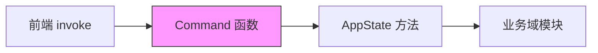

# Tauri 命令参考

InvoiceVault 通过 Tauri 的 `invoke` 机制暴露后端功能给前端调用。所有命令在 `src-tauri/src/lib.rs` 中通过 `tauri::generate_handler!` 注册，按功能域拆分在 `src-tauri/src/commands/` 子模块中。

## 命令注册

所有命令在 `lib.rs` 的 `invoke_handler` 中统一注册：

```rust
.invoke_handler(tauri::generate_handler![
    window_start_dragging,
    window_minimize,
    // ... 共 107 个命令
    set_log_level
])
```

## 薄壳命令模式

InvoiceVault 的命令层采用"薄壳"设计模式：



每个命令函数仅负责：
1. 从前端接收参数
2. 解包 Tauri 的 `State` 或 `AppHandle`
3. 调用 `AppState` 上的对应方法
4. 将 `Result` 映射为 `Result<T, String>` 返回前端

典型命令示例：

```rust
#[tauri::command]
pub fn set_badge_config(
    state: State<'_, AppState>,
    config: BadgeConfig,
) -> Result<(), String> {
    state
        .set_badge_config(config)
        .map_err(|err| err.to_string())
}
```

## 窗口控制 (window)

| 命令 | 参数 | 返回值 | 说明 |
|------|------|--------|------|
| `window_start_dragging` | 无 | `()` | 开始窗口拖拽移动 |
| `window_minimize` | 无 | `()` | 最小化窗口 |
| `window_toggle_maximize` | 无 | `bool` | 切换最大化/还原，返回是否最大化 |
| `window_close` | 无 | `()` | 关闭窗口 |
| `window_get_position` | 无 | `Position` | 获取窗口位置 `{x, y}` |
| `window_set_position` | `x: f64, y: f64` | `()` | 设置窗口位置 |

## 发票管理 (invoice)

| 命令 | 参数 | 返回值 | 说明 |
|------|------|--------|------|
| `save_invoice_extraction` | `request: SaveInvoiceExtractionRequest` | `InvoiceSummary` | 保存识别结果为发票记录 |
| `list_invoices` | 无 | `Vec<InvoiceSummary>` | 获取所有发票列表 |
| `search_invoices` | `params: InvoiceSearchParams` | `InvoiceSearchResult` | 按条件搜索发票 |
| `get_tag_options` | 无 | `Vec<TagOption>` | 获取所有已使用的标签选项 |
| `get_invoice_detail` | `invoice_id: i64` | `InvoiceDetail` | 获取发票完整详情 |
| `mark_invoice_viewed` | `invoice_id: i64` | `bool` | 标记发票为已查看 |
| `count_unviewed_invoices` | 无 | `i64` | 统计未查看发票数量 |
| `open_invoice_raw_file_in_browser` | `invoice_id: i64` | `()` | 用系统默认程序打开原始文件 |
| `update_invoice` | `request: UpdateInvoiceRequest` | `UpdateInvoiceResult` | 更新发票信息 |
| `update_invoice_items` | `request: UpdateInvoiceItemsRequest` | `Vec<InvoiceItemRow>` | 更新发票明细行 |
| `batch_update_invoices` | `request: BatchUpdateRequest` | `Vec<InvoiceSummary>` | 批量更新发票 |
| `batch_delete_invoices` | `ids: Vec<i64>` | `usize` | 批量删除发票 |
| `check_invoice_duplicates` | `invoice_id: i64` | `DedupeCheckResult` | 检查发票是否有重复 |
| `resolve_duplicate` | `request: ResolveDuplicateRequest` | `ResolveDuplicateResult` | 解决重复发票 |
| `regenerate_all_duplicates` | 无 | `usize` | 重新计算所有发票的重复状态 |
| `merge_invoices` | `target_id, source_ids` | `MergeInvoicesResult` | 合并多个发票记录 |

## 文件导入 (import)

| 命令 | 参数 | 返回值 | 说明 |
|------|------|--------|------|
| `import_files` | `request: ImportRequest` | `Vec<ImportJobSummary>` | 从路径列表导入文件 |
| `pick_invoice_files` | 无 | `Vec<String>` | 打开文件选择对话框（限定发票格式） |
| `pick_any_files` | 无 | `Vec<String>` | 打开文件选择对话框（不限格式） |
| `pick_save_file` | `default_path, filters` | `Option<String>` | 打开保存文件对话框 |
| `poll_dropped_files` | 无 | `Vec<String>` | 获取拖拽到窗口的文件路径 |
| `import_dropped_file` | `name, data` | `Vec<ImportJobSummary>` | 导入拖拽的文件数据 |
| `list_import_jobs` | `page?, page_size?` | `ImportJobListResult` | 分页查询导入任务列表 |
| `delete_import_job` | `job_id: i64` | `()` | 删除导入任务 |

## 文件导出 (export)

| 命令 | 参数 | 返回值 | 说明 |
|------|------|--------|------|
| `export_invoices` | `request: ExportInvoicesRequest` | `ExportResult` | 导出发票数据（Excel/CSV） |
| `export_pdf_report` | `request: PdfReportRequest` | `PdfReportResult` | 导出 PDF 报告 |
| `move_export_file` | `source_path, dest_path` | `()` | 移动导出文件到指定位置 |

## 发票识别 (recognize)

| 命令 | 参数 | 返回值 | 说明 |
|------|------|--------|------|
| `recognize_raw_file` | `request: RecognizeRawFileRequest` | `RecognizeRawFileResult` | 对原始文件执行 LLM 识别 |

识别过程包括 PDF 页面渲染、图片预处理、VLM 多次尝试、置信度审核和 SCNet OCR 交叉验证。

## LLM 配置与测试 (config)

| 命令 | 参数 | 返回值 | 说明 |
|------|------|--------|------|
| `set_llm_config` | `config: LlmProviderConfig` | `()` | 保存 LLM 配置 |
| `get_llm_config` | 无 | `Option<LlmProviderConfig>` | 读取 LLM 配置 |
| `test_llm_connection` | `config: LlmProviderConfig` | `LlmConnectionTestResult` | 测试 LLM 连接 |
| `set_llm_audit_enabled` | `enabled: bool` | `()` | 启用/禁用审计日志 |
| `get_llm_audit_enabled` | 无 | `bool` | 查询审计日志开关 |
| `analyze_email_error` | `error_message: String` | `Option<String>` | 用 LLM 分析邮件连接错误 |
| `set_chroma_config` | `config: ChromaConfig` | `()` | 保存 ChromaDB 配置 |
| `get_chroma_config` | 无 | `ChromaConfig` | 读取 ChromaDB 配置 |
| `test_chroma_connection` | 无 | `bool` | 测试 ChromaDB 连接 |
| `set_embedding_enabled` | `enabled: bool` | `()` | 启用/禁用本地 Embedding |
| `get_embedding_status` | 无 | `LocalEmbeddingStatus` | 查询 Embedding 状态 |
| `download_embedding_model` | 无 | `LocalEmbeddingStatus` | 下载 Embedding 模型 |
| `test_embedding_connection` | 无 | `EmbeddingTestResult` | 测试 Embedding 推理 |
| `regenerate_all_embeddings` | 无 | `RegenerateEmbeddingsResult` | 重新生成所有向量 |
| `set_badge_config` | `config: BadgeConfig` | `()` | 保存标签配置 |
| `get_badge_config` | 无 | `BadgeConfig` | 读取标签配置 |
| `set_invoice_badge` | `invoice_id, group_name, value` | `Vec<InvoiceBadgeSelection>` | 为发票设置标签 |
| `get_theme` | 无 | `String` | 获取主题（light/dark） |
| `set_theme` | `theme: String` | `()` | 设置主题 |
| `set_price_config` | `config: PriceConfig` | `()` | 保存价格配置 |
| `get_price_config` | 无 | `PriceConfig` | 读取价格配置 |
| `set_log_level` | `level: String` | `()` | 设置日志级别 |
| `get_log_level` | 无 | `String` | 获取当前日志级别 |
| `set_diagnostic_config` | `config: DiagnosticConfig` | `()` | 保存诊断配置 |
| `get_diagnostic_config` | 无 | `DiagnosticConfig` | 读取诊断配置 |
| `run_llm_diagnostic` | 无 | `DiagnosticResult` | 运行 LLM 诊断测试 |

## 目录监控 (watcher)

| 命令 | 参数 | 返回值 | 说明 |
|------|------|--------|------|
| `add_watch_dir` | `request: AddWatchDirRequest` | `WatchDirStatus` | 添加监控目录 |
| `remove_watch_dir` | `id: i64` | `()` | 移除监控目录 |
| `list_watch_dirs` | 无 | `Vec<WatchDirStatus>` | 列出所有监控目录 |
| `update_watch_dir` | `id, request` | `WatchDirStatus` | 更新监控目录配置 |
| `toggle_watch_dir` | `id, enabled` | `WatchDirStatus` | 启用/禁用监控目录 |

## 邮件数据源 (email)

| 命令 | 参数 | 返回值 | 说明 |
|------|------|--------|------|
| `add_email_source` | `request` | `EmailSource` | 添加邮件数据源 |
| `update_email_source` | `id, request` | `EmailSource` | 更新邮件源配置 |
| `remove_email_source` | `id: i64` | `()` | 删除邮件源 |
| `list_email_sources` | 无 | `Vec<EmailSource>` | 列出所有邮件源 |
| `toggle_email_source` | `id, enabled` | `EmailSource` | 启用/禁用邮件源 |
| `sync_email_source` | `id: i64` | `EmailSyncResult` | 同步单个邮件源 |
| `sync_all_email_sources` | 无 | `Vec<EmailSyncResult>` | 同步所有邮件源 |
| `test_email_connection` | `protocol, host, port, ...` | `EmailTestResult` | 测试邮件连接 |

## Agent 会话 (agent)

| 命令 | 参数 | 返回值 | 说明 |
|------|------|--------|------|
| `create_agent_session` | 无 | `AgentSession` | 创建新会话 |
| `list_agent_sessions` | 无 | `Vec<AgentSession>` | 列出所有会话 |
| `get_agent_session` | `session_id` | `Vec<AgentMessageRow>` | 获取会话消息历史 |
| `delete_agent_session` | `session_id` | `()` | 删除会话 |
| `update_agent_session_title` | `session_id, title` | `AgentSession` | 更新会话标题 |
| `send_agent_message` | `session_id, content, ...` | `AgentResponse` | 发送消息（非流式） |
| `send_agent_message_stream` | `stream_id, session_id, ...` | `AgentResponse` | 发送消息（流式） |
| `attach_agent_file` | `session_id, path` | `AgentAttachment` | 附加文件到会话 |
| `list_agent_attachments` | `session_id` | `Vec<AgentAttachment>` | 列出会话附件 |
| `remove_agent_attachment` | `attachment_id` | `()` | 删除附件 |
| `list_agent_tasks` | `session_id` | `Vec<AgentTask>` | 列出会话任务 |
| `list_agent_artifacts` | `session_id` | `Vec<AgentArtifact>` | 列出会话产出物 |
| `open_agent_artifact_file` | `session_id, artifact_id` | `()` | 打开产出物文件 |
| `open_agent_artifact_folder` | `session_id, artifact_id` | `()` | 打开产出物所在文件夹 |
| `delete_agent_artifact` | `session_id, artifact_id` | `()` | 删除产出物 |
| `confirm_agent_action` | `request, config` | `AgentResponse` | 确认 Agent 动作（非流式） |
| `confirm_agent_action_stream` | `stream_id, request, config` | `AgentResponse` | 确认 Agent 动作（流式） |
| `generate_session_title` | `session_id, config` | `String` | 自动生成会话标题 |

## 事件通知 (event)

| 命令 | 参数 | 返回值 | 说明 |
|------|------|--------|------|
| `list_events` | `page?, page_size?, event_type?` | `EventListResult` | 分页查询事件列表 |
| `get_unread_event_count` | 无 | `i64` | 获取未读事件数量 |
| `get_unread_failed_import_event_count` | 无 | `i64` | 获取未读失败导入事件数 |
| `mark_event_read` | `id: i64` | `()` | 标记事件为已读 |
| `mark_all_events_read` | 无 | `()` | 标记所有事件为已读 |
| `delete_all_events` | 无 | `usize` | 删除所有事件 |

## 语义搜索 (semantic)

| 命令 | 参数 | 返回值 | 说明 |
|------|------|--------|------|
| `search_invoices_semantic` | `query: String, limit: usize` | `Vec<SimilarResult>` | 语义向量搜索发票 |

## 工具与健康检查 (util)

| 命令 | 参数 | 返回值 | 说明 |
|------|------|--------|------|
| `app_health` | 无 | `AppHealth` | 应用健康检查 |
| `get_app_version` | 无 | `String` | 获取应用版本号 |
| `frontend_heartbeat` | `seq: u64` | `()` | 前端心跳（调试用） |
| `check_external_dependencies` | 无 | `Vec<ExternalDependencyStatus>` | 检查外部依赖状态 |
| `get_dashboard_stats` | `date_from?, date_to?` | `DashboardStats` | 获取仪表盘统计数据 |
| `get_llm_usage` | `date_from?, date_to?` | `LlmUsageStats` | 获取 LLM 用量统计 |
| `get_recognition_queue_status` | 无 | `RecognitionQueueStatus` | 获取识别队列状态 |
| `raw_file_has_invoices` | `raw_file_id` | `bool` | 检查原始文件是否有关联发票 |
| `get_invoice_id_by_raw_file` | `raw_file_id` | `Option<i64>` | 根据原始文件 ID 获取发票 ID |
| `export_logs` | `output_path` | `ExportLogsResult` | 导出应用日志 |
| `export_backup` | `output_path` | `ExportLogsResult` | 导出完整备份 |
| `cleanup_storage` | 无 | `CleanupStorageResult` | 清理孤立存储文件 |
