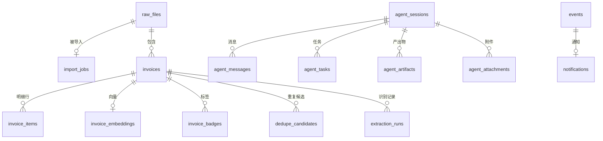

# 数据模型参考

InvoiceVault 使用 SQLite 作为本地数据库，通过版本化迁移脚本管理 schema。数据库文件存储在应用数据目录中。

## 迁移系统

数据库迁移通过 `src-tauri/src/storage/mod.rs` 管理，使用 `schema_migrations` 表跟踪已应用的版本：

```sql
CREATE TABLE IF NOT EXISTS schema_migrations (
    version INTEGER PRIMARY KEY,
    applied_at TEXT NOT NULL DEFAULT CURRENT_TIMESTAMP
);
```

迁移按版本号顺序执行，幂等安全（可重复调用）。当前共 4 个迁移版本：

| 版本 | 文件 | 内容 |
|------|------|------|
| 1 | `0001_initial.sql` | 创建所有核心表 |
| 2 | `0002_indexes.sql` | 添加性能优化索引 |
| 3 | `0003_add_uuid.sql` | 为 agent_sessions 添加 UUID 列 |
| 4 | `0004_add_content_summary.sql` | 为 invoices 添加 content_summary 列 |

迁移文件位于 `src-tauri/migrations/` 目录中，编译时通过 `include_str!` 嵌入二进制。

## 表关系总览



## 核心表结构

### raw_files - 原始文件

存储导入的原始发票文件（PDF、图片等），按 SHA256 去重。

```sql
CREATE TABLE IF NOT EXISTS raw_files (
    id INTEGER PRIMARY KEY AUTOINCREMENT,
    sha256 TEXT NOT NULL UNIQUE,         -- 文件 SHA256 哈希（去重键）
    md5 TEXT,                            -- 文件 MD5 哈希
    original_name TEXT NOT NULL,         -- 原始文件名
    current_name TEXT,                   -- 当前文件名
    extension TEXT NOT NULL,             -- 文件扩展名
    mime_type TEXT,                      -- MIME 类型
    byte_size INTEGER NOT NULL,          -- 文件大小（字节）
    storage_path TEXT NOT NULL,          -- 存储路径
    created_at TEXT NOT NULL DEFAULT CURRENT_TIMESTAMP
);
```

### import_jobs - 导入任务

记录每次文件导入的状态和来源信息。

```sql
CREATE TABLE IF NOT EXISTS import_jobs (
    id INTEGER PRIMARY KEY AUTOINCREMENT,
    raw_file_id INTEGER,                -- 关联的原始文件
    source_path TEXT NOT NULL,           -- 源文件路径
    status TEXT NOT NULL,                -- 状态：imported/failed/recognizing/pending
    error_message TEXT,                  -- 错误信息
    source_type TEXT NOT NULL DEFAULT 'manual', -- 来源类型：manual/watcher/email
    created_at TEXT NOT NULL DEFAULT CURRENT_TIMESTAMP,
    updated_at TEXT NOT NULL DEFAULT CURRENT_TIMESTAMP,
    FOREIGN KEY (raw_file_id) REFERENCES raw_files(id)
);
```

### invoices - 发票

核心业务表，存储识别后的发票结构化数据。

```sql
CREATE TABLE IF NOT EXISTS invoices (
    id INTEGER PRIMARY KEY AUTOINCREMENT,
    raw_file_id INTEGER NOT NULL,        -- 关联的原始文件
    invoice_type TEXT,                   -- 发票类型
    invoice_code TEXT,                   -- 发票代码
    invoice_number TEXT,                 -- 发票号码
    issue_date TEXT,                     -- 开票日期 (YYYY-MM-DD)
    seller_name TEXT,                    -- 销售方名称
    seller_tax_id TEXT,                  -- 销售方税号
    buyer_name TEXT,                     -- 购买方名称
    buyer_tax_id TEXT,                   -- 购买方税号
    currency TEXT NOT NULL DEFAULT 'CNY', -- 币种
    amount_without_tax TEXT,             -- 不含税金额
    tax_amount TEXT,                     -- 税额
    total_amount TEXT,                   -- 价税合计
    category TEXT,                       -- 分类
    remarks TEXT,                        -- 备注
    extra_fields TEXT,                   -- 扩展字段 (JSON)
    source_page_range TEXT,              -- 来源页码范围
    confidence REAL,                     -- 识别置信度
    has_embedding INTEGER NOT NULL DEFAULT 0, -- 是否已生成向量
    status TEXT NOT NULL DEFAULT 'pending_confirmation', -- 状态
    duplicate_status TEXT NOT NULL DEFAULT 'unknown',     -- 去重状态
    viewed_at TEXT,                      -- 首次查看时间
    content_summary TEXT,                -- 内容摘要（用于 Embedding）
    created_at TEXT NOT NULL DEFAULT CURRENT_TIMESTAMP,
    updated_at TEXT NOT NULL DEFAULT CURRENT_TIMESTAMP,
    FOREIGN KEY (raw_file_id) REFERENCES raw_files(id)
);
```

#### 索引

```sql
CREATE INDEX idx_invoices_issue_date ON invoices(issue_date);
CREATE INDEX idx_invoices_seller_name ON invoices(seller_name);
CREATE INDEX idx_invoices_buyer_name ON invoices(buyer_name);
CREATE INDEX idx_invoices_invoice_number ON invoices(invoice_number);
CREATE INDEX idx_invoices_total_amount ON invoices(total_amount);
CREATE INDEX idx_invoices_status ON invoices(status);
CREATE INDEX idx_invoices_duplicate_status ON invoices(duplicate_status);
CREATE INDEX idx_invoices_viewed_at ON invoices(viewed_at);
CREATE INDEX idx_invoices_raw_file_id ON invoices(raw_file_id);
```

### invoice_items - 发票明细行

存储发票的商品/服务明细。

```sql
CREATE TABLE IF NOT EXISTS invoice_items (
    id INTEGER PRIMARY KEY AUTOINCREMENT,
    invoice_id INTEGER NOT NULL,
    name TEXT NOT NULL,                  -- 商品/服务名称
    specification TEXT,                  -- 规格型号
    unit TEXT,                           -- 单位
    quantity TEXT,                       -- 数量
    unit_price TEXT,                     -- 单价
    amount TEXT,                         -- 金额
    tax_rate TEXT,                       -- 税率
    tax_amount TEXT,                     -- 税额
    created_at TEXT NOT NULL DEFAULT CURRENT_TIMESTAMP,
    FOREIGN KEY (invoice_id) REFERENCES invoices(id) ON DELETE CASCADE
);
```

### extraction_runs - 识别记录

记录每次 LLM 识别调用的详细信息。

```sql
CREATE TABLE IF NOT EXISTS extraction_runs (
    id INTEGER PRIMARY KEY AUTOINCREMENT,
    raw_file_id INTEGER NOT NULL,
    invoice_id INTEGER,
    provider_name TEXT NOT NULL,         -- LLM 提供商
    model TEXT NOT NULL,                 -- 使用的模型
    status TEXT NOT NULL,                -- 识别状态
    request_started_at TEXT NOT NULL,    -- 请求开始时间
    duration_ms INTEGER,                 -- 耗时（毫秒）
    prompt_tokens INTEGER,              -- 输入 Token 数
    completion_tokens INTEGER,           -- 输出 Token 数
    response_summary TEXT,              -- 响应摘要
    error_message TEXT,                 -- 错误信息
    created_at TEXT NOT NULL DEFAULT CURRENT_TIMESTAMP,
    FOREIGN KEY (raw_file_id) REFERENCES raw_files(id),
    FOREIGN KEY (invoice_id) REFERENCES invoices(id)
);
```

### dedupe_candidates - 重复候选

存储发票之间的重复关系。

```sql
CREATE TABLE IF NOT EXISTS dedupe_candidates (
    id INTEGER PRIMARY KEY AUTOINCREMENT,
    invoice_id INTEGER NOT NULL,
    candidate_invoice_id INTEGER NOT NULL,
    score REAL NOT NULL DEFAULT 0.0,     -- 相似度分数
    reason TEXT NOT NULL DEFAULT 'field_match', -- 匹配原因
    status TEXT NOT NULL DEFAULT 'open', -- 状态：open/resolved
    created_at TEXT NOT NULL DEFAULT CURRENT_TIMESTAMP,
    resolved_at TEXT,                    -- 解决时间
    FOREIGN KEY (invoice_id) REFERENCES invoices(id) ON DELETE CASCADE,
    FOREIGN KEY (candidate_invoice_id) REFERENCES invoices(id) ON DELETE CASCADE,
    UNIQUE(invoice_id, candidate_invoice_id)
);
```

### invoice_embeddings - 发票向量

存储发票文本的 Embedding 向量，用于语义搜索。

```sql
CREATE TABLE IF NOT EXISTS invoice_embeddings (
    invoice_id INTEGER PRIMARY KEY REFERENCES invoices(id) ON DELETE CASCADE,
    embedding BLOB NOT NULL,             -- 384 维浮点向量（二进制）
    text_content TEXT NOT NULL DEFAULT '', -- 生成向量的文本内容
    created_at TEXT NOT NULL DEFAULT (datetime('now'))
);
```

### invoice_badges - 发票标签

存储发票的自定义标签。

```sql
CREATE TABLE IF NOT EXISTS invoice_badges (
    invoice_id INTEGER NOT NULL,
    group_name TEXT NOT NULL,            -- 标签分组名
    value TEXT NOT NULL,                 -- 标签值
    created_at TEXT NOT NULL DEFAULT CURRENT_TIMESTAMP,
    updated_at TEXT NOT NULL DEFAULT CURRENT_TIMESTAMP,
    PRIMARY KEY (invoice_id, group_name), -- 每个发票每个分组只有一个标签
    FOREIGN KEY (invoice_id) REFERENCES invoices(id) ON DELETE CASCADE
);
```

## Agent 相关表

### agent_sessions - Agent 会话

```sql
CREATE TABLE IF NOT EXISTS agent_sessions (
    id INTEGER PRIMARY KEY AUTOINCREMENT,
    uuid TEXT NOT NULL DEFAULT '',       -- 会话 UUID（v4）
    title TEXT NOT NULL DEFAULT '新对话',
    created_at TEXT NOT NULL DEFAULT (datetime('now')),
    updated_at TEXT NOT NULL DEFAULT (datetime('now'))
);
```

### agent_messages - Agent 消息

```sql
CREATE TABLE IF NOT EXISTS agent_messages (
    id INTEGER PRIMARY KEY AUTOINCREMENT,
    session_id INTEGER NOT NULL REFERENCES agent_sessions(id) ON DELETE CASCADE,
    role TEXT NOT NULL CHECK (role IN ('user', 'assistant', 'tool')),
    content TEXT NOT NULL DEFAULT '',
    tool_call_json TEXT,                -- 工具调用请求 JSON
    tool_call_id TEXT,                  -- 工具调用 ID
    reasoning_content TEXT,             -- 推理内容
    created_at TEXT NOT NULL DEFAULT (datetime('now'))
);
```

### agent_tasks - Agent 任务

```sql
CREATE TABLE IF NOT EXISTS agent_tasks (
    id INTEGER PRIMARY KEY AUTOINCREMENT,
    session_id INTEGER NOT NULL REFERENCES agent_sessions(id) ON DELETE CASCADE,
    tool_name TEXT NOT NULL,             -- 工具名称
    status TEXT NOT NULL,                -- 任务状态
    input_json TEXT,                     -- 输入参数 JSON
    result_json TEXT,                    -- 执行结果 JSON
    error_message TEXT,                  -- 错误信息
    created_at TEXT NOT NULL DEFAULT (datetime('now')),
    updated_at TEXT NOT NULL DEFAULT (datetime('now')),
    completed_at TEXT                    -- 完成时间
);
```

### agent_artifacts - Agent 产出物

```sql
CREATE TABLE IF NOT EXISTS agent_artifacts (
    id INTEGER PRIMARY KEY AUTOINCREMENT,
    session_id INTEGER NOT NULL REFERENCES agent_sessions(id) ON DELETE CASCADE,
    task_id INTEGER REFERENCES agent_tasks(id) ON DELETE SET NULL,
    artifact_type TEXT NOT NULL,         -- 产出物类型
    title TEXT NOT NULL,                 -- 标题
    file_path TEXT,                      -- 文件路径
    mime_type TEXT,                      -- MIME 类型
    byte_size INTEGER,                   -- 文件大小
    metadata_json TEXT,                  -- 元数据 JSON
    created_at TEXT NOT NULL DEFAULT (datetime('now'))
);
```

### agent_attachments - Agent 附件

```sql
CREATE TABLE IF NOT EXISTS agent_attachments (
    id INTEGER PRIMARY KEY AUTOINCREMENT,
    session_id INTEGER NOT NULL REFERENCES agent_sessions(id) ON DELETE CASCADE,
    message_id INTEGER REFERENCES agent_messages(id) ON DELETE SET NULL,
    original_name TEXT NOT NULL,
    mime_type TEXT,
    byte_size INTEGER NOT NULL,
    storage_path TEXT NOT NULL,
    created_at TEXT NOT NULL DEFAULT (datetime('now'))
);
```

## 系统表

### watch_dirs - 监控目录

```sql
CREATE TABLE IF NOT EXISTS watch_dirs (
    id INTEGER PRIMARY KEY AUTOINCREMENT,
    path TEXT NOT NULL UNIQUE,
    extensions TEXT NOT NULL DEFAULT '', -- 监控的文件扩展名（逗号分隔）
    recursive INTEGER NOT NULL DEFAULT 1,
    enabled INTEGER NOT NULL DEFAULT 1,
    stable_wait_ms INTEGER NOT NULL DEFAULT 2000,
    archive_after_import INTEGER NOT NULL DEFAULT 0,
    archive_path TEXT,
    name_keywords TEXT NOT NULL DEFAULT '',
    max_file_age_days INTEGER NOT NULL DEFAULT 0,
    created_at TEXT NOT NULL DEFAULT CURRENT_TIMESTAMP,
    updated_at TEXT NOT NULL DEFAULT CURRENT_TIMESTAMP
);
```

### email_sources - 邮件数据源

```sql
CREATE TABLE IF NOT EXISTS email_sources (
    id INTEGER PRIMARY KEY AUTOINCREMENT,
    name TEXT NOT NULL DEFAULT '',
    protocol TEXT NOT NULL DEFAULT 'imap',
    imap_host TEXT NOT NULL,
    imap_port INTEGER NOT NULL DEFAULT 993,
    username TEXT NOT NULL,
    password TEXT NOT NULL,
    use_ssl INTEGER NOT NULL DEFAULT 1,
    folder TEXT NOT NULL DEFAULT 'INBOX',
    name_keywords TEXT NOT NULL DEFAULT '',
    max_email_age_days INTEGER NOT NULL DEFAULT 0,
    enabled INTEGER NOT NULL DEFAULT 1,
    last_uid INTEGER NOT NULL DEFAULT 0,
    poll_interval_seconds INTEGER NOT NULL DEFAULT 60,
    processed_uidls TEXT NOT NULL DEFAULT '',
    last_sync_at TEXT,
    status TEXT NOT NULL DEFAULT 'idle',
    error_message TEXT,
    auth_method TEXT NOT NULL DEFAULT 'password',
    created_at TEXT NOT NULL DEFAULT (datetime('now')),
    updated_at TEXT NOT NULL DEFAULT (datetime('now'))
);
```

### events - 事件通知

```sql
CREATE TABLE IF NOT EXISTS events (
    id INTEGER PRIMARY KEY AUTOINCREMENT,
    event_type TEXT NOT NULL,
    title TEXT NOT NULL,
    description TEXT NOT NULL DEFAULT '',
    status TEXT NOT NULL DEFAULT 'completed' CHECK (status IN ('pending', 'running', 'completed', 'failed')),
    is_read INTEGER NOT NULL DEFAULT 0,
    reference_type TEXT,                 -- 关联实体类型
    reference_id INTEGER,               -- 关联实体 ID
    metadata_json TEXT,                  -- 元数据 JSON
    created_at TEXT NOT NULL DEFAULT (datetime('now'))
);
```

### notifications - 通知

```sql
CREATE TABLE IF NOT EXISTS notifications (
    id INTEGER PRIMARY KEY AUTOINCREMENT,
    level TEXT NOT NULL CHECK (level IN ('info', 'warning', 'error')),
    title TEXT NOT NULL,
    message TEXT NOT NULL DEFAULT '',
    is_read INTEGER NOT NULL DEFAULT 0,
    reference_type TEXT,
    reference_id INTEGER,
    created_at TEXT NOT NULL DEFAULT (datetime('now'))
);
```

### audit_logs - 审计日志

```sql
CREATE TABLE IF NOT EXISTS audit_logs (
    id INTEGER PRIMARY KEY AUTOINCREMENT,
    actor TEXT NOT NULL DEFAULT 'agent',
    action TEXT NOT NULL,
    target_type TEXT,
    target_id INTEGER,
    payload_json TEXT,
    created_at TEXT NOT NULL DEFAULT (datetime('now'))
);
```

### usage_log - LLM 用量日志

```sql
CREATE TABLE IF NOT EXISTS usage_log (
    id INTEGER PRIMARY KEY AUTOINCREMENT,
    operation TEXT NOT NULL,             -- 操作类型
    model TEXT,                          -- 模型名
    prompt_tokens INTEGER NOT NULL DEFAULT 0,
    completion_tokens INTEGER NOT NULL DEFAULT 0,
    total_tokens INTEGER NOT NULL DEFAULT 0,
    created_at TEXT NOT NULL DEFAULT (datetime('now'))
);
```

## RAW 文件存储结构

原始文件存储在应用数据目录的 `raw_files/` 子目录中，按年月组织：

```
<app_data_dir>/
  raw_files/
    2026/
      06/
        a1b2c3d4e5f6.pdf    # 文件名使用 SHA256 前缀
        f6e5d4c3b2a1.png
```

文件存储路径记录在 `raw_files.storage_path` 列中。导入时通过 SHA256 哈希去重，相同文件不会重复存储。

## 状态值参考

### import_jobs.status

| 值 | 说明 |
|----|------|
| `pending` | 等待处理 |
| `recognizing` | 正在 LLM 识别 |
| `imported` | 已导入并识别完成 |
| `failed` | 导入失败 |

### invoices.status

| 值 | 说明 |
|----|------|
| `pending_confirmation` | 待确认 |
| `confirmed` | 已确认 |
| `archived` | 已归档 |

### invoices.duplicate_status

| 值 | 说明 |
|----|------|
| `unknown` | 未检查 |
| `unique` | 唯一 |
| `exact_duplicate` | 精确重复 |
| `probable_duplicate` | 可能重复 |
| `possible_duplicate` | 疑似重复 |
| `not_duplicate` | 确认非重复 |

### email_sources.status

| 值 | 说明 |
|----|------|
| `idle` | 空闲 |
| `syncing` | 同步中 |
| `error` | 出错 |
