# 数据流

本章通过时序图和流程图详细展示票匣五大核心业务的数据流转过程。

## 1. 导入流程

文件导入是票匣最基本的业务流程。用户通过拖拽或文件选择器提供文件路径，系统自动完成哈希计算、去重检查、归档存储和任务创建。

```mermaid
sequenceDiagram
    participant User as 用户
    participant FE as 前端
    participant Cmd as commands/import.rs
    participant AS as AppState
    participant IMP as importer/
    participant RAW as raw_store/
    participant DB as SQLite

    User->>FE: 拖拽文件 / 选择文件
    FE->>Cmd: invoke("import_files", {paths})
    Cmd->>AS: state.import_files(paths, app)
    AS->>AS: 路径去重 guard（importing_paths）

    loop 每个文件路径
        AS->>RAW: inspect_file(path)
        Note over RAW: 计算 SHA256 + MD5<br/>验证扩展名<br/>检测 MIME 类型
        RAW-->>AS: RawFileInput

        AS->>DB: 查询 SHA256 是否已存在
        alt 文件已存在
            DB-->>AS: 返回 duplicate
        else 文件不存在
            AS->>RAW: store_original_file(input, raw_dir)
            Note over RAW: 按 年/月/ 归档<br/>处理文件名冲突
            RAW-->>AS: 存储路径
            AS->>DB: INSERT INTO raw_files
            AS->>DB: INSERT INTO import_jobs (status: imported)
        end
    end

    AS-->>Cmd: Vec&lt;ImportJobSummary&gt;
    Cmd-->>FE: 返回导入结果
    FE->>User: 显示导入状态

    Note over AS: 异步触发识别
    AS->>AS: spawn_recognition_task()
```

### 导入状态机

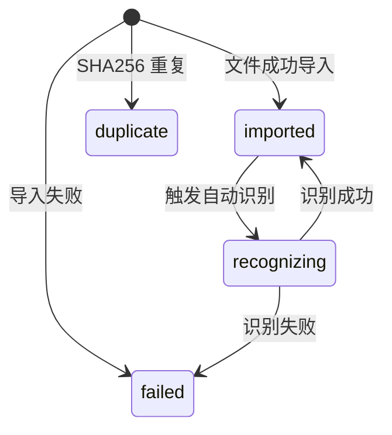

### 文件归档结构

导入的文件按年月目录归档：

```
raw/
├── 2026/
│   ├── 01/
│   │   ├── a1b2c3d4_original_name.pdf
│   │   └── e5f6g7h8_another_invoice.jpg
│   └── 06/
│       └── i9j0k1l2_june_invoice.png
```

文件名格式为 `{hash_prefix}_{original_name}`，通过 SHA256 哈希前 8 位避免冲突。

## 2. 识别流程

识别流程将原始发票文件转换为结构化数据，是票匣最核心的 AI 能力。

```mermaid
sequenceDiagram
    participant AS as AppState
    participant Doc as document/
    participant LLM as llm/
    participant API as LLM API
    participant EXT as extractor/
    participant EMB as embedding/
    participant DB as SQLite
    participant CH as chroma/

    Note over AS: spawn_recognition_task()
    AS->>DB: UPDATE import_jobs SET status = 'recognizing'

    alt PDF 文件
        AS->>Doc: render_pdf_pages(pdf_path)
        Note over Doc: 调用 pdftoppm<br/>逐页渲染为 PPM<br/>转为 JPEG
        Doc-->>AS: Vec&lt;RenderedPdfPage&gt;

        loop 每页
            AS->>Doc: prepare_image_for_recognition()
            Note over Doc: 缩放到合理尺寸<br/>标准化格式<br/>生成缩略图
            Doc-->>AS: PreparedImage

            AS->>LLM: recognize_invoice_with_retries()
            LLM->>API: POST /chat/completions
            Note over API: 多模态识别<br/>图片 Base64 + Prompt
            API-->>LLM: JSON 响应
            Note over LLM: 解析 + 置信度校验<br/>失败时重试（温度递增）

            LLM-->>AS: InvoiceRecognitionResult
            AS->>EXT: save_invoice_extraction()
            EXT->>DB: INSERT INTO invoices + invoice_items
        end
    else 图片文件
        AS->>Doc: prepare_image_for_recognition()
        Doc-->>AS: PreparedImage
        AS->>LLM: recognize_invoice_with_retries()
        LLM->>API: POST /chat/completions
        API-->>LLM: JSON 响应
        LLM-->>AS: InvoiceRecognitionResult
        AS->>EXT: save_invoice_extraction()
        EXT->>DB: INSERT INTO invoices + invoice_items
    end

    opt Embedding 已启用
        AS->>EXT: get_invoice_detail()
        EXT->>DB: 查询发票详情
        EXT-->>AS: InvoiceDetail
        AS->>EXT: invoice_to_embedding_text()
        Note over EXT: 拼接发票文本描述
        AS->>EMB: generate_embedding(engine, text)
        Note over EMB: ONNX Runtime 推理<br/>bge-small-zh-v1.5<br/>输出 384 维向量
        EMB-->>AS: EmbeddingResult
        AS->>CH: upsert_embedding(invoice_id, vector)
        CH->>DB: INSERT INTO invoice_embeddings
    end

    AS->>DB: UPDATE import_jobs SET status = 'imported'
    AS->>AS: app.emit("recognition-complete")
```

### LLM 识别详细流程

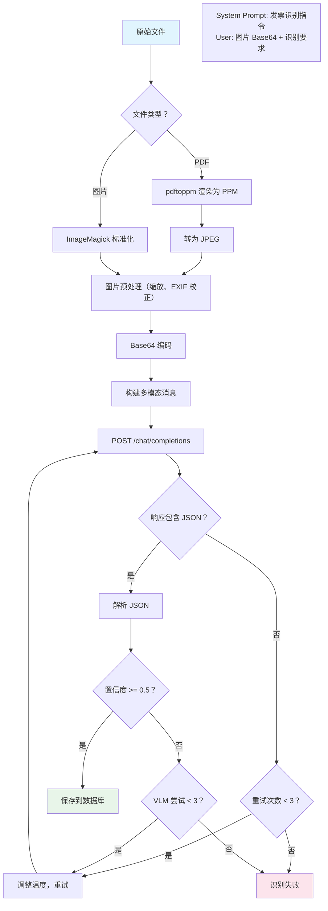

### 识别结果字段

LLM 返回的 JSON 包含以下结构化字段：

| 字段 | 类型 | 说明 |
|------|------|------|
| `invoice_type` | string | 发票类型（增值税普通发票、增值税专用发票等） |
| `invoice_code` | string | 发票代码 |
| `invoice_number` | string | 发票号码 |
| `issue_date` | string | 开票日期 |
| `seller_name` | string | 销售方名称 |
| `seller_tax_id` | string | 销售方纳税人识别号 |
| `buyer_name` | string | 购买方名称 |
| `buyer_tax_id` | string | 购买方纳税人识别号 |
| `total_amount` | string | 金额合计 |
| `tax_amount` | string | 税额 |
| `currency` | string | 币种（默认 CNY） |
| `category` | string | 消费类别 |
| `confidence` | number | 识别置信度（0-1） |
| `items` | array | 明细行列表 |
| `items[].name` | string | 项目名称 |
| `items[].quantity` | string | 数量 |
| `items[].unit_price` | string | 单价 |
| `items[].amount` | string | 金额 |

## 3. 搜索流程

票匣支持关键词搜索和语义搜索两种模式。

### 关键词搜索

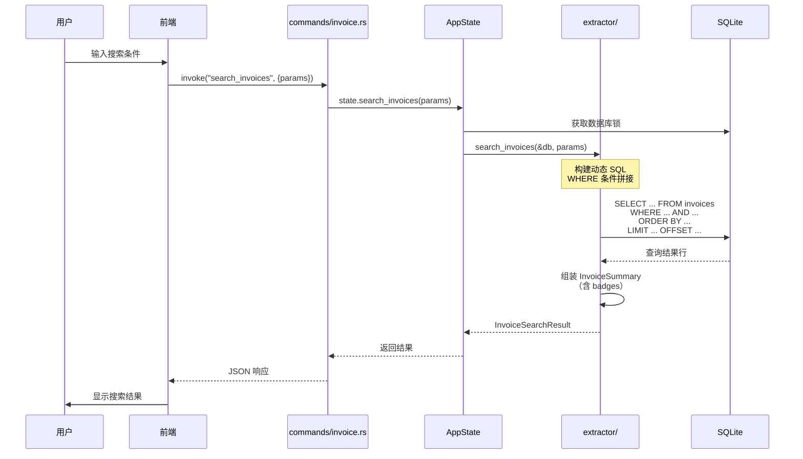

### 语义搜索

```mermaid
sequenceDiagram
    participant User as 用户
    participant FE as 前端
    participant Cmd as commands/semantic.rs
    participant AS as AppState
    participant EMB as embedding/
    participant CH as chroma/
    participant DB as SQLite

    User->>FE: 输入自然语言查询
    FE->>Cmd: invoke("search_invoices_semantic", {query, limit})
    Cmd->>AS: state.search_invoices_semantic(query, limit)
    AS->>AS: 检查 Embedding 已启用
    AS->>EMB: generate_embedding(engine, query)
    Note over EMB: ONNX 推理<br/>文本 → 384 维向量
    EMB-->>AS: EmbeddingResult
    AS->>DB: 获取数据库锁
    AS->>CH: query_similar(&db, &embedding, limit)
    Note over CH: 遍历 invoice_embeddings 表<br/>计算余弦相似度<br/>返回 Top-K 结果
    CH->>DB: SELECT invoice_id, embedding
    DB-->>CH: 向量数据
    CH-->>AS: Vec&lt;SimilarResult&gt;
    AS-->>Cmd: 返回结果
    Cmd-->>FE: JSON 响应
    FE->>User: 显示相似发票
```

### 余弦相似度计算

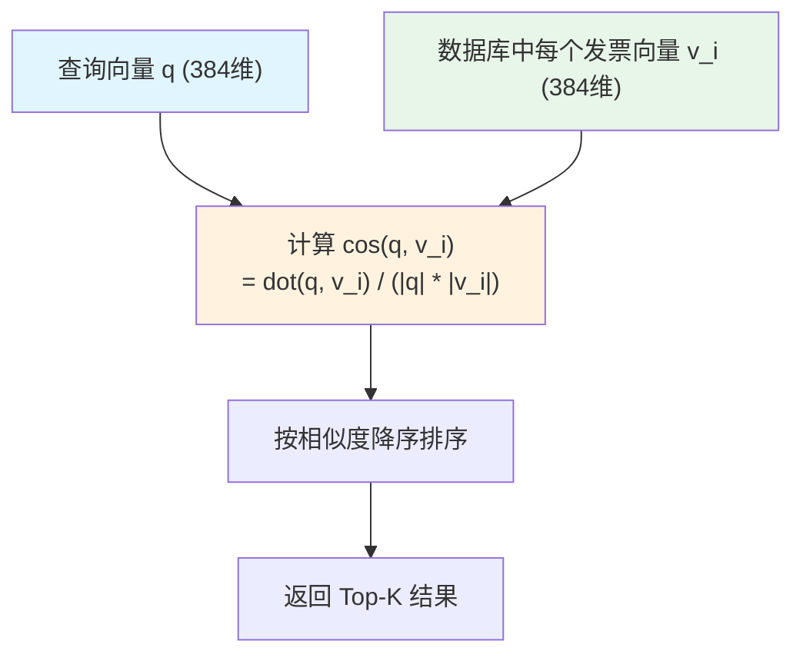

## 4. 导出流程

导出流程将发票数据转换为 CSV、Excel 或 PDF 格式的文件。

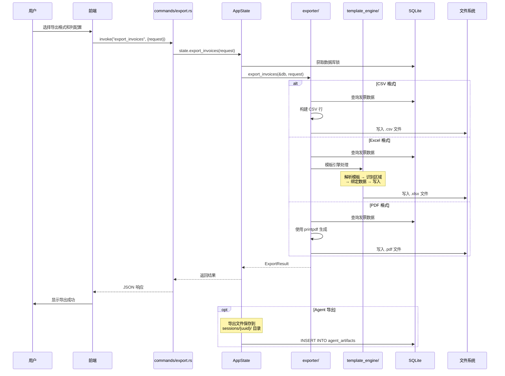

### Excel 模板引擎

票匣内置了一个自研的 Excel 模板引擎，支持格式保持导出：

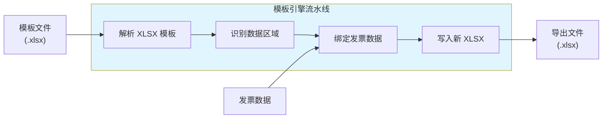

模板引擎通过以下子模块协作：

| 子模块 | 职责 |
|--------|------|
| `parser.rs` | 解析 XLSX 文件结构 |
| `ast.rs` | 构建抽象语法树 |
| `region.rs` | 识别数据填充区域 |
| `binder.rs` | 将数据绑定到模板 |
| `ir.rs` | 中间表示 |
| `plan.rs` | 执行计划 |
| `writer.rs` | 写入输出文件 |
| `cloner.rs` | 格式克隆（保持原始样式） |
| `strings.rs` | 字符串工具 |

## 5. Agent 对话流程

Agent 是票匣最复杂的数据流，涉及多轮对话、工具调用和流式响应。

### Agent 会话生命周期

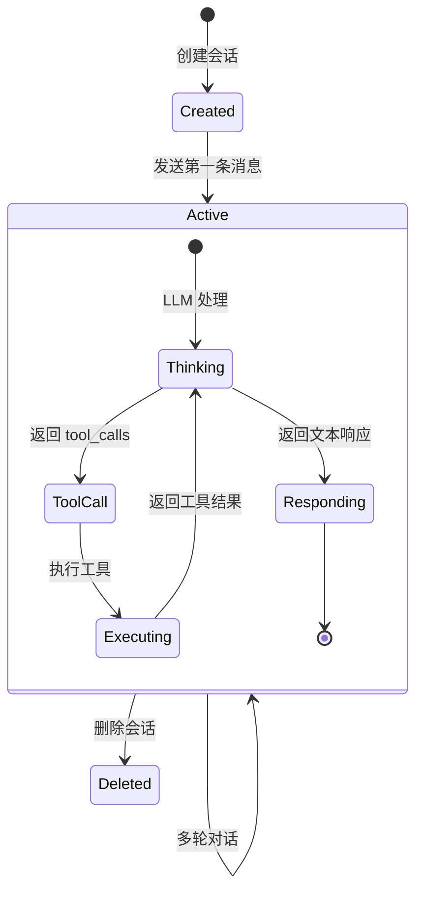

### 完整对话流程

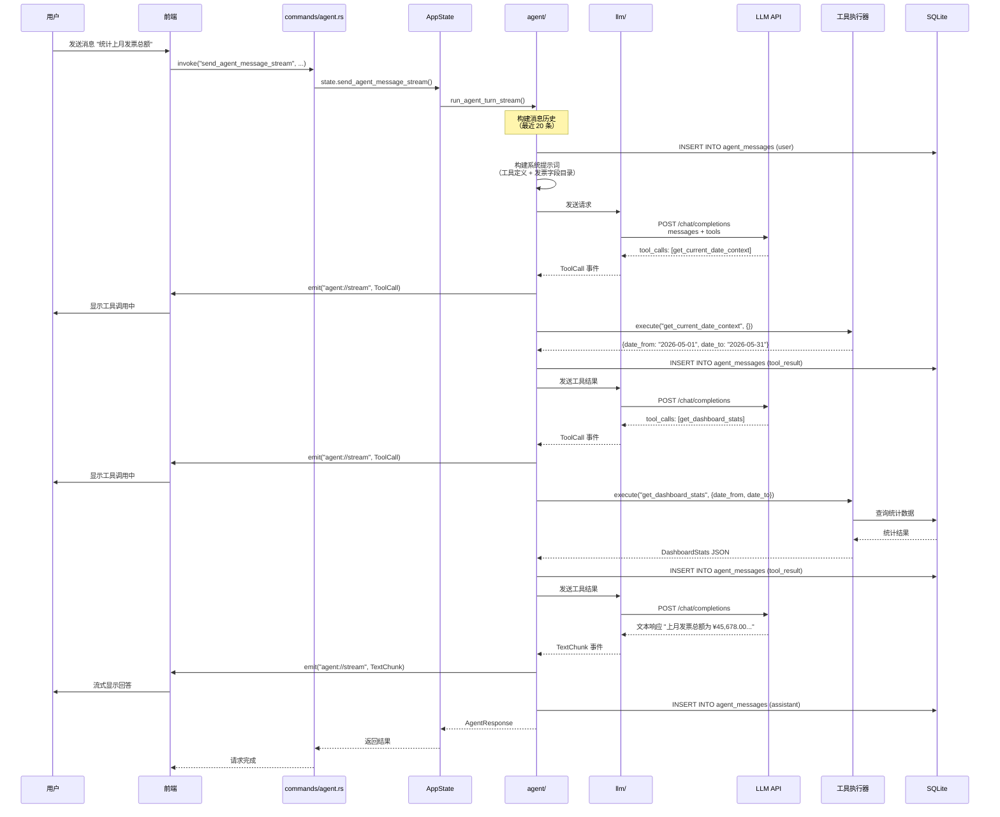

### Agent 工具集

Agent 可调用以下工具与发票数据交互：

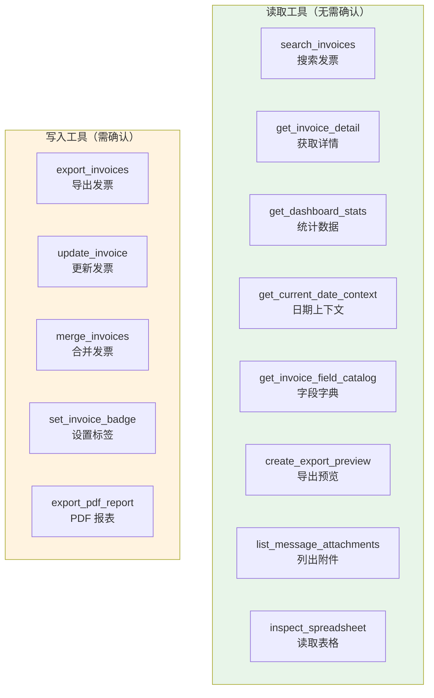

### 工具调用循环

Agent 的工具调用遵循一个循环，最多执行 20 次迭代：

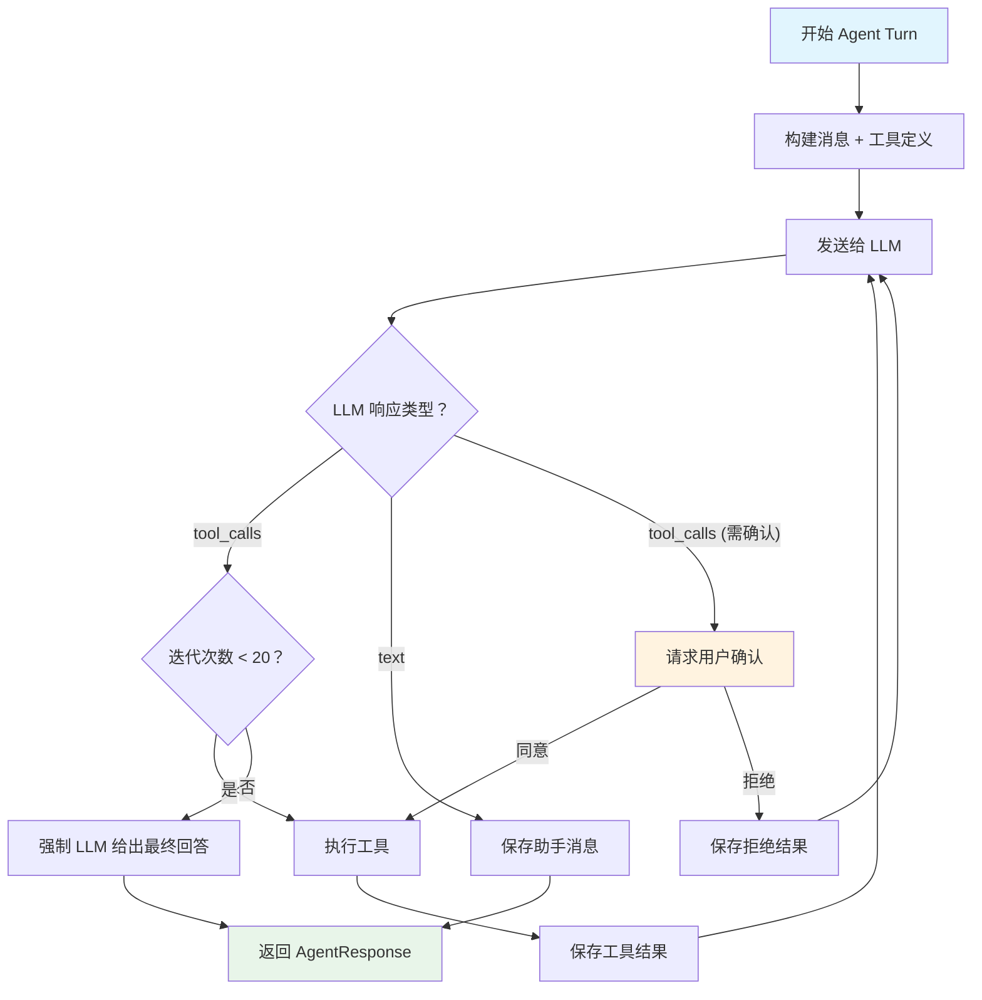

### 流式事件类型

Agent 通过 Tauri 事件系统实时推送以下事件给前端：

| 事件类型 | 说明 | 前端处理 |
|---------|------|---------|
| `TextChunk` | 文本响应的增量片段 | 追加显示到消息 |
| `ToolCall` | LLM 请求调用工具 | 显示工具调用卡片 |
| `ToolResult` | 工具执行完成 | 更新工具卡片状态 |
| `ConfirmRequest` | 需要用户确认的操作 | 显示确认对话框 |
| `Error` | 错误信息 | 显示错误提示 |
| `Done` | Agent Turn 完成 | 移除加载状态 |

## 数据流总结

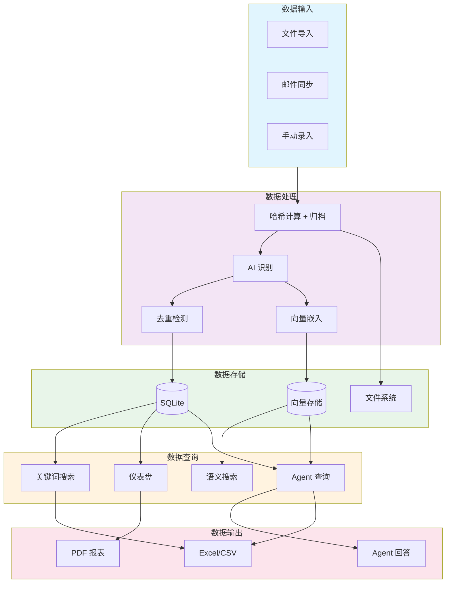
