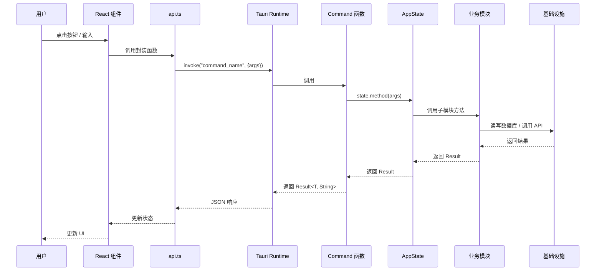
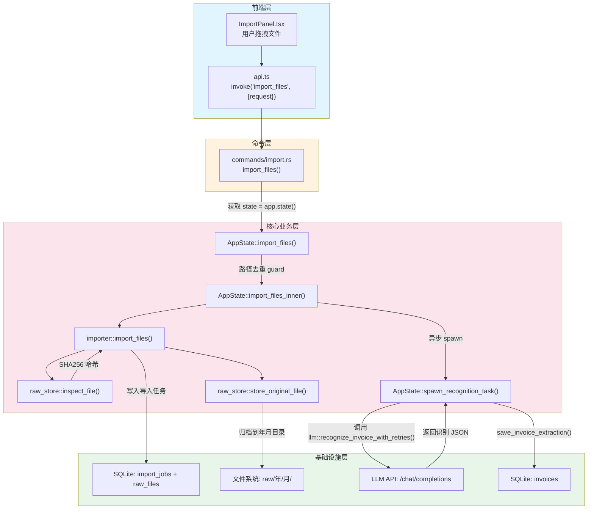
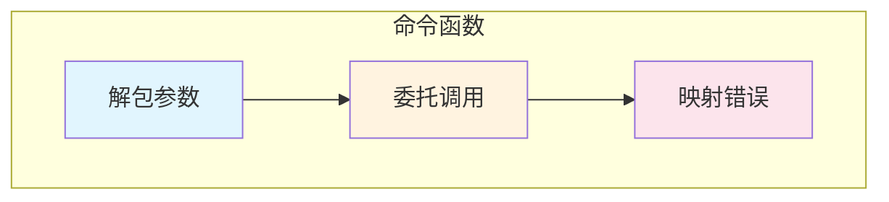
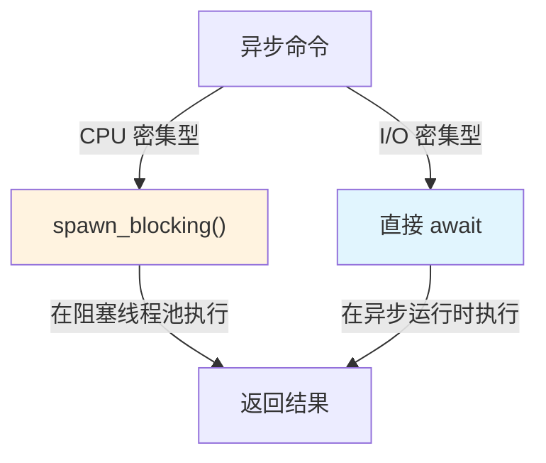
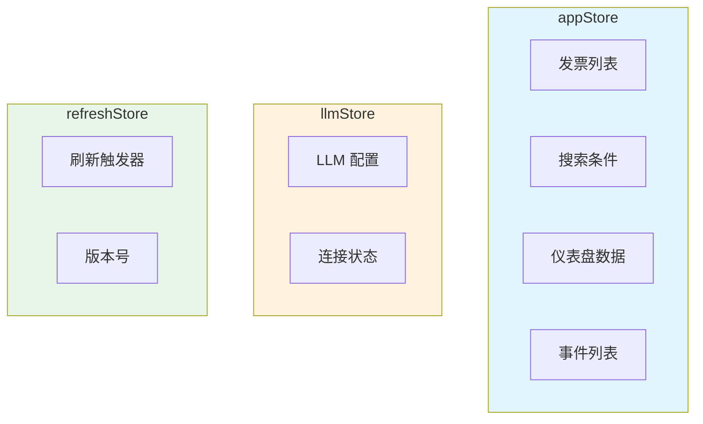
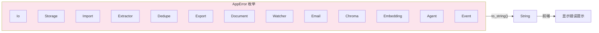
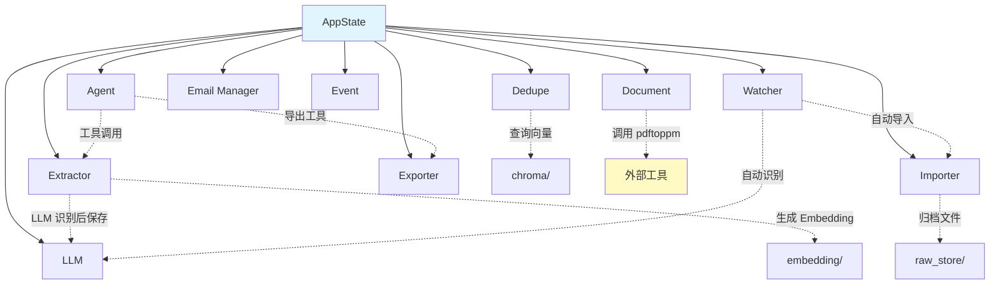
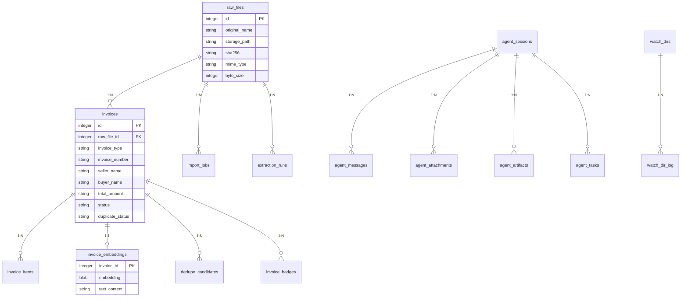
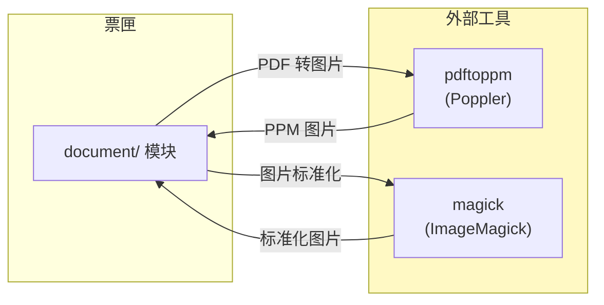

# 四层架构详解

本章深入讲解票匣四层架构中每一层的技术实现细节，以及命令如何从前端流转到后端。

## 命令流转：从前端到后端

当用户在界面上执行操作时，数据经过以下路径：



### 具体示例：导入文件

以下展示了从用户拖拽文件到发票识别完成的完整调用链：



## 薄壳命令模式

票匣的命令层遵循**薄壳（Thin Shell）模式**，每个命令函数只做三件事：

1. **解包参数**：从 Tauri 运行时接收序列化的参数
2. **委托调用**：获取 `AppState` 引用并调用对应方法
3. **映射错误**：将 `Result<T, AppError>` 转为 `Result<T, String>`



### 示例对比

**薄壳命令函数（commands/invoice.rs）：**

```rust
#[tauri::command]
pub fn search_invoices(
    state: State<'_, AppState>,
    params: InvoiceSearchParams,
) -> Result<InvoiceSearchResult, String> {
    state.search_invoices(params)
        .map_err(|err| err.to_string())
}
```

**AppState 方法（app_core/mod.rs）：**

```rust
impl AppState {
    pub fn search_invoices(
        &self,
        params: InvoiceSearchParams,
    ) -> Result<InvoiceSearchResult, AppError> {
        let db = self.db.lock().unwrap_or_else(|e| e.into_inner());
        Ok(search_invoices(&db, params)?)
    }
}
```

命令函数只有 4 行代码，不包含任何业务逻辑。所有搜索条件的处理、SQL 查询的构建都在 `extractor::search_invoices()` 中完成。

### 同步与异步命令

命令层的函数有两种模式：

| 模式 | Tauri 标记 | 适用场景 | 示例 |
|------|-----------|---------|------|
| 同步 | `#[tauri::command]` | 快速操作，不涉及网络请求 | 配置读写、数据库查询 |
| 异步 | `#[tauri::command] + async` | 涉及 I/O 等待的操作 | LLM 调用、文件选择对话框 |

异步命令有两种处理方式：



- **`spawn_blocking`**：用于 CPU 密集型操作（如文件导入、数据库查询），避免阻塞异步运行时
- **直接 await**：用于真正的异步 I/O（如 LLM API 调用、文件选择对话框）

## 前端层详解

### 技术栈

| 技术 | 版本 | 用途 |
|------|------|------|
| React | 19 | UI 框架 |
| TypeScript | 5.9 | 类型安全 |
| Vite | 7 | 构建工具和开发服务器 |
| Tailwind CSS | 4 | 原子化样式 |
| Zustand | 5 | 轻量级状态管理 |
| React Router | 7 | 页面路由 |
| Recharts | 3 | 图表组件 |
| Lucide React | 1 | 图标库 |
| Framer Motion | 12 | 动画 |
| Radix UI | - | 无障碍 UI 原语（Dialog、Tabs、Tooltip 等） |

### 状态管理

前端使用 Zustand 进行状态管理，分为三个 Store：



### Tauri 命令调用

前端通过 `api.ts` 封装所有 Tauri 命令调用：

```typescript
// api.ts 中的封装模式
import { invoke } from '@tauri-apps/api/core';

export async function importFiles(paths: string[]): Promise<ImportJobSummary[]> {
    return invoke('import_files', { request: { paths } });
}

export async function searchInvoices(params: InvoiceSearchParams): Promise<InvoiceSearchResult> {
    return invoke('search_invoices', { params });
}
```

## 命令层详解

### 模块组织

命令层的 13 个文件按功能领域划分，通过 `mod.rs` 的 `pub use` 统一导出：

```rust
// commands/mod.rs
mod agent;
mod config;
mod email;
mod event;
mod export;
mod import;
mod invoice;
mod recognize;
mod semantic;
mod util;
mod watcher;
mod window;

pub use agent::*;
pub use config::*;
// ... 所有模块 re-export
```

在 `lib.rs` 中，所有命令通过 `use commands::*` 引入，然后在 `tauri::generate_handler![]` 宏中注册：

```rust
.invoke_handler(tauri::generate_handler![
    import_files,
    list_invoices,
    search_invoices,
    // ... 107 个命令
])
```

### 错误处理模式

所有命令函数统一使用 `.map_err(|err| err.to_string())` 将内部错误转为字符串返回给前端：



`AppError` 使用 `thiserror` 宏定义，每个子模块的错误类型都实现了自动转换：

```rust
#[derive(Debug, thiserror::Error)]
pub enum AppError {
    #[error("storage error: {0}")]
    Storage(#[from] StorageError),
    #[error("import error: {0}")]
    Import(#[from] ImportError),
    // ... 13 个错误变体
}
```

## 核心业务层详解

### 模块依赖关系



### AppState 的角色

`AppState` 不仅是状态容器，更是业务逻辑的**统一门面（Facade）**。它：

1. 持有所有子系统的引用（数据库、配置、管理器、缓存）
2. 暴露所有业务操作的公共方法
3. 协调跨模块的操作（如导入后自动识别、更新后重新去重）
4. 管理缓存失效策略

详见[状态管理](./state-management.mdx)章节。

## 基础设施层详解

### 数据库 Schema

票匣使用 SQLite，当前有 4 个迁移版本。主要表结构：



### 向量存储

向量存储直接使用 SQLite 的 `invoice_embeddings` 表，而非外部向量数据库：

| 字段 | 类型 | 说明 |
|------|------|------|
| `invoice_id` | INTEGER | 关联发票 ID |
| `embedding` | BLOB | 384 维 float32 向量，以二进制存储 |
| `text_content` | TEXT | 用于生成 Embedding 的文本 |

相似度查询通过 Rust 代码实现余弦相似度计算，遍历所有向量与查询向量比较。

### 外部工具依赖

票匣依赖两个外部命令行工具：



- **pdftoppm**：将 PDF 文件逐页渲染为 PPM 格式图片，再转为 JPEG
- **magick (ImageMagick)**：图片格式标准化、EXIF 方向校正、缩放

票匣在 Windows 安装包中内置了这两个工具的预编译二进制，Linux 上需用户自行安装。
