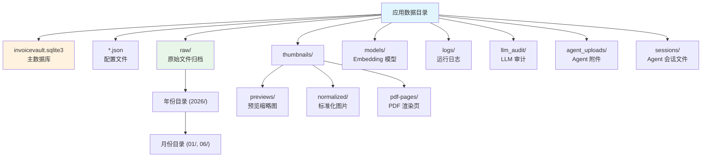

# 架构概览

InvoiceVault 采用经典的**四层架构**设计，将前端 UI、Tauri 命令桥接、核心业务逻辑和基础设施清晰分层。这种设计使得各层职责明确、耦合度低，便于独立开发和测试。

## 四层架构总览

```mermaid
graph TB
    subgraph Frontend["前端层 (Frontend)"]
        React["React 19 + TypeScript"]
        Pages["页面组件<br/>InvoicesPage / ImportPage / AgentPage / DashboardPage"]
        Stores["状态管理 (Zustand)<br/>appStore / llmStore / refreshStore"]
        API["API 调用层 (api.ts)<br/>@tauri-apps/api invoke()"]
    end

    subgraph Commands["Tauri 命令层 (Command Layer)"]
        CmdMod["commands/ 模块<br/>13 个领域文件，107 个命令"]
        Window["window.rs"]
        Import["import.rs"]
        Invoice["invoice.rs"]
        Recognize["recognize.rs"]
        ExportCmd["export.rs"]
        AgentCmd["agent.rs"]
        ConfigCmd["config.rs"]
        WatcherCmd["watcher.rs"]
        EmailCmd["email.rs"]
        Semantic["semantic.rs"]
        EventCmd["event.rs"]
        UtilCmd["util.rs"]
    end

    subgraph Core["核心业务层 (Core Business)"]
        AppState["AppState<br/>全局状态中心"]
        Extractor["extractor/<br/>发票数据提取与 CRUD"]
        Importer["importer/<br/>文件导入"]
        Dedupe["dedupe/<br/>去重检测"]
        Exporter["exporter/<br/>导出"]
        AgentMod["agent/<br/>Agent 会话与工具"]
        LLM["llm/<br/>LLM 客户端"]
        TemplateEngine["template_engine/<br/>Excel 模板引擎"]
        Watcher["watcher/<br/>目录监听"]
        Email["email_manager/<br/>邮件同步"]
        Event["event/<br/>事件记录"]
        Document["document/<br/>PDF/图片处理"]
    end

    subgraph Infra["基础设施层 (Infrastructure)"]
        SQLite["SQLite (rusqlite)<br/>invoicevault.sqlite3"]
        VecStore["向量存储<br/>invoice_embeddings 表<br/>余弦相似度查询"]
        ONNX["ONNX Runtime<br/>bge-small-zh-v1.5<br/>384 维向量"]
        Moka["Moka TTL 缓存<br/>仪表盘 / LLM 用量"]
        Tracing["tracing<br/>结构化日志"]
        Reqwest["Reqwest<br/>HTTP 客户端"]
        NotifyLib["notify<br/>文件系统监听"]
        RawStore["raw_store/<br/>原始文件归档"]
        Storage["storage/<br/>数据库迁移"]
    end

    Frontend -->|"invoke()"| Commands
    Commands -->|"state.method()"| Core
    Core -->|"读写数据"| Infra

    style Frontend fill:#e1f5fe
    style Commands fill:#fff3e0
    style Core fill:#fce4ec
    style Infra fill:#e8f5e9
```



## 各层职责一览

| 层 | 技术 | 职责 |
|----|------|------|
| **前端层** | React 19 + TypeScript + Zustand | UI 渲染、用户交互、状态管理 |
| **命令层** | Tauri Commands (107 个) | 参数解包、委托到核心层、错误映射 |
| **核心业务层** | Rust + AppState | 业务逻辑、数据处理、AI 调用 |
| **基础设施层** | SQLite + ONNX + 文件系统 | 数据持久化、向量计算、文件存储 |

## 各层职责详解

### 前端层

前端层负责 UI 渲染和用户交互，技术栈为 React 19 + TypeScript + Vite + Tailwind CSS。

**主要模块：**

| 目录/文件 | 说明 |
|-----------|------|
| `src/components/` | React 组件（页面、表单、对话框等） |
| `src/stores/` | Zustand 状态管理（appStore、llmStore、refreshStore） |
| `src/api.ts` | Tauri invoke 命令调用封装 |
| `src/types.ts` | TypeScript 类型定义 |
| `src/hooks/` | 自定义 React Hooks（useAppInitializer、useNavigateToInvoice） |

**关键页面组件：**

- `ImportPage` - 文件导入页面
- `InvoicesPage` - 发票列表与搜索页面
- `InvoiceDetail` - 发票详情编辑页面
- `DashboardPage` - 统计仪表盘页面
- `AgentPage` - Agent 对话页面
- `SettingsPage` - 设置页面（含子页面：AiProviderPage、GeneralPage、AdvancedPage）

前端通过 `@tauri-apps/api` 的 `invoke()` 函数调用后端命令，数据以 JSON 格式在前后端之间传递。

### Tauri 命令层

命令层是前端与后端之间的**薄壳桥接层**，位于 `src-tauri/src/commands/` 目录。它按功能领域拆分为 13 个子模块，共注册 107 个 Tauri 命令。

| 文件 | 职责 | 命令数 |
|------|------|--------|
| `window.rs` | 窗口操作（拖拽、最小化、最大化、关闭、位置） | 6 |
| `import.rs` | 文件导入与拖拽处理 | 6 |
| `invoice.rs` | 发票 CRUD、搜索、标签、去重 | 18 |
| `recognize.rs` | 发票识别与 LLM 连接测试 | 3 |
| `export.rs` | CSV/Excel/PDF 导出 | 4 |
| `agent.rs` | Agent 会话管理与消息发送 | 17 |
| `config.rs` | LLM、Embedding、标签、价格、日志等配置 | 18 |
| `watcher.rs` | 目录监听管理 | 5 |
| `email.rs` | 邮件源管理与同步 | 7 |
| `semantic.rs` | 语义搜索与 Embedding | 5 |
| `event.rs` | 事件记录查询 | 5 |
| `util.rs` | 工具函数（健康检查、版本、备份、清理等） | 10 |

每个命令函数使用 `#[tauri::command]` 宏标记，通过 Tauri 的状态管理机制获取 `AppState` 实例，然后委托给 `AppState` 的方法执行实际逻辑。

### 核心业务层

核心业务层是票匣的**心脏**，包含所有业务逻辑。`AppState` 是核心业务层的**统一入口**，持有数据库连接、配置、各管理器实例和缓存。

**主要业务模块：**

| 模块 | 核心职责 |
|------|---------|
| `extractor/` | 发票数据的解析、校验、持久化，以及搜索、更新、删除、合并、标签管理 |
| `importer/` | 文件导入流程：路径解析、哈希计算、去重、归档、创建导入任务 |
| `dedupe/` | 重复发票检测：字段精确匹配 + 加权模糊匹配 + 语义向量相似度 |
| `exporter/` | CSV/Excel/PDF 多格式导出，列配置管理 |
| `agent/` | Agent 会话管理、工具定义、消息处理、工具调用循环、流式响应 |
| `llm/` | OpenAI 兼容 API 客户端，发票识别、连接测试、审计日志 |
| `template_engine/` | Excel 模板解析、区域识别、数据绑定、格式保持导出 |
| `watcher/` | 基于 `notify` 库的文件系统监听，文件稳定性检测 |
| `email_manager/` | IMAP/POP3 邮件源管理，邮件同步与附件提取 |
| `event/` | 系统事件记录（导入、识别、配置变更等） |
| `document/` | PDF 渲染（调用 pdftoppm）、图片预处理、EXIF 校正 |

### 基础设施层

基础设施层提供底层的技术能力，被核心业务层直接使用。

| 组件 | 技术 | 说明 |
|------|------|------|
| 关系数据库 | SQLite (rusqlite) | 存储发票、导入任务、事件、Agent 会话等所有结构化数据 |
| 向量存储 | SQLite (invoice_embeddings 表) | 存储 384 维 Embedding 向量，支持余弦相似度查询 |
| ONNX 推理 | ONNX Runtime | 本地运行 bge-small-zh-v1.5 模型生成文本向量 |
| HTTP 客户端 | Reqwest | 调用 OpenAI 兼容 API |
| 文件监听 | notify | 跨平台文件系统事件监听 |
| 原始文件存储 | raw_store/ | SHA256 哈希计算、按年月目录归档 |
| 数据库迁移 | storage/ | 版本化 schema 迁移，幂等安全（当前 4 个迁移版本） |
| 缓存 | Moka (TTL) | 仪表盘统计和 LLM 用量缓存（60 秒 TTL，最大 8 条） |
| 日志 | tracing + tracing-subscriber | 结构化日志，按天滚动文件输出 |
| 序列化 | Serde + serde_json | JSON 序列化/反序列化 |
| 错误处理 | thiserror | 类型安全的错误枚举 |
| 异步运行时 | Tokio | 异步任务调度 |

## 关键设计决策

1. **AppState 中心化**：所有子系统通过 `AppState` 统一管理，命令层通过 Tauri 的 `state::<AppState>()` 获取引用
2. **薄壳命令层**：命令函数只做参数解包和错误映射，不做业务判断
3. **Mutex 共享**：数据库连接和可变状态使用 `Arc<Mutex<T>>` 实现线程安全共享
4. **事件驱动**：长时间任务（识别、导入）通过 Tauri 事件通知前端更新
5. **本地优先**：所有数据存储在本地 SQLite，Embedding 推理在本地 ONNX 完成
6. **渐进增强**：Embedding、语义搜索、Agent 等功能可独立启用/禁用

## 数据目录结构



## 代码组织

```
src-tauri/src/
├── main.rs                    # 应用入口
├── lib.rs                     # 库入口，模块声明与 run() 函数（注册 107 个命令）
├── app_core/                  # 核心业务模块
│   ├── mod.rs                 # AppState 定义与方法（约 2200 行）
│   ├── config.rs              # 配置读写工具
│   ├── constants.rs           # 全局常量（超时、路径、模型参数、限制）
│   ├── paths.rs               # 路径管理 (AppPaths)
│   ├── archive.rs             # ZIP 归档工具
│   ├── fs_utils.rs            # 文件系统工具
│   └── template_adapter.rs    # 模板引擎适配器
├── commands/                  # Tauri 命令层（13 个文件）
│   ├── mod.rs
│   ├── agent.rs / config.rs / email.rs / event.rs
│   ├── export.rs / import.rs / invoice.rs
│   ├── recognize.rs / semantic.rs / util.rs
│   └── watcher.rs / window.rs
├── agent/                     # Agent 会话与工具调用
├── llm/                       # LLM 客户端
├── extractor/                 # 发票数据提取与 CRUD
├── importer/                  # 文件导入
├── exporter/                  # 数据导出
├── dedupe/                    # 去重检测
├── chroma/                    # 向量存储
├── embedding/                 # 本地 Embedding 引擎
├── document/                  # PDF/图片处理
├── template_engine/           # Excel 模板引擎（9 个文件）
├── watcher/                   # 目录监听
├── email_manager.rs           # 邮件同步
├── event.rs                   # 事件记录
├── raw_store/                 # 原始文件存储
├── storage/                   # 数据库迁移
├── mcp/                       # MCP Server
├── scnet_ocr.rs               # SCNet OCR 集成
├── diag.rs                    # 诊断工具
└── bin/
    └── mcp_server.rs          # MCP Server 独立二进制
```
