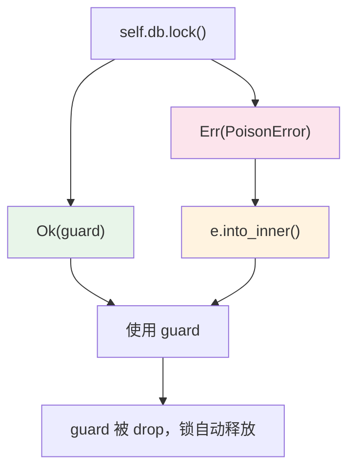
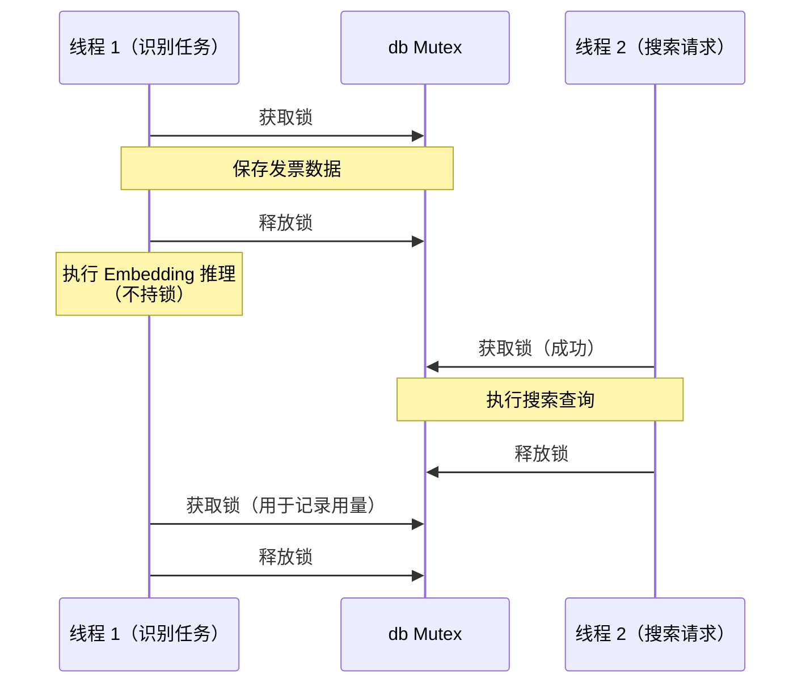
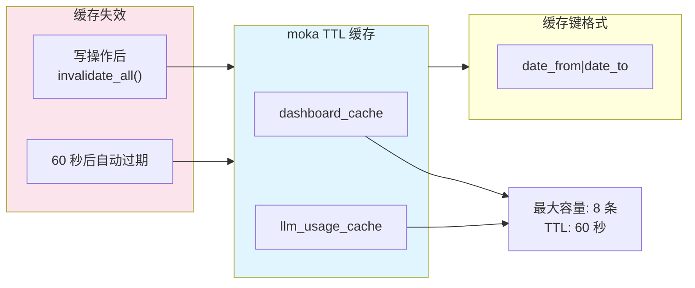
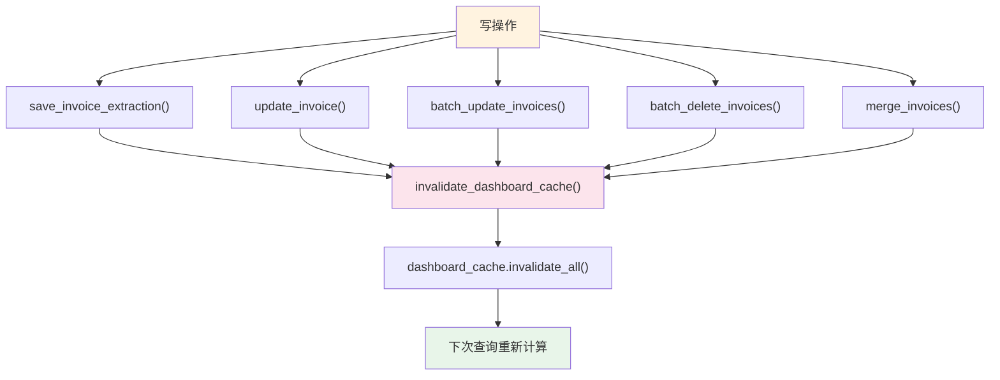
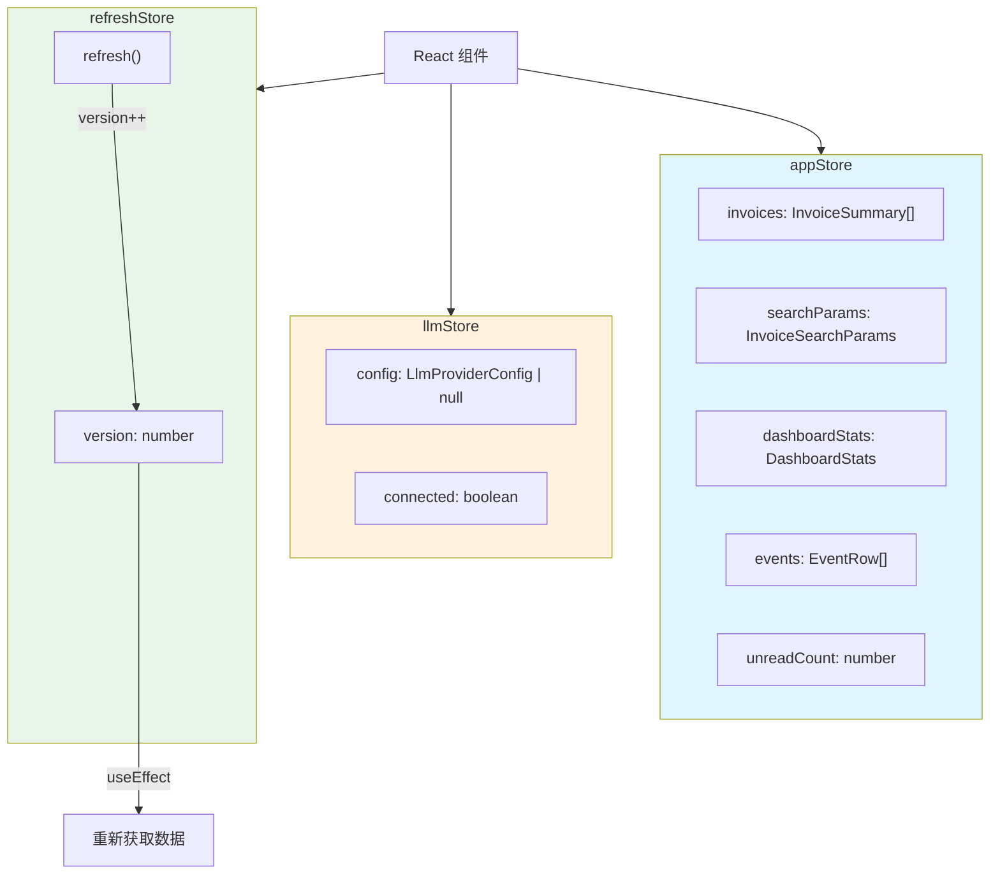
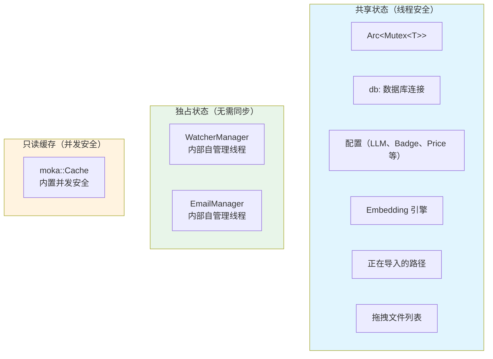

# 状态管理

票匣的状态管理以 `AppState` 为核心，通过 Tauri 的依赖注入机制分发给所有命令处理器。本章详细讲解 `AppState` 的结构、Mutex 使用模式、配置持久化和缓存策略。

## AppState：全局状态中心

```mermaid
graph TB
    subgraph Tauri["Tauri Runtime"]
        Manage["app.manage(state)"]
        Inject["state::&lt;AppState&gt;()"]
    end

    subgraph AppState["AppState"]
        direction TB
        AppHandle["app_handle: AppHandle"]
        Paths["paths: AppPaths"]
        DB["db: Arc&lt;Mutex&lt;Connection&gt;&gt;"]
        WatcherMgr["watcher_manager: WatcherManager"]
        EmailMgr["email_manager: EmailManager"]
        ChromaCfg["chroma_config: Mutex&lt;ChromaConfig&gt;"]
        LocalEmb["local_embedding: Arc&lt;Mutex&lt;Option&lt;LocalEmbeddingEngine&gt;&gt;&gt;"]
        EmbEnabled["embedding_enabled: Mutex&lt;bool&gt;"]
        BadgeCfg["badge_config: Arc&lt;Mutex&lt;BadgeConfig&gt;&gt;"]
        PriceCfg["price_config: Arc&lt;Mutex&lt;PriceConfig&gt;&gt;"]
        LlmCfg["llm_config: Arc&lt;Mutex&lt;Option&lt;LlmProviderConfig&gt;&gt;&gt;"]
        LlmAudit["llm_audit_enabled: Arc&lt;Mutex&lt;bool&gt;&gt;"]
        Importing["importing_paths: Arc&lt;Mutex&lt;HashSet&lt;String&gt;&gt;&gt;"]
        Dashboard["dashboard_cache: moka::Cache"]
        LlmUsage["llm_usage_cache: moka::Cache"]
        Dropped["pending_dropped_files: Arc&lt;Mutex&lt;Vec&lt;String&gt;&gt;&gt;"]
    end

    Manage --> AppState
    Inject --> AppState

    style AppState fill:#e1f5fe
    style Tauri fill:#fff3e0
```

`AppState` 是整个应用的**单一状态容器**，持有所有子系统的引用。它在应用启动时初始化，通过 `app.manage(state)` 注册到 Tauri 的状态管理系统中，所有命令函数都可以通过 `state::<AppState>()` 获取引用。



### AppState 字段详解

| 字段 | 类型 | 说明 |
|------|------|------|
| `app_handle` | `AppHandle` | Tauri 应用句柄，用于访问路径、窗口和事件系统 |
| `paths` | `AppPaths` | 应用数据目录下的所有路径集合 |
| `db` | `Arc<Mutex<Connection>>` | SQLite 数据库连接，所有数据库操作通过此连接 |
| `watcher_manager` | `WatcherManager` | 目录监听管理器，管理所有监听任务 |
| `email_manager` | `EmailManager` | 邮件同步管理器，管理所有邮件源 |
| `chroma_config` | `Mutex<ChromaConfig>` | 向量存储配置（是否启用） |
| `local_embedding` | `Arc<Mutex<Option<LocalEmbeddingEngine>>>` | 本地 Embedding 引擎实例（延迟加载） |
| `embedding_enabled` | `Mutex<bool>` | Embedding 功能开关 |
| `badge_config` | `Arc<Mutex<BadgeConfig>>` | 自定义标签配置 |
| `price_config` | `Arc<Mutex<PriceConfig>>` | LLM 调用价格配置 |
| `llm_config` | `Arc<Mutex<Option<LlmProviderConfig>>>` | LLM 服务配置 |
| `llm_audit_enabled` | `Arc<Mutex<bool>>` | LLM 审计开关 |
| `importing_paths` | `Arc<Mutex<HashSet<String>>>` | 正在导入的路径集合（防并发重复导入） |
| `dashboard_cache` | `moka::sync::Cache` | 仪表盘统计缓存 |
| `llm_usage_cache` | `moka::sync::Cache` | LLM 用量统计缓存 |
| `pending_dropped_files` | `Arc<Mutex<Vec<String>>>` | 拖拽到窗口的文件路径暂存 |

## Tauri 状态注入机制

Tauri 2 提供了内置的依赖注入系统。票匣在 `setup` 阶段初始化 `AppState` 并注册：

```mermaid
sequenceDiagram
    participant Main as main.rs / lib.rs
    participant Setup as Tauri setup()
    participant AS as AppState
    participant DB as SQLite
    participant FS as 文件系统

    Main->>Setup: tauri::Builder::default().setup()
    Setup->>FS: 创建数据目录
    Setup->>DB: 打开数据库 + 运行迁移
    Setup->>AS: AppState::initialize(app)
    AS->>AS: 加载所有 JSON 配置
    AS->>AS: 创建 WatcherManager
    AS->>AS: 创建 EmailManager
    AS->>AS: 创建 moka 缓存
    AS-->>Setup: 返回 AppState
    Setup->>Setup: app.manage(state)
    Note over Setup: 此后所有命令可通过<br/>state::&lt;AppState&gt;() 获取
    Setup->>Setup: setup_tray()
    Setup->>Setup: 恢复目录监听
    Setup->>Setup: 后台生成缺失缩略图
    Setup->>Setup: 后台下载 Embedding 模型
```

命令函数通过 Tauri 的 `State` 参数自动注入：

```rust
#[tauri::command]
pub fn list_invoices(state: State<'_, AppState>) -> Result<Vec<InvoiceSummary>, String> {
    // state 自动注入，无需手动获取
    state.list_invoices().map_err(|err| err.to_string())
}
```

有些命令需要同时访问 `AppState` 和 `AppHandle`（用于事件发射或窗口操作）：

```rust
#[tauri::command]
pub async fn import_files(
    app: AppHandle,          // Tauri 应用句柄
    request: ImportRequest,
) -> Result<Vec<ImportJobSummary>, String> {
    tauri::async_runtime::spawn_blocking(move || {
        let state = app.state::<AppState>();  // 从 AppHandle 获取状态
        state.import_files(request.paths, &app)
            .map_err(|err| err.to_string())
    })
    .await
    .map_err(|err| err.to_string())?
}
```

## Mutex 使用模式

票匣大量使用 `Arc<Mutex<T>>` 实现线程安全的共享状态。这是因为 Tauri 的命令可能在不同线程中并发执行。

### 基本模式

```rust
// 获取锁，中毒时自动恢复
let guard = self.db.lock().unwrap_or_else(|e| e.into_inner());
```

### Mutex 中毒恢复

当一个线程在持有锁时发生 panic，锁会进入"中毒"（poisoned）状态。后续所有 `lock()` 调用都会返回 `Err`。

票匣统一使用 `unwrap_or_else(|e| e.into_inner())` 模式来恢复中毒的锁：



这种模式确保即使某个操作 panic 了，其他操作仍然可以继续工作，而不是级联崩溃。

### 锁的持有时间

票匣在设计时注意控制锁的持有时间，避免长时间持锁导致其他线程阻塞：



关键设计：在进行 ONNX 推理（可能耗时数秒）之前释放数据库锁，避免阻塞其他数据库操作。

## 配置持久化

票匣的所有配置以 JSON 文件形式存储在应用数据目录下，采用**内存 + 文件**双重存储策略。

### 读写流程

```mermaid
graph TD
    subgraph 读取["启动时读取"]
        Init["AppState::initialize()"]
        Init --> LoadDB["load_config_raw(&app_data_dir, 'llm_config.json')"]
        LoadDB --> Deserialize["serde_json::from_str()"]
        Deserialize --> Memory["存入 Arc&lt;Mutex&lt;T&gt;&gt;"]
    end

    subgraph 写入["用户修改时写入"]
        Set["set_llm_config(config)"]
        Set --> UpdateMem["更新内存中的值"]
        UpdateMem --> WriteFile["write_config(&app_data_dir, 'llm_config.json', &config)"]
        WriteFile --> Serialize["serde_json::to_string_pretty()"]
        Serialize --> Disk["写入磁盘文件"]
    end

    style 读取 fill:#e1f5fe
    style 写入 fill:#e8f5e9
```



### 配置文件列表

| 文件 | Rust 类型 | 内存字段 | 说明 |
|------|----------|---------|------|
| `llm_config.json` | `LlmProviderConfig` | `llm_config` | LLM API 连接信息 |
| `embedding_enabled.json` | `serde_json::Value` | `embedding_enabled` | Embedding 开关 |
| `badge_config.json` | `BadgeConfig` | `badge_config` | 自定义标签配置 |
| `price_config.json` | `PriceConfig` | `price_config` | LLM 价格配置 |
| `audit_config.json` | `serde_json::Value` | `llm_audit_enabled` | 审计开关 |
| `log_config.json` | `serde_json::Value` | - | 日志级别（仅启动时读取） |
| `window_state.json` | `WindowSizeState` | - | 窗口尺寸（窗口事件时写入） |
| `diagnostic_config.json` | - | - | 诊断配置 |

### 配置读写工具

配置的读写通过两个通用工具函数完成：

```rust
// 读取配置
pub fn load_config_raw<T: DeserializeOwned>(
    app_data_dir: &Path,
    filename: &str,
) -> Option<T> {
    let path = app_data_dir.join(filename);
    let json = std::fs::read_to_string(&path).ok()?;
    serde_json::from_str(&json).ok()
}

// 写入配置
pub fn write_config<T: Serialize>(
    app_data_dir: &Path,
    filename: &str,
    value: &T,
) -> Result<(), std::io::Error> {
    let json = serde_json::to_string_pretty(value)?;
    std::fs::write(app_data_dir.join(filename), json)
}
```

`load_config_raw` 返回 `Option<T>`，文件不存在或解析失败时返回 `None`，使用默认值。

## 缓存策略

票匣使用 `moka` 库实现高性能的 TTL（Time-To-Live）缓存，主要用于两个频繁查询但不经常变化的统计接口。

### 缓存配置



### 缓存键生成

```rust
fn cache_key(date_from: &Option<String>, date_to: &Option<String>) -> String {
    format!("{}|{}",
        date_from.as_deref().unwrap_or(""),
        date_to.as_deref().unwrap_or("")
    )
}
```

不同的日期范围组合生成不同的缓存键，同一日期范围的查询在 60 秒内直接返回缓存结果。

### 缓存失效

当发票数据发生变化时，缓存被主动失效：



:::note 设计考量
使用 `invalidate_all()` 而非精确失效，是因为写操作可能影响多个日期范围的统计结果，全量失效更安全。缓存容量仅 8 条，重建成本很低。
:::

## 前端状态管理

前端使用 Zustand 进行状态管理，与后端的 `AppState` 互相配合。

### Zustand Store



### 前后端状态协作

```mermaid
sequenceDiagram
    participant UI as 前端组件
    participant Store as Zustand Store
    participant API as api.ts
    participant State as AppState
    participant Event as Tauri Event

    UI->>Store: 触发刷新
    Store->>API: invoke("list_invoices")
    API->>State: state.list_invoices()
    State-->>API: Vec&lt;InvoiceSummary&gt;
    API-->>Store: 更新 invoices
    Store-->>UI: 重新渲染

    Note over State: 后台识别完成
    State->>Event: app.emit("recognition-complete")
    Event-->>UI: 收到事件
    UI->>Store: 触发刷新
```

前端通过 Tauri 事件系统接收后端的异步通知（如识别完成、导入完成），然后主动刷新数据。

## 线程安全设计总结



| 状态类型 | 同步机制 | 说明 |
|---------|---------|------|
| 数据库连接 | `Arc<Mutex<Connection>>` | 所有数据库操作通过同一连接 |
| 配置 | `Arc<Mutex<T>>` | 读写都需要获取锁 |
| Embedding 引擎 | `Arc<Mutex<Option<T>>>` | 延迟加载，未加载时为 None |
| WatcherManager | 内部自管理 | 使用内部 `Mutex` 和原子标志 |
| EmailManager | 内部自管理 | 类似 WatcherManager |
| moka 缓存 | 内置并发安全 | 无需外部 `Mutex` |
