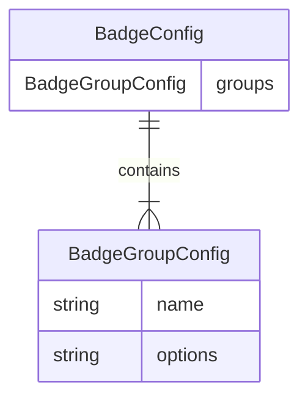

# 标签（Badge）配置

标签系统允许用户为发票添加自定义分类标记。每个标签由 **分组（Group）** 和 **选项（Option）** 两级结构组成，用户可以灵活定义自己的标签体系。

## BadgeConfig 结构

标签配置通过 `BadgeConfig` 结构体管理，定义在 `src-tauri/src/extractor/mod.rs` 中：

```rust
pub struct BadgeConfig {
    pub groups: Vec<BadgeGroupConfig>,
}

pub struct BadgeGroupConfig {
    pub name: String,        // 分组名称，如 "报销状态"
    pub options: Vec<String>, // 该分组下的可选值列表
}
```

### 数据模型



## 配置示例

以下是一个典型的标签配置示例：

```json
{
  "groups": [
    {
      "name": "报销状态",
      "options": ["未报销", "已报销", "报销中", "无需报销"]
    },
    {
      "name": "费用类型",
      "options": ["差旅", "餐饮", "办公用品", "交通", "通讯", "其他"]
    },
    {
      "name": "优先级",
      "options": ["普通", "重要", "紧急"]
    },
    {
      "name": "项目归属",
      "options": ["项目A", "项目B", "项目C", "通用"]
    }
  ]
}
```

每个发票在每个分组中最多选择一个选项（单选模式）。分组之间相互独立。

## Tauri 命令

| 命令 | 参数 | 返回值 | 说明 |
|------|------|--------|------|
| `get_badge_config` | 无 | `BadgeConfig` | 读取当前标签配置 |
| `set_badge_config` | `config: BadgeConfig` | `()` | 保存标签配置 |
| `set_invoice_badge` | `invoice_id`, `group_name`, `value` | `Vec<InvoiceBadgeSelection>` | 为发票设置/清除标签 |

### 为发票设置标签

```rust
set_invoice_badge(
    invoice_id: i64,       // 发票 ID
    group_name: String,    // 分组名称
    value: Option<String>  // 选项值，None 表示清除该分组的标签
) -> Vec<InvoiceBadgeSelection>
```

返回值是该发票当前所有标签的完整列表。

## 配置清理

保存标签配置时，系统会自动执行清理（`sanitize_badge_config`），处理以下情况：

1. **空白分组名**：跳过名称为空或仅含空白字符的分组
2. **空白选项**：跳过选项值为空或仅含空白字符的条目
3. **重复选项**：同一分组内的重复选项会被去重
4. **重复分组**：相同名称的分组只保留第一个

## 数据库存储

标签数据存储在 `invoice_badges` 表中：

```sql
CREATE TABLE invoice_badges (
    invoice_id INTEGER NOT NULL,
    group_name TEXT NOT NULL,
    value TEXT NOT NULL,
    created_at TEXT NOT NULL DEFAULT CURRENT_TIMESTAMP,
    updated_at TEXT NOT NULL DEFAULT CURRENT_TIMESTAMP,
    PRIMARY KEY (invoice_id, group_name),
    FOREIGN KEY (invoice_id) REFERENCES invoices(id) ON DELETE CASCADE
);
```

- 主键为 `(invoice_id, group_name)`，确保每个发票在每个分组中只有一个标签值
- 当发票被删除时，关联的标签记录自动级联删除

## UI 使用方式

标签配置通过应用内的 **设置 > 标签管理** 页面进行管理：

1. **添加分组**：点击"添加分组"按钮，输入分组名称
2. **添加选项**：在对应分组下添加可选值
3. **编辑**：直接修改分组名或选项值
4. **删除**：移除不需要的分组或选项
5. **保存**：系统自动清理后保存配置

在发票详情页和列表页中，用户可以通过标签选择器为发票分配标签。标签以彩色标签形式展示，支持按标签筛选发票。
