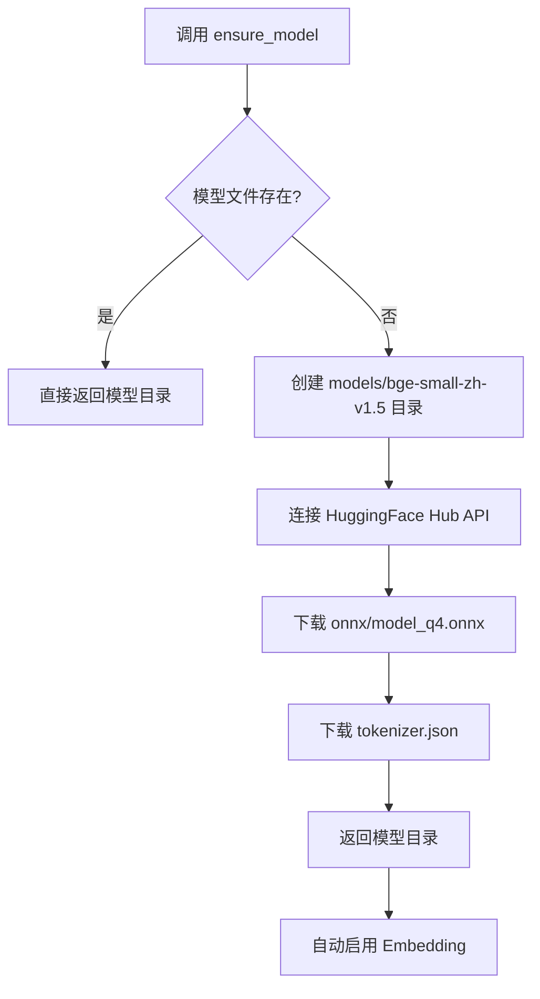
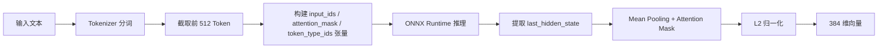

# 本地 Embedding 配置

InvoiceVault 内置了基于 ONNX Runtime 的本地 Embedding 引擎，使用 `bge-small-zh-v1.5` 模型将文本转换为向量，用于语义搜索和发票去重。无需外部 API 调用，所有推理在本地完成。

## 模型参数

| 参数 | 值 | 说明 |
|------|-----|------|
| 模型仓库 | `Xenova/bge-small-zh-v1.5` | HuggingFace 上的量化 BERT 模型 |
| 向量维度 | 384 | 每条文本生成 384 维浮点向量 |
| 最大 Token 数 | 512 | 超出部分将被截断 |
| ONNX 文件 | `onnx/model_q4.onnx` | 4-bit 量化模型文件 |
| Tokenizer 文件 | `tokenizer.json` | 分词器配置 |

这些常量定义在 `src-tauri/src/app_core/constants.rs` 中。

## 启用与禁用

Embedding 功能默认启用，可通过以下命令控制：

```rust
// 启用/禁用 Embedding
set_embedding_enabled(enabled: bool)

// 查询 Embedding 状态
get_embedding_status() -> LocalEmbeddingStatus
```

### LocalEmbeddingStatus 结构

```rust
pub struct LocalEmbeddingStatus {
    pub enabled: bool,         // 功能是否启用
    pub model_present: bool,   // 模型文件是否已下载
    pub model_loaded: bool,    // 模型是否已加载到内存
    pub model_dir: Option<String>,  // 模型目录路径
    pub dimensions: Option<usize>,  // 向量维度（已加载时为 384）
}
```

## 模型下载

模型文件在首次使用时自动从 HuggingFace 下载。也可以通过命令手动触发：

```rust
download_embedding_model() -> LocalEmbeddingStatus
```

### 下载流程



模型存储在应用数据目录下的 `models/bge-small-zh-v1.5/` 中：

```
<app_data_dir>/
  models/
    bge-small-zh-v1.5/
      onnx/
        model_q4.onnx    # 量化 ONNX 模型
      tokenizer.json      # 分词器
```

下载超时为 120 秒。如果下载失败，可以手动从 HuggingFace 仓库 `Xenova/bge-small-zh-v1.5` 下载对应文件放到上述目录。

## Embedding 推理流程

当生成文本向量时，内部执行以下步骤：



推理结果结构：

```rust
pub struct EmbeddingResult {
    pub embedding: Vec<f32>,    // 384 维浮点向量
    pub prompt_tokens: i64,     // 输入 Token 数
    pub total_tokens: i64,      // 总 Token 数
}
```

## ONNX Runtime 动态加载

InvoiceVault 使用 ONNX Runtime 的动态加载模式（`load-dynamic` 特性），不静态链接 ONNX Runtime 库。

### 各平台库文件

| 平台 | 库文件名 | 位置 |
|------|----------|------|
| Windows | `onnxruntime.dll` | `src-tauri/resources/win-x86_64/` |
| Linux | `libonnxruntime.so` | `src-tauri/resources/` |
| macOS | `libonnxruntime.dylib` | `src-tauri/resources/` |

### 库文件查找顺序

1. 环境变量 `ORT_DYLIB_PATH` 指定的路径
2. `src-tauri/resources/` 目录
3. `target/debug/` 或 `target/release/` 目录
4. 系统库路径（Linux: `/usr/lib/`）
5. 可执行文件同级目录及其 `resources/` 子目录

:::note
在 Windows 上，CI 构建时会从预编译的依赖包中自动提取 `onnxruntime.dll` 到 `src-tauri/resources/win-x86_64/` 目录。
:::

## 应用场景

### 语义搜索

将发票文本内容向量化后存储，用户搜索时将查询文本也转为向量，通过余弦相似度匹配最相关的发票：

```rust
search_invoices_semantic(query: String, limit: usize) -> Vec<SimilarResult>
```

### 发票去重

Embedding 向量用于辅助发票去重。当新发票入库时，将其文本向量与已有发票比较，找出语义相似的候选重复项。

### 连接测试

可通过命令测试 Embedding 引擎是否正常工作：

```rust
test_embedding_connection() -> EmbeddingTestResult
```

返回结果包含模型名、向量维度和推理耗时。测试超时为 120 秒（ONNX Runtime 首次加载可能较慢）。

## 重新生成所有 Embedding

当模型更新或数据异常时，可以重新为所有发票生成 Embedding 向量：

```rust
regenerate_all_embeddings() -> RegenerateEmbeddingsResult
```

该操作会遍历所有发票记录，重新计算文本向量并更新数据库。

## ChromaDB 外部向量库

除了本地 Embedding 引擎外，InvoiceVault 还支持连接 ChromaDB 外部向量数据库：

```rust
set_chroma_config(config: ChromaConfig)
get_chroma_config() -> ChromaConfig
test_chroma_connection() -> bool
```

ChromaDB 用于存储和检索 Embedding 向量，提供更高效的相似度搜索。当 ChromaDB 未配置时，系统使用 SQLite 中的 `invoice_embeddings` 表进行向量存储。
