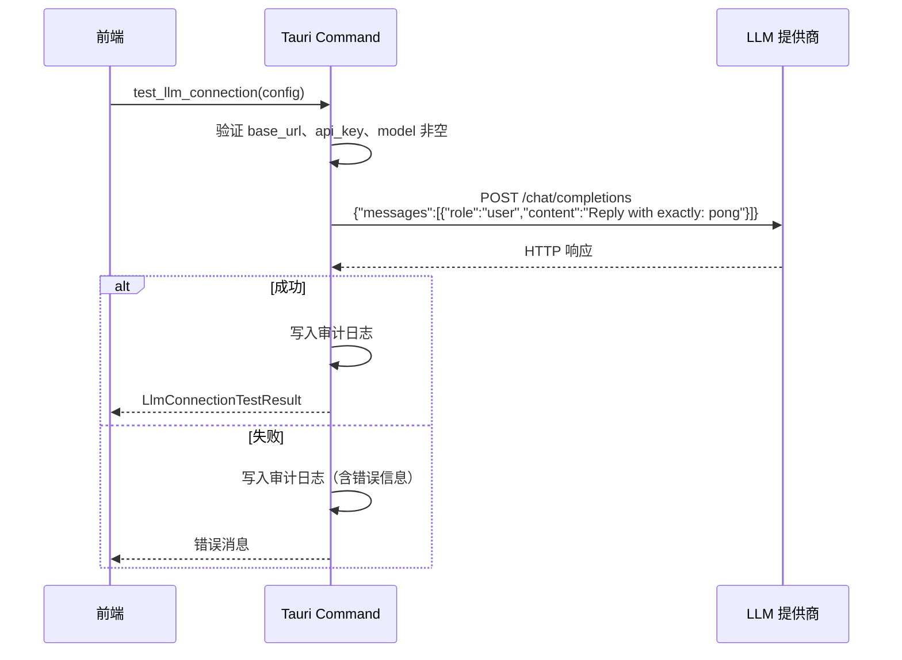

# LLM 提供商配置

InvoiceVault 使用 OpenAI 兼容协议与大语言模型（LLM）交互，支持发票图片识别、Agent 对话和标题生成等功能。本文档介绍如何配置 LLM 提供商连接。

## LlmProviderConfig 结构

LLM 配置通过 `LlmProviderConfig` 结构体管理，定义在 `src-tauri/src/llm/mod.rs` 中：

```rust
pub struct LlmProviderConfig {
    pub base_url: String,                    // API 基础地址
    pub api_key: String,                     // API 密钥
    pub model: String,                       // 模型名称
    pub timeout_seconds: Option<u64>,        // 请求超时时间（秒）
    pub scnet_ocr_api_key: Option<String>,   // SCNet OCR API 密钥（可选）
    pub recognition_max_tokens: Option<u16>, // 发票识别最大输出 Token 数
    pub agent_max_tokens: Option<u16>,       // Agent 对话最大输出 Token 数
}
```

### 字段说明

| 字段 | 类型 | 必填 | 说明 |
|------|------|------|------|
| `base_url` | `String` | 是 | LLM API 的基础 URL，不含 `/chat/completions` 后缀 |
| `api_key` | `String` | 是 | API 鉴权密钥，将以 `Bearer` 格式放入请求头 |
| `model` | `String` | 是 | 模型标识符，如 `qwen-vl-plus`、`moonshot-v1-8k-vision-preview` |
| `timeout_seconds` | `Option<u64>` | 否 | 请求超时秒数，默认 30 秒（识别时默认 90 秒），范围 1-300 |
| `scnet_ocr_api_key` | `Option<String>` | 否 | SCNet OCR API 密钥，启用后可交叉验证识别结果 |
| `recognition_max_tokens` | `Option<u16>` | 否 | 发票识别最大输出 Token，默认 16384 |
| `agent_max_tokens` | `Option<u16>` | 否 | Agent 对话最大输出 Token，默认 8192 |

## 配置不同提供商

InvoiceVault 支持所有兼容 OpenAI `/v1/chat/completions` 接口的 LLM 提供商。以下是常见提供商的配置示例：

### 提供商预设

| 提供商 | base_url | 推荐模型 | 说明 |
|--------|----------|----------|------|
| OpenAI | `https://api.openai.com/v1` | `gpt-4o` | 原生 OpenAI API |
| 通义千问 (Qwen) | `https://dashscope.aliyuncs.com/compatible-mode/v1` | `qwen-vl-plus` | 阿里云百炼平台 |
| Kimi (Moonshot) | `https://api.moonshot.cn/v1` | `moonshot-v1-8k-vision-preview` | 月之暗面 |
| 智谱 GLM | `https://open.bigmodel.cn/api/paas/v4` | `glm-4v` | 智谱 AI |
| DeepSeek | `https://api.deepseek.com/v1` | `deepseek-chat` | DeepSeek |
| 本地部署 (Ollama) | `http://localhost:11434/v1` | `llava` | 本地 Ollama 服务 |

### 配置流程

在 InvoiceVault 应用内的 **设置 > LLM 配置** 页面中填写以下信息：

1. **API 地址**：填写提供商的 `base_url`（不需要包含 `/chat/completions`）
2. **API 密钥**：填写有效的 API Key
3. **模型名称**：填写提供商支持的视觉语言模型名称
4. **超时设置**：根据网络情况调整超时时间

配置完成后，点击 **测试连接** 按钮验证配置是否正确。

## 连接测试

连接测试通过 `test_llm_connection` 命令执行，其流程如下：



测试时发送的消息内容为 `"Reply with exactly: pong"`，期望模型原样回复 `pong`。

### 返回结果

```rust
pub struct LlmConnectionTestResult {
    pub model: String,          // 响应中的模型名
    pub duration_ms: u128,      // 请求耗时（毫秒）
    pub response_preview: String, // 响应内容预览（截取前 120 字符）
}
```

## 审计日志

LLM 审计日志记录每次 API 调用的详细信息，用于排查问题和监控用量。

### 日志格式

审计日志以 JSONL 格式存储，每日一个文件，位于应用数据目录的 `llm-audit-YYYY-MM-DD.jsonl`。

每条记录包含以下字段：

| 字段 | 说明 |
|------|------|
| `timestamp` | 日志写入时间 (UTC RFC3339) |
| `request_timestamp` | 请求发起时间 |
| `operation` | 操作类型：`connection_test`、`invoice_recognition`、`scnet_ocr` |
| `endpoint` | 请求的完整 URL |
| `model` | 使用的模型名 |
| `duration_ms` | 请求耗时（毫秒） |
| `status` | HTTP 状态码（可能为 null） |
| `request` | 请求体 JSON |
| `response` | 响应体 JSON（可能为 null） |
| `error` | 错误信息（成功时为 null） |

### 启用/禁用审计

通过以下 Tauri 命令控制审计日志：

- `set_llm_audit_enabled(enabled: bool)` — 启用或禁用审计日志
- `get_llm_audit_enabled()` — 查询当前审计开关状态

### 日志示例

```json
{
  "timestamp": "2026-06-07T08:30:00Z",
  "request_timestamp": "2026-06-07T08:29:59Z",
  "operation": "connection_test",
  "endpoint": "https://dashscope.aliyuncs.com/compatible-mode/v1/chat/completions",
  "model": "qwen-vl-plus",
  "duration_ms": 1523,
  "status": 200,
  "request": {"model":"qwen-vl-plus","messages":[...],"temperature":0.0,"max_tokens":512},
  "response": {"choices":[{"message":{"content":"pong"}}],"usage":{"prompt_tokens":12,"completion_tokens":1,"total_tokens":13}},
  "error": null
}
```

## 价格配置

InvoiceVault 支持配置 LLM 和 Embedding 调用的单价（元/千 Token），用于费用统计：

```rust
pub struct PriceConfig {
    pub llm_input_price_per_1k: f64,        // LLM 输入价格，默认 0.0008
    pub llm_output_price_per_1k: f64,       // LLM 输出价格，默认 0.002
    pub embedding_input_price_per_1k: f64,  // Embedding 输入价格，默认 0.0007
    pub embedding_output_price_per_1k: f64, // Embedding 输出价格，默认 0.0007
}
```

通过 `get_price_config` 和 `set_price_config` 命令读写价格配置。

## 重试机制

发票识别过程包含多层重试保障：

1. **单次请求重试**：最多重试 3 次，遇到网络错误、429 (限流) 和 5xx (服务端错误) 时自动重试
2. **VLM 多次尝试**：使用不同温度（0.0、0.3、0.5）进行最多 3 次识别尝试
3. **置信度审核**：当所有尝试的置信度低于阈值（0.5）时，交由 LLM 比较所有候选结果，选出最佳答案
4. **SCNet OCR 交叉验证**：配置了 SCNet OCR 密钥时，会与 VLM 结果进行交叉验证合并
