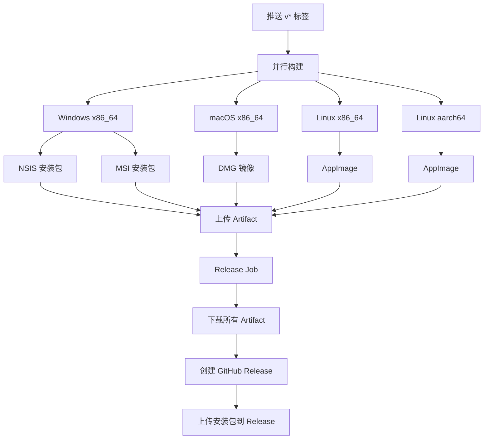

# CI/CD 流程

InvoiceVault 使用 GitHub Actions 实现跨平台自动构建和发布。当推送版本标签时，自动构建所有平台的安装包并发布 GitHub Release。

## 触发条件

```yaml
on:
  push:
    tags:
      - "v*"          # 推送 v 开头的标签时触发
  workflow_dispatch:   # 支持手动触发
    inputs:
      version:
        description: "Version to release"
        required: false
```

## 流程总览



## 构建矩阵

| 平台 | Runner | 架构 | 产物格式 |
|------|--------|------|----------|
| Windows | `windows-latest` | x86_64 | NSIS (.exe)、MSI (.msi) |
| macOS | `macos-latest` | x86_64 | DMG (.dmg) |
| Linux | `ubuntu-24.04` | x86_64 | AppImage |
| Linux | `ubuntu-24.04-arm` | aarch64 | AppImage |

## 构建流程详解

每个平台的构建 Job 遵循以下步骤：

### 1. 代码检出

```yaml
- name: Checkout repository
  uses: actions/checkout@v4
```

### 2. 版本注入

从 git tag 或手动输入中提取版本号，注入到 `tauri.conf.json` 和 `Cargo.toml` 中：

```bash
TAG="${GITHUB_REF#refs/tags/}"
VER="${TAG#v}"
sed -i "s/\"version\": \"0.1.0\"/\"version\": \"${VER}\"/" src-tauri/tauri.conf.json
sed -i "s/^version = \"0.1.0\"/version = \"${VER}\"/" src-tauri/Cargo.toml
```

### 3. 环境准备

```yaml
- name: Set up Node.js
  uses: actions/setup-node@v4
  with:
    node-version: 22

- name: Set up Rust
  uses: dtolnay/rust-toolchain@stable

- name: Cache Cargo
  uses: Swatinem/rust-cache@v2
  with:
    workspaces: src-tauri
```

### 4. Windows 依赖包下载

Windows 构建需要预编译的 ONNX Runtime 和 Poppler：

```yaml
- name: Download bundled Windows dependencies
  shell: pwsh
  run: |
    $url = "https://github.com/XUranus/InvoiceVault/releases/download/build/invoicevault-dependencies-win-x86_64.zip"
    New-Item -ItemType Directory -Force -Path "src-tauri/resources"
    Invoke-WebRequest -Uri $url -OutFile deps.zip
    Expand-Archive -Path deps.zip -DestinationPath "src-tauri/resources"
```

### 5. Linux 系统依赖

```bash
sudo apt-get install -y \
    build-essential curl wget file patchelf \
    libssl-dev libgtk-3-dev libayatana-appindicator3-dev \
    librsvg2-dev libwebkit2gtk-4.1-dev libxdo-dev
```

### 6. 前端构建和 Tauri 打包

```yaml
- name: Install frontend dependencies
  run: npm ci

- name: Build Tauri bundles
  run: npm run tauri -- build --bundles nsis msi
```

### 7. AppImage 后处理（仅 Linux）

Linux AppImage 构建后需要移除冲突的图形库：

```bash
"$APPIMAGE" --appimage-extract
rm "$APPIMAGE"

# 移除与宿主 GPU 驱动冲突的库
find squashfs-root -name "libwayland-*.so*" -delete
find squashfs-root -name "libEGL.so*" -delete
find squashfs-root -name "libGL.so*" -delete

# 重新打包
ARCH=x86_64 appimagetool squashfs-root "$APPIMAGE"
```

这一步解决了不同 GPU 驱动环境下 Wayland/EGL 库冲突导致的白屏问题。

## 发布流程

所有平台构建完成后，Release Job 自动执行：

```yaml
release:
  needs: [build-windows, build-macos, build-linux, build-linux-aarch64]
  runs-on: ubuntu-latest
  steps:
    - name: Download all artifacts
      uses: actions/download-artifact@v4

    - name: Create GitHub Release
      uses: softprops/action-gh-release@v2
      with:
        tag_name: ${{ steps.version.outputs.tag }}
        name: "InvoiceVault ${{ steps.version.outputs.tag }}"
        generate_release_notes: true
        files: artifacts/*
```

### Release 产物

一次发布包含以下安装包：

| 文件 | 平台 | 说明 |
|------|------|------|
| `InvoiceVault_*_x64-setup.exe` | Windows | NSIS 安装程序 |
| `InvoiceVault_*_x64_en-US.msi` | Windows | MSI 安装包 |
| `InvoiceVault_*.dmg` | macOS | 磁盘镜像 |
| `InvoiceVault_*_amd64.AppImage` | Linux x86_64 | AppImage |
| `InvoiceVault_*_aarch64.AppImage` | Linux aarch64 | AppImage |

## NSIS 安装包配置

Windows NSIS 安装包的配置在 `src-tauri/tauri.conf.json` 中：

- 应用名称：票匣
- 支持自定义安装目录
- 创建桌面快捷方式和开始菜单
- 卸载程序自动生成

## 本地模拟 CI 构建

要在本地模拟 CI 的生产构建：

```bash
# 安装依赖
npm ci

# 构建（会自动编译 Rust release 模式）
npm run tauri build

# 查看产物
ls -la src-tauri/target/release/bundle/
```

:::note
本地构建与 CI 构建的差异：
- CI 使用 `npm ci`（锁定依赖版本），本地通常用 `npm install`
- CI 在 clean 环境中构建，本地可能有缓存
- Windows CI 会下载预编译依赖包，本地需要手动准备
:::

## 添加新平台

要添加新的构建平台，在 `.github/workflows/release.yml` 中添加新的 Job，参考现有平台的配置：

1. 选择合适的 Runner（如 `ubuntu-24.04-arm` 用于 aarch64）
2. 安装平台相关的系统依赖
3. 注入版本号
4. 执行构建
5. 上传 Artifact
6. 在 `release` Job 的 `needs` 中添加新 Job
