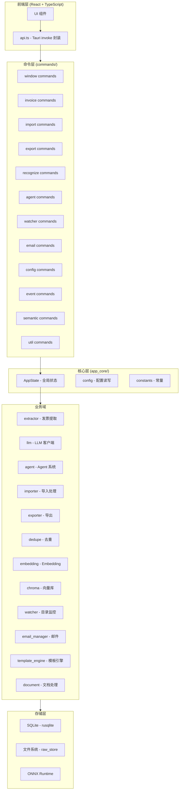
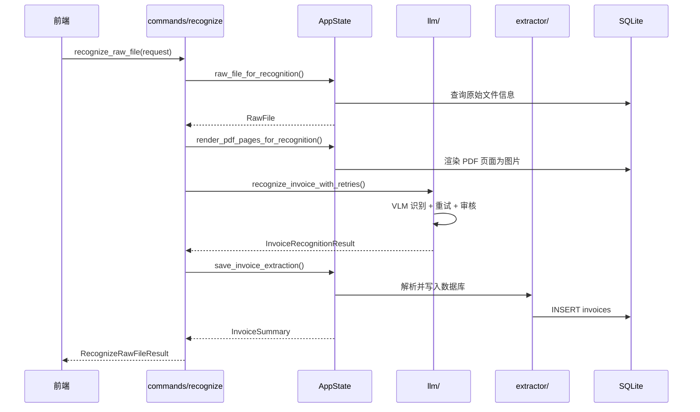

# 项目结构

本文档介绍 InvoiceVault 的项目目录布局、各模块职责以及模块间的关系。

## 根目录布局

```
InvoiceVault/
├── src/                          # 前端源码（React + TypeScript）
├── src-tauri/                    # 后端源码（Rust + Tauri）
├── wiki/                         # 文档站点（Docusaurus）
├── scripts/                      # 构建和打包脚本
├── receipts/                     # 测试用发票样本
├── .github/workflows/            # CI/CD 工作流配置
├── package.json                  # 前端依赖和脚本
├── vite.config.ts                # Vite 构建配置
├── tsconfig.json                 # TypeScript 配置
├── tailwind.config.js            # Tailwind CSS 配置
└── index.html                    # 前端入口 HTML
```

## 后端结构 (src-tauri/src/)

```
src-tauri/src/
├── main.rs                       # 应用入口，调用 lib::run()
├── lib.rs                        # Tauri 应用初始化、窗口管理、命令注册
│
├── app_core/                     # 应用核心层
│   ├── mod.rs                    # AppState 定义，全局状态管理
│   ├── config.rs                 # 配置文件读写工具
│   ├── constants.rs              # 全局常量定义
│   ├── paths.rs                  # 文件路径工具
│   ├── fs_utils.rs               # 文件系统工具
│   ├── archive.rs                # 归档功能
│   └── template_adapter.rs       # 模板引擎适配器
│
├── commands/                     # Tauri 命令层（薄壳）
│   ├── mod.rs                    # 命令模块汇总导出
│   ├── window.rs                 # 窗口控制命令
│   ├── invoice.rs                # 发票 CRUD 命令
│   ├── import.rs                 # 文件导入命令
│   ├── export.rs                 # 导出命令
│   ├── recognize.rs              # 识别命令
│   ├── agent.rs                  # Agent 会话命令
│   ├── watcher.rs                # 目录监控命令
│   ├── email.rs                  # 邮件源命令
│   ├── config.rs                 # 配置管理命令
│   ├── event.rs                  # 事件通知命令
│   ├── semantic.rs               # 语义搜索命令
│   └── util.rs                   # 工具和健康检查命令
│
├── llm/                          # LLM 客户端
│   └── mod.rs                    # OpenAI 兼容 API 调用、重试、审计
│
├── agent/                        # Agent 会话系统
│   └── mod.rs                    # 会话管理、工具调用、流式响应
│
├── extractor/                    # 发票数据提取与持久化
│   ├── mod.rs                    # 发票 CRUD、搜索、合并、标签
│   ├── dashboard.rs              # 仪表盘统计
│   └── usage.rs                  # LLM 用量统计
│
├── storage/                      # 数据库存储层
│   └── mod.rs                    # SQLite 连接管理、schema 迁移
│
├── embedding/                    # 本地 Embedding 引擎
│   └── mod.rs                    # ONNX Runtime 推理、模型下载
│
├── chroma/                       # ChromaDB 向量数据库客户端
│   └── mod.rs                    # 向量存储和检索
│
├── importer/                     # 文件导入处理
│   └── mod.rs                    # 文件哈希、存储、导入任务管理
│
├── exporter/                     # 导出功能
│   └── mod.rs                    # Excel/PDF/CSV 导出
│
├── dedupe/                       # 发票去重
│   └── mod.rs                    # 字段匹配、相似度计算、重复解决
│
├── document/                     # 文档处理
│   └── mod.rs                    # PDF 渲染、图片处理
│
├── template_engine/              # Excel 模板引擎
│   ├── mod.rs                    # 模板引擎入口
│   ├── parser.rs                 # 模板解析器
│   ├── ast.rs                    # 抽象语法树
│   ├── ir.rs                     # 中间表示
│   ├── plan.rs                   # 执行计划
│   ├── binder.rs                 # 数据绑定
│   ├── writer.rs                 # Excel 写入
│   ├── cloner.rs                 # 工作表克隆
│   ├── region.rs                 # 区域处理
│   └── strings.rs                # 字符串工具
│
├── watcher/                      # 文件系统监控
│   └── mod.rs                    # 目录监控、文件稳定性检测
│
├── email_manager.rs              # 邮件数据源管理
├── event.rs                      # 事件通知系统
├── scnet_ocr.rs                  # SCNet OCR 集成
├── raw_store/                    # 原始文件存储
│   └── mod.rs                    # 文件存储管理
├── diag.rs                       # 诊断工具
├── process_utils.rs              # 进程工具
│
├── mcp/                          # MCP 服务器
│   └── mod.rs                    # Model Context Protocol 实现
│
└── bin/
    └── mcp_server.rs             # MCP 服务器二进制入口
```

## 前端结构 (src/)

```
src/
├── main.tsx                      # React 应用入口
├── api.ts                        # Tauri invoke 命令封装
├── types.ts                      # TypeScript 类型定义
├── status.ts                     # 状态常量
├── emailPresets.ts               # 邮件提供商预设
├── styles.css                    # 全局样式
│
├── components/                   # UI 组件
│   ├── InvoiceTable.tsx          # 发票列表表格
│   ├── InvoiceDetail.tsx         # 发票详情面板
│   ├── ImportDialog.tsx          # 导入对话框
│   ├── SearchBar.tsx             # 搜索栏
│   ├── AgentChat.tsx             # Agent 对话界面
│   ├── Settings.tsx              # 设置页面
│   ├── Dashboard.tsx             # 仪表盘
│   ├── EventLog.tsx              # 事件日志
│   ├── WatchDirPanel.tsx         # 监控目录面板
│   ├── EmailSourcePanel.tsx      # 邮件源面板
│   └── ...
│
├── hooks/                        # 自定义 React Hooks
│   ├── useInvoices.ts            # 发票数据 Hook
│   ├── useAgent.ts               # Agent 会话 Hook
│   └── ...
│
└── stores/                       # 状态管理
    ├── invoiceStore.ts           # 发票状态
    ├── agentStore.ts             # Agent 状态
    └── ...
```

## 架构关系

### 分层架构



### 关键设计原则

1. **薄壳命令模式**：`commands/` 层不做业务逻辑，仅解包前端参数后调用 `AppState` 方法
2. **集中状态管理**：`AppState` 持有数据库连接、配置和各子系统实例
3. **模块化业务域**：每个业务域独立模块，通过 `AppState` 协调
4. **配置集中化**：所有常量和配置在 `app_core/` 中统一管理

### 数据流示例：发票识别



## 关键文件说明

| 文件 | 作用 |
|------|------|
| `src-tauri/src/lib.rs` | Tauri 应用入口，注册所有命令，初始化窗口和系统托盘 |
| `src-tauri/src/app_core/mod.rs` | AppState 结构体，协调所有业务域 |
| `src-tauri/src/app_core/constants.rs` | 全局常量，影响超时、重试、模型参数等 |
| `src-tauri/src/storage/mod.rs` | 数据库迁移管理，确保 schema 版本化 |
| `src-tauri/src/llm/mod.rs` | LLM 调用核心，包含重试、审核、审计日志 |
| `src-tauri/migrations/*.sql` | 数据库迁移脚本 |
| `src/api.ts` | 前端调用 Tauri 命令的统一封装层 |
| `src/types.ts` | 前后端共享的 TypeScript 类型定义 |
