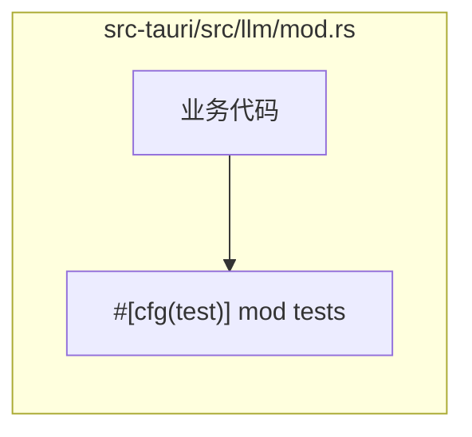
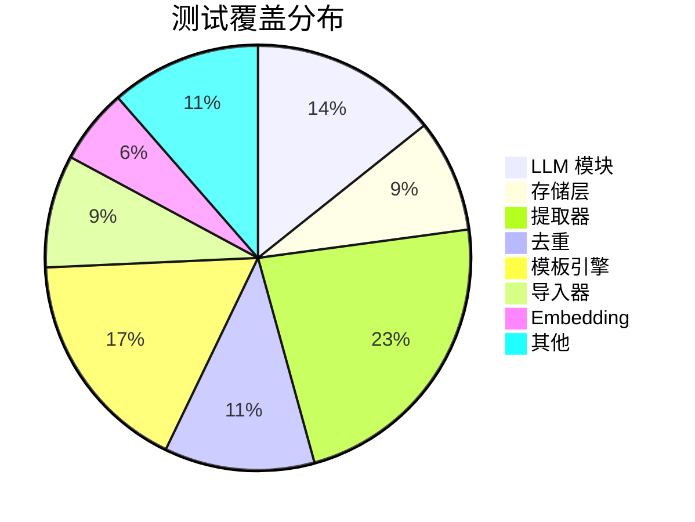

# 测试指南

InvoiceVault 的测试主要集中在 Rust 后端，使用 Rust 内置的测试框架进行单元测试和集成测试。

## 运行测试

### 运行所有测试

```bash
cd src-tauri
cargo test
```

### 运行特定模块的测试

```bash
# 运行 llm 模块的测试
cargo test --lib llm

# 运行 storage 模块的测试
cargo test --lib storage

# 运行 extractor 模块的测试
cargo test --lib extractor
```

### 运行单个测试函数

```bash
# 按测试函数名过滤
cargo test truncates_by_char_boundary

# 使用精确匹配
cargo test -- --exact migrations_are_idempotent
```

### 显示测试输出

默认情况下，通过的测试不显示 `println!` 输出。要查看所有输出：

```bash
cargo test -- --nocapture
```

## 测试组织

### 单元测试

每个模块内部通过 `#[cfg(test)] mod tests { ... }` 组织单元测试，与被测代码放在同一文件中。



### 测试分布

项目中包含测试的主要模块：

| 模块 | 测试内容 | 测试数量 |
|------|----------|----------|
| `llm/mod.rs` | JSON 提取、截断函数、审计日志写入、配置验证 | 5+ |
| `storage/mod.rs` | 迁移幂等性 | 1 |
| `embedding/mod.rs` | 常量有效性 | 1 |
| `extractor/` | 发票数据解析、搜索、CRUD | 多个 |
| `dedupe/` | 去重匹配逻辑 | 多个 |
| `template_engine/` | 模板解析、渲染 | 多个 |
| `importer/` | 文件哈希、导入流程 | 多个 |

## 测试模式

### 基本单元测试

```rust
#[test]
fn truncates_by_char_boundary() {
    assert_eq!(truncate("发票识别", 2), "发票");
}
```

### 异步测试

使用 `#[tokio::test]` 属性测试异步函数：

```rust
#[tokio::test]
async fn rejects_missing_provider_fields() {
    let err = test_llm_connection(
        LlmProviderConfig {
            base_url: String::new(),
            api_key: "key".to_owned(),
            model: "model".to_owned(),
            timeout_seconds: Some(1),
            scnet_ocr_api_key: None,
            recognition_max_tokens: None,
            agent_max_tokens: None,
        },
        None,
    )
    .await
    .expect_err("missing base url");

    assert!(matches!(err, LlmError::MissingBaseUrl));
}
```

### 使用临时目录

文件系统相关测试使用 `tempfile` 创建临时目录：

```rust
#[test]
fn writes_audit_record_as_jsonl() {
    let temp_dir = tempfile::tempdir().expect("tempdir");
    let audit = LlmAuditConfig {
        dir: temp_dir.path().to_path_buf(),
    };
    write_llm_audit_record(
        Some(&audit),
        LlmAuditRecord { /* ... */ },
    );

    let entries = std::fs::read_dir(temp_dir.path())
        .expect("read audit dir")
        .collect::<Result<Vec<_>, _>>()
        .expect("entries");
    assert_eq!(entries.len(), 1);
}
```

### 内存数据库测试

数据库迁移测试使用 SQLite 内存数据库：

```rust
#[test]
fn migrations_are_idempotent() {
    let mut conn = Connection::open_in_memory().expect("open in-memory sqlite");

    run_migrations(&mut conn).expect("first migration run");
    run_migrations(&mut conn).expect("second migration run");

    let version: i64 = conn
        .query_row(
            "SELECT COALESCE(MAX(version), 0) FROM schema_migrations",
            [],
            |row| row.get(0),
        )
        .expect("read migration version");

    assert_eq!(version, 4);
}
```

### 忽略的集成测试

需要真实 API 调用的测试标记为 `#[ignore]`，避免在常规 CI 中运行：

```rust
#[tokio::test]
#[ignore]
async fn live_llm_connection_from_env() {
    let result = test_llm_connection(
        LlmProviderConfig {
            base_url: std::env::var("RECEIPTIER_LLM_BASE_URL")
                .expect("RECEIPTIER_LLM_BASE_URL"),
            api_key: std::env::var("RECEIPTIER_LLM_API_KEY")
                .expect("RECEIPTIER_LLM_API_KEY"),
            model: std::env::var("RECEIPTIER_LLM_MODEL")
                .expect("RECEIPTIER_LLM_MODEL"),
            timeout_seconds: Some(30),
            scnet_ocr_api_key: None,
            recognition_max_tokens: None,
            agent_max_tokens: None,
        },
        None,
    )
    .await
    .expect("live llm connection");

    assert!(!result.response_preview.is_empty());
}
```

运行忽略的测试：

```bash
# 运行所有被忽略的测试（需要设置环境变量）
RECEIPTIER_LLM_BASE_URL=https://api.example.com/v1 \
RECEIPTIER_LLM_API_KEY=sk-xxx \
RECEIPTIER_LLM_MODEL=gpt-4o \
cargo test -- --ignored
```

## 测试覆盖概览



### 重点测试场景

| 场景 | 测试位置 | 说明 |
|------|----------|------|
| JSON 对象提取 | `llm/mod.rs` | 从 LLM 响应中提取 JSON，支持代码块包装 |
| 审计日志写入 | `llm/mod.rs` | 验证 JSONL 格式的审计记录正确写入 |
| 数据库迁移幂等 | `storage/mod.rs` | 确保重复执行迁移不会出错 |
| 配置字段验证 | `llm/mod.rs` | 缺少必填字段时返回正确错误 |
| 字符截断边界 | `llm/mod.rs` | 中文字符按字符边界截断 |

## 编写新测试

### 测试命名规范

- 测试函数名使用 `snake_case`，清晰描述测试行为
- 使用 `rejects_`、`extracts_`、`writes_` 等动词前缀
- 例如：`rejects_missing_provider_fields`、`extracts_json_from_fenced_response`

### 测试结构

遵循 Arrange-Act-Assert 模式：

```rust
#[test]
fn my_new_test() {
    // Arrange: 准备测试数据
    let input = "test input";

    // Act: 执行被测函数
    let result = my_function(input);

    // Assert: 验证结果
    assert_eq!(result, expected_value);
}
```

### 断言宏选择

| 宏 | 用途 |
|----|------|
| `assert!` | 布尔条件断言 |
| `assert_eq!` / `assert_ne!` | 值相等/不等断言 |
| `assert!(matches!(...))` | 模式匹配断言（用于枚举变体） |
| `.expect_err(...)` | 确认 Result 是 Err |

## 测试运行配置

### Cargo 配置

可以在 `.cargo/config.toml` 中设置测试相关配置：

```toml
[build]
# 使用多线程编译加速
jobs = 8

[test]
# 测试超时设置（秒）
timeout = 120
```

### 环境变量

部分测试需要环境变量：

| 变量 | 用途 |
|------|------|
| `RECEIPTIER_LLM_BASE_URL` | 集成测试用 LLM API 地址 |
| `RECEIPTIER_LLM_API_KEY` | 集成测试用 API 密钥 |
| `RECEIPTIER_LLM_MODEL` | 集成测试用模型名 |
| `RUST_LOG` | 日志级别，如 `invoicevault=debug` |
