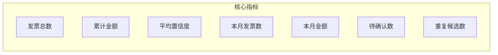
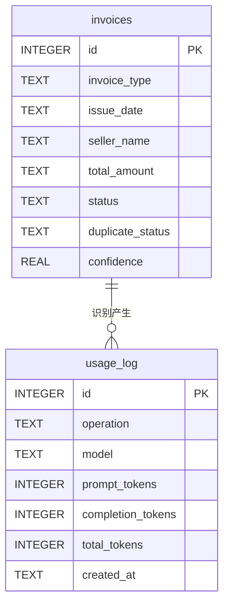

# 仪表盘

仪表盘是 InvoiceVault 的数据总览页面，提供发票统计、月度趋势、类型分布、卖家排行和 LLM 使用量等关键指标的可视化展示。

## 统计概览

仪表盘顶部展示核心统计指标：



| 指标 | 字段名 | 说明 |
|------|--------|------|
| 发票总数 | `total_invoices` | 数据库中所有发票数量 |
| 累计金额 | `total_amount` | 所有发票的价税合计总和 |
| 主要币种 | `currency` | 出现频率最高的币种（默认 CNY） |
| 平均置信度 | `average_confidence` | 所有发票识别置信度的平均值 |
| 本月发票数 | `this_month_count` | 当月开票日期的发票数量 |
| 本月金额 | `this_month_amount` | 当月发票的金额总和 |
| 待确认数 | `pending_count` | 状态为 `pending_confirmation` 的发票数 |
| 重复候选数 | `duplicate_count` | 重复状态为 `possible_duplicate` 或 `probable_duplicate` 的数量 |

:::info 本月统计
"本月"以 `issue_date`（开票日期）为准，而非导入时间。这意味着历史发票如果开票日期在当月，也会被计入本月统计。
:::

## 月度趋势

月度趋势展示最近 12 个月的发票数量和金额变化：


返回数据结构：

```typescript
interface MonthlyTrendPoint {
  month: string;   // "2026-01" 格式
  count: number;   // 当月发票数
  amount: number;  // 当月金额总和
}
```

前端通常以折线图或柱状图展示，双 Y 轴分别显示数量和金额。

### SQL 实现

```sql
SELECT strftime('%Y-%m', issue_date) as month, COUNT(*),
       COALESCE(SUM(CAST(total_amount AS REAL)), 0.0)
FROM invoices
WHERE issue_date IS NOT NULL
GROUP BY month
ORDER BY month DESC
LIMIT 12
```

## 类型分布

按 `invoice_type`（发票类型）分组统计：

```typescript
interface BreakdownItem {
  label: string;   // 发票类型名称
  count: number;   // 该类型的发票数
  amount: number;  // 该类型的金额总和
}
```

常见的发票类型包括：
- 增值税电子普通发票
- 增值税电子专用发票
- 增值税普通发票
- 全电发票
- 火车票/铁路电子客票
- 机票行程单
- 通行费发票
- 微信/支付宝转账记录

如果发票类型为空，归类为"未知"。

## 状态分布

按 `status`（识别状态）分组统计：

| 状态 | 含义 |
|------|------|
| `recognized` | 已识别 |
| `pending_confirmation` | 待确认 |
| `manual` | 手动录入 |

## 卖家排行

展示发票数量最多的前 5 名卖家（按 `seller_name` 分组）：

```typescript
interface TopSellerItem {
  seller_name: string;  // 卖家名称
  count: number;        // 发票数量
  amount: number;       // 累计金额
}
```

如果卖家名称为空，归类为"未知"。

## 日期范围过滤

所有统计指标都支持可选的日期范围过滤：

```typescript
const stats = await invoke('get_dashboard_stats', {
  date_from: '2026-01-01',
  date_to: '2026-06-30'
});
```

日期过滤基于 `issue_date`（开票日期），适用于所有统计维度（总额、趋势、类型分布、卖家排行等）。

未指定日期范围时统计所有历史数据。

## LLM 使用量统计

仪表盘还提供 LLM 调用的 token 消耗统计：

```typescript
interface LlmUsageStats {
  total_calls: number;          // 总调用次数
  llm_calls: number;            // 识别调用次数
  embedding_calls: number;      // Embedding 调用次数
  total_prompt_tokens: number;  // 累计输入 token
  total_completion_tokens: number; // 累计输出 token
  total_tokens: number;         // 累计总 token
  this_month_calls: number;     // 本月调用次数
  this_month_tokens: number;    // 本月 token 消耗
}
```

### 调用类型区分

| operation 值 | 含义 |
|--------------|------|
| `llm_recognition` | 发票识别调用 |
| `embedding` | 文本向量化调用 |
| `agent_chat` | AI 助手对话调用 |

这些数据来自 `usage_log` 表，每次 LLM 调用完成后自动记录。

## 缓存策略

前端对仪表盘数据采用缓存策略，避免频繁请求后端：

- **缓存时长**：60 秒 TTL（Time To Live）
- **缓存粒度**：以日期范围参数为 key
- **失效时机**：60 秒后自动失效，下次访问重新查询

:::tip 性能优化
仪表盘查询涉及多个聚合 SQL（COUNT、SUM、GROUP BY），在数据量较大时可能较慢。60 秒的缓存可以显著改善用户体验，同时保证数据的时效性。导入或编辑发票后缓存会自动刷新。
:::

## 数据模型

### 使用的数据库表



### 聚合查询说明

仪表盘的统计查询使用 SQLite 聚合函数：

- `COUNT(*)`：计数
- `SUM(CAST(total_amount AS REAL))`：金额求和（存储为 TEXT，需 CAST）
- `AVG(confidence)`：置信度平均值
- `strftime('%Y-%m', issue_date)`：按月分组
- `GROUP BY` + `ORDER BY COUNT(*) DESC`：分组排序

## API 命令

| 命令 | 参数 | 说明 |
|------|------|------|
| `get_dashboard_stats` | `{ date_from?, date_to? }` | 获取仪表盘统计数据 |
| `get_llm_usage` | `{ date_from?, date_to? }` | 获取 LLM 使用量统计 |
| `count_unviewed_invoices` | 无 | 获取未查看发票数量 |
