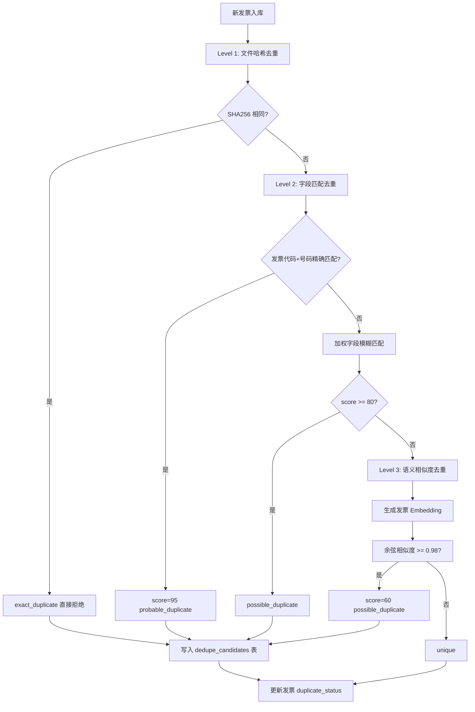
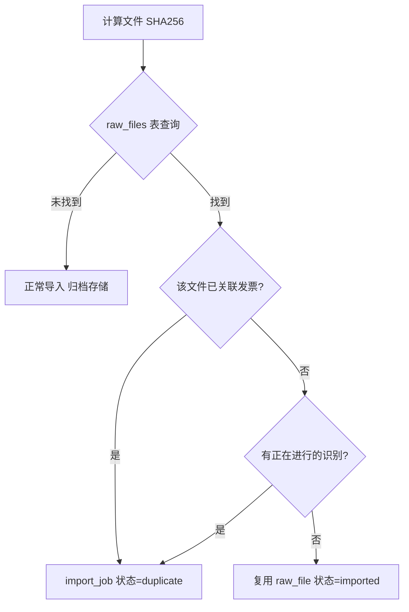
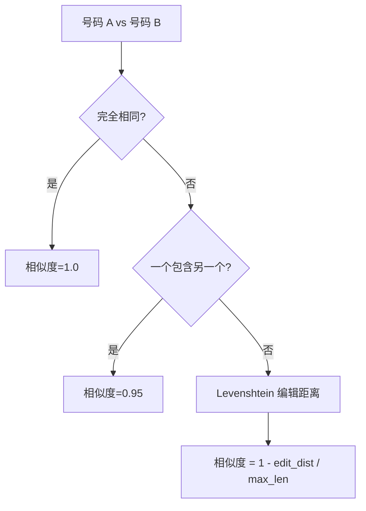
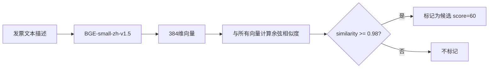
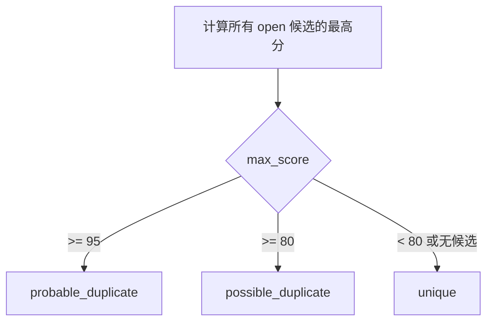
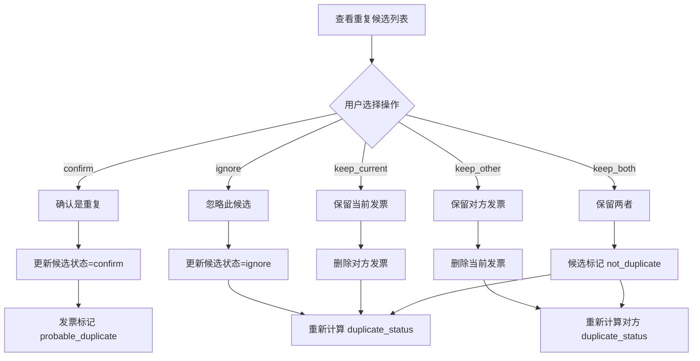

# 发票去重

InvoiceVault 实现了三级递进的发票去重策略，从精确的文件哈希匹配到模糊的语义相似度检测，最大程度避免重复发票入库。

## 去重流程总览



## Level 1: 文件哈希去重（SHA256）

文件哈希去重发生在**导入阶段**，是最严格的去重级别。

### 原理

每个导入的文件都会计算 SHA256 哈希值。如果数据库中已存在相同哈希的文件：

- **已有发票记录**：标记为 `duplicate`，拒绝导入
- **无发票记录**：复用已有 raw_file，允许重新识别
- **有进行中的识别任务**：标记为 `duplicate`，避免并发冲突



:::info 精确度
SHA256 哈希的碰撞概率极低（2^256 种可能），可以认为两个不同文件产生相同哈希的概率为零。这是最可靠的去重方式。
:::

### 局限性

- 只能检测完全相同的文件（逐字节一致）
- 同一张发票的不同扫描件、不同分辨率的图片会被视为不同文件
- 同一发票的 PDF 和图片版本不会被关联

## Level 2: 字段匹配去重

字段匹配去重在**发票识别完成后**执行，通过比对结构化字段来发现语义上的重复。

### 规则一：发票代码 + 号码精确匹配

如果两张发票的 `invoice_code` 和 `invoice_number` 完全相同，直接标记为候选重复，得分 95 分。

```sql
SELECT id FROM invoices
WHERE id != ?1 AND invoice_code = ?2 AND invoice_number = ?3
```

这是最准确的字段级去重方式，因为发票代码和号码的组合在全国范围内是唯一的。

### 规则二：加权字段模糊匹配

当代码+号码不完全匹配时，系统使用加权评分模型进行模糊匹配：

| 字段 | 权重 | 匹配规则 |
|------|------|---------|
| `invoice_number` | 40 | 精确匹配=40分，Levenshtein 相似度>=0.9=30分 |
| `total_amount` | 25 | 精确匹配=25分 |
| `issue_date` | 20 | 精确匹配=20分 |
| `seller_name` | 15 | 精确匹配=15分 |
| **总计** | **100** | |

最终得分计算公式：

```
score = (加权总分 / 100) * 95
```

得分低于 30 分的候选会被过滤掉。

### 发票号码相似度算法

系统使用 Levenshtein 编辑距离和子串包含检查来计算发票号码的相似度：



这种设计能够处理常见的 OCR 识别错误：
- 多识别了一位数字（子串包含，得分 0.95）
- 少识别了一位数字（子串包含，得分 0.95）
- 一位数字识别错误（编辑距离 1，得分约 0.9）

### SQL 优化

为了减少比较次数，字段匹配会先用 `amount + date` 缩小候选范围：

```sql
SELECT id, invoice_number, issue_date, total_amount, seller_name
FROM invoices
WHERE id != ?1
  AND total_amount = ?2   -- 先按金额过滤
  AND issue_date = ?3     -- 再按日期过滤
```

这大大减少了需要逐条比较的发票数量。

## Level 3: 语义相似度去重

语义去重基于 Embedding 向量的余弦相似度，能够发现结构化字段难以捕捉的重复。

### 原理

每张发票会生成一段文本描述（包含发票类型、销售方、金额、日期等信息），通过 BGE-small-zh-v1.5 模型转换为 384 维向量，存储在 `invoice_embeddings` 表中。

去重时，计算新发票向量与所有已有向量的余弦相似度：



### 严格阈值

语义相似度的阈值设置为 **0.98**（非常严格），这是因为：

- 同一模板/格式的不同发票天然具有较高的 Embedding 相似度
- 只有几乎完全相同的发票文本描述才会达到 0.98 以上
- 宽松的阈值会导致大量误报

:::caution 语义去重的局限
语义去重单独使用时不够可靠（同模板不同发票可能有高相似度），因此语义去重只作为补充手段，得分上限为 60 分，需要与其他证据结合判断。
:::

## 评分系统

三级去重的结果统一存储在 `dedupe_candidates` 表中，使用统一的评分体系：

### 评分规则

| 来源 | 得分 | 原因标记 |
|------|------|---------|
| 文件哈希相同 | -- | 直接拒绝，不进入候选表 |
| 发票代码+号码精确匹配 | 95 | `field_match` |
| 加权字段模糊匹配（高分） | 80-94 | `field_match` |
| 加权字段模糊匹配（中分） | 30-79 | `field_match` |
| 语义相似度 >= 0.98 | 60 | `semantic` |

### 重复状态映射

根据候选中的最高得分，发票的 `duplicate_status` 字段会被更新：



| 状态 | 含义 | 阈值 |
|------|------|------|
| `unique` | 无重复 | 无候选或最高分 < 80 |
| `possible_duplicate` | 可能重复 | 最高分 80-94 |
| `probable_duplicate` | 很可能重复 | 最高分 >= 95 |
| `unknown` | 未检测 | 新创建的发票默认状态 |

### 候选记录的冲突处理

当同一对发票被多次检测时，使用 `ON CONFLICT` 语句进行 upsert：

- 如果候选已被用户处理（`confirm` 或 `ignore`），保留用户操作
- 否则更新分数和原因（取更高分）

## 用户确认工作流

系统检测到重复候选后，用户可以通过 `resolve_duplicate` 命令进行处理：



### 操作说明

| 操作 | 说明 | 副作用 |
|------|------|--------|
| `confirm` | 确认是重复 | 发票标记为 `probable_duplicate` |
| `ignore` | 忽略此候选 | 重新计算发票的重复状态 |
| `keep_current` | 保留当前，删除对方 | 删除对方发票及其所有关联数据 |
| `keep_other` | 保留对方，删除当前 | 删除当前发票及其所有关联数据 |
| `keep_both` | 两者都保留 | 双向候选标记为 `not_duplicate` |

:::warning 数据删除
`keep_current` 和 `keep_other` 操作会**永久删除**发票及其关联的原始文件、明细项、标签等数据。操作前请确认选择正确。
:::

## 合并发票

当有多张发票需要合并为一张时，可以使用 `merge_invoices` 命令。合并操作会：

1. 将源发票的明细项复制到目标发票
2. 更新目标发票的金额汇总
3. 删除源发票

## 全局重新检测

`regenerate_all_duplicates` 命令会对数据库中所有发票重新执行字段级去重检测。适用于：

- 识别规则更新后重新评估
- 导入了大量新发票后的批量去重
- 修复数据不一致问题

## 数据模型

### dedupe_candidates 表

| 字段 | 类型 | 说明 |
|------|------|------|
| `id` | INTEGER | 主键 |
| `invoice_id` | INTEGER | 发票 A 的 ID |
| `candidate_invoice_id` | INTEGER | 候选发票 B 的 ID |
| `score` | REAL | 相似度得分（0-100） |
| `reason` | TEXT | 检测原因（field_match/semantic） |
| `status` | TEXT | 状态（open/confirm/ignore/not_duplicate） |
| `resolved_at` | TEXT | 用户处理时间 |

### invoices 表中的 duplicate_status

| 值 | 含义 |
|----|------|
| `unknown` | 未检测 |
| `unique` | 无重复 |
| `possible_duplicate` | 可能重复（80-94分） |
| `probable_duplicate` | 很可能重复（>=95分） |

## API 命令

| 命令 | 参数 | 说明 |
|------|------|------|
| `check_invoice_duplicates` | `{ invoice_id }` | 检查指定发票的重复情况 |
| `resolve_duplicate` | `{ dedupe_id, action }` | 处理重复候选 |
| `regenerate_all_duplicates` | 无 | 全局重新检测重复 |
| `merge_invoices` | `{ target_id, source_ids }` | 合并多张发票 |
