# 数据导出

InvoiceVault 支持将发票数据导出为 CSV、Excel（XLSX）和 PDF 报表三种格式，提供灵活的列选择、数据过滤和导出预览功能。

## 导出流程总览

```mermaid
flowchart TD
    A[用户发起导出] --> B[选择导出格式]
    B --> C{格式}
    C -->|CSV| D[export_csv]
    C -->|XLSX| E[export_xlsx]
    C -->|PDF| F[export_pdf_report]

    A --> G[应用过滤条件]
    G --> H{过滤方式}
    H -->|指定发票 ID| I[invoice_ids 列表]
    H -->|日期范围| J[date_from + date_to]
    H -->|两者结合| K[ID + 日期]

    I --> L[load_invoices_for_export]
    J --> L
    K --> L

    L --> M[执行 SQL 查询]
    M --> N[应用列选择]
    N --> D
    N --> E
    N --> F

    D --> O[输出文件]
    E --> O
    F --> O
```



## CSV 导出

CSV 导出使用 `csv` crate 生成标准 CSV 文件：

### 特性

- **UTF-8 BOM**：文件开头写入 `\xEF\xBB\xBF`，确保 Excel 正确识别中文编码
- **自定义列**：通过 `columns` 参数选择导出字段
- **中文表头**：使用中文列标签（如"发票号码"、"价税合计"）

### 导出示例

```typescript
const result = await invoke('export_invoices', {
  request: {
    format: 'csv',
    output_path: '/Users/me/invoices.csv',
    columns: ['invoice_number', 'issue_date', 'seller_name', 'total_amount'],
    date_from: '2026-01-01',
    date_to: '2026-06-30'
  }
});
// result: { file_path, row_count, format, byte_size, columns }
```

## Excel 导出（XLSX）

Excel 导出使用 `rust_xlsxwriter` crate 生成 `.xlsx` 文件：

### 特性

- **表头格式**：加粗、灰色背景（`#E0E0E0`）
- **数值格式**：金额字段使用 `0.00` 格式，避免科学计数法
- **自适应列宽**：根据内容自动调整列宽（中文字符算 2 个宽度单位）
- **工作表名称**：默认为 "Invoices"

### 导出示例

```typescript
const result = await invoke('export_invoices', {
  request: {
    format: 'xlsx',
    output_path: '/Users/me/invoices.xlsx',
    columns: null,  // null 表示导出所有列
    invoice_ids: [1, 2, 3, 4, 5]
  }
});
```

### Excel 输出效果

| 发票号码 | 开票日期 | 销售方 | 价税合计 |
|---------|---------|--------|---------|
| 12345678 | 2026-01-15 | 某科技有限公司 | 1060.00 |
| 87654321 | 2026-02-20 | 某商贸有限公司 | 2340.00 |

## PDF 报表导出

PDF 导出使用 `printpdf` crate 生成 A4 横版报表：

### 报表结构


- **第 1 页**：汇总表，包含所有发票的关键字段（发票号码、日期、销售方、购买方、总金额、税额、类型）
- **后续每页**：单张发票的详细信息，包含所有字段和可选的缩略图

### 汇总表特性

- A4 横版（297mm x 210mm）
- 表头灰色背景、加粗字体
- 交替行背景色（浅灰色）
- 使用内置 Helvetica 字体

### 详情页特性

- 列出发票的所有字段（类型、代码、号码、日期、购销方、金额、备注等）
- 可选嵌入发票缩略图（右上角）
- 每张发票独立一页

### 导出示例

```typescript
const result = await invoke('export_pdf_report', {
  request: {
    output_path: '/Users/me/report.pdf',
    date_from: '2026-01-01',
    date_to: '2026-03-31',
    thumbnails_dir: '/path/to/thumbnails'  // 可选
  }
});
// result: { file_path, invoice_count, byte_size }
```

:::caution 字符限制
PDF 报表使用内置的 Helvetica 字体，不支持中文字符。中文字符会被替换为 `?`。如需中文支持，考虑使用 CSV 或 Excel 格式导出。
:::

## 列选择与自定义

### 可导出列完整列表

系统定义了 20 个可导出列，每个列有唯一的 key、中文标签和别名：

| key | 标签 | 别名 | 类型 |
|-----|------|------|------|
| `invoice_type` | 发票类型 | 类型、票种 | string |
| `invoice_code` | 发票代码 | 发票编码、代码 | string |
| `invoice_number` | 发票号码 | 发票号、号码 | string |
| `issue_date` | 开票日期 | 日期、时间 | string |
| `seller_name` | 销售方 | 销方、供应商 | string |
| `seller_tax_id` | 销售方税号 | 销方税号 | string |
| `buyer_name` | 购买方 | 购方、买方 | string |
| `buyer_tax_id` | 购买方税号 | 购方税号 | string |
| `currency` | 币种 | 货币 | string |
| `amount_without_tax` | 不含税金额 | 未税金额、金额 | number |
| `tax_amount` | 税额 | 税金 | number |
| `total_amount` | 价税合计 | 总金额、合计 | number |
| `category` | 类别 | 分类、费用类别 | string |
| `remarks` | 备注 | 说明 | string |
| `content_summary` | 内容摘要 | 开票内容 | string |
| `source_page_range` | 页码范围 | 页码 | string |
| `confidence` | 置信度 | 识别置信度 | number |
| `status` | 状态 | 识别状态 | string |
| `duplicate_status` | 重复状态 | 是否重复 | string |
| `created_at` | 创建时间 | 导入时间 | string |

### 列选择方式

列选择支持三种方式：

1. **使用 key**：`["invoice_number", "total_amount"]`
2. **使用标签**：`["发票号码", "价税合计"]`
3. **使用别名**：`["号码", "合计"]`

系统会自动解析用户提供的标签或别名为标准 key。如果 `columns` 为 `null` 或空列表，导出所有列。

```typescript
// 这三种写法等价
columns: ['invoice_number', 'total_amount']
columns: ['发票号码', '价税合计']
columns: ['号码', '合计']
```

## 导出预览

在正式导出前，可以通过 `preview_export` 预览导出结果：

```typescript
const preview = await invoke('preview_export', {
  request: {
    columns: ['invoice_number', 'seller_name', 'total_amount'],
    date_from: '2026-01-01',
    limit: 5
  }
});
// preview: {
//   row_count: 150,
//   columns: ['发票号码', '销售方', '价税合计'],
//   sample_rows: [
//     ['12345678', '某科技有限公司', '1060.00'],
//     ['87654321', '某商贸有限公司', '2340.00'],
//     ...
//   ]
// }
```

预览返回：
- `row_count`：匹配的总行数
- `columns`：将要导出的列标签
- `sample_rows`：前 N 行样例数据（默认 5 行，最多 20 行）

## 数据过滤

### 按发票 ID 过滤

```typescript
// 只导出指定的发票
request: {
  format: 'csv',
  invoice_ids: [1, 5, 12, 34],
  output_path: 'selected.csv'
}
```

### 按日期范围过滤

```typescript
// 只导出 2026 年上半年的发票
request: {
  format: 'xlsx',
  date_from: '2026-01-01',
  date_to: '2026-06-30',
  output_path: '2026-h1.xlsx'
}
```

### 组合过滤

```typescript
// 在指定发票中再按日期筛选
request: {
  format: 'csv',
  invoice_ids: [1, 2, 3, 4, 5],
  date_from: '2026-03-01',
  output_path: 'filtered.csv'
}
```

过滤条件之间是 AND 关系。未指定的条件不做限制。

## 模板导出

除标准格式外，InvoiceVault 还支持基于自定义 Excel 模板的导出。模板导出允许用户定义自己的列布局、样式和公式。

详见 [模板引擎](/template-engine/overview) 章节。

## Agent 自然语言导出

通过 AI 助手可以用自然语言描述导出需求：

```
用户：把 2024 年的发票导出为 Excel
Agent：[调用 export_invoices] 已导出到桌面，共 150 条记录
```

## 保存路径选择

导出前可以调用 `pick_save_file` 命令打开系统文件保存对话框：

```typescript
const path = await invoke('pick_save_file', {
  default_path: 'invoices.xlsx',
  filters: [
    ['Excel 文件', ['xlsx']],
    ['CSV 文件', ['csv']],
    ['PDF 文件', ['pdf']]
  ]
});
```

## API 命令

| 命令 | 参数 | 说明 |
|------|------|------|
| `export_invoices` | `{ format, output_path, invoice_ids?, columns?, date_from?, date_to? }` | 导出为 CSV 或 XLSX |
| `export_pdf_report` | `{ output_path, invoice_ids?, date_from?, date_to?, thumbnails_dir? }` | 导出 PDF 报表 |
| `preview_export` | `{ invoice_ids?, columns?, date_from?, date_to?, limit? }` | 预览导出结果 |
| `export_column_catalog` | 无 | 获取所有可导出列的元数据 |
| `pick_save_file` | `{ default_path, filters }` | 打开文件保存对话框 |
