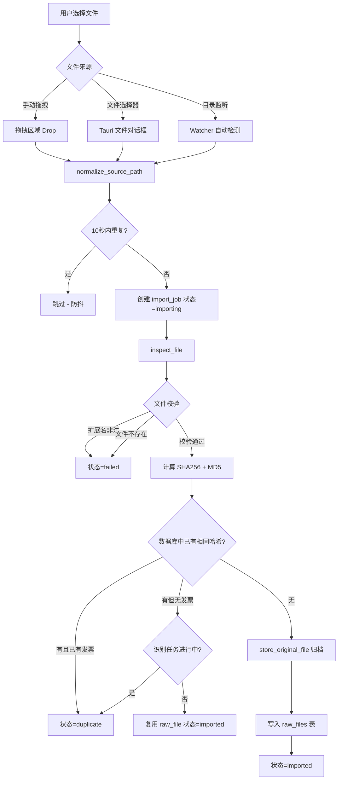
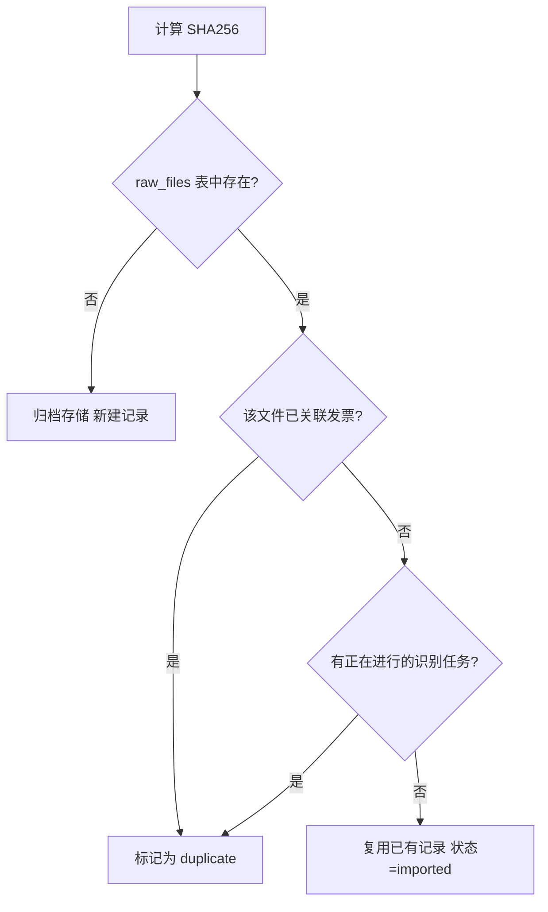
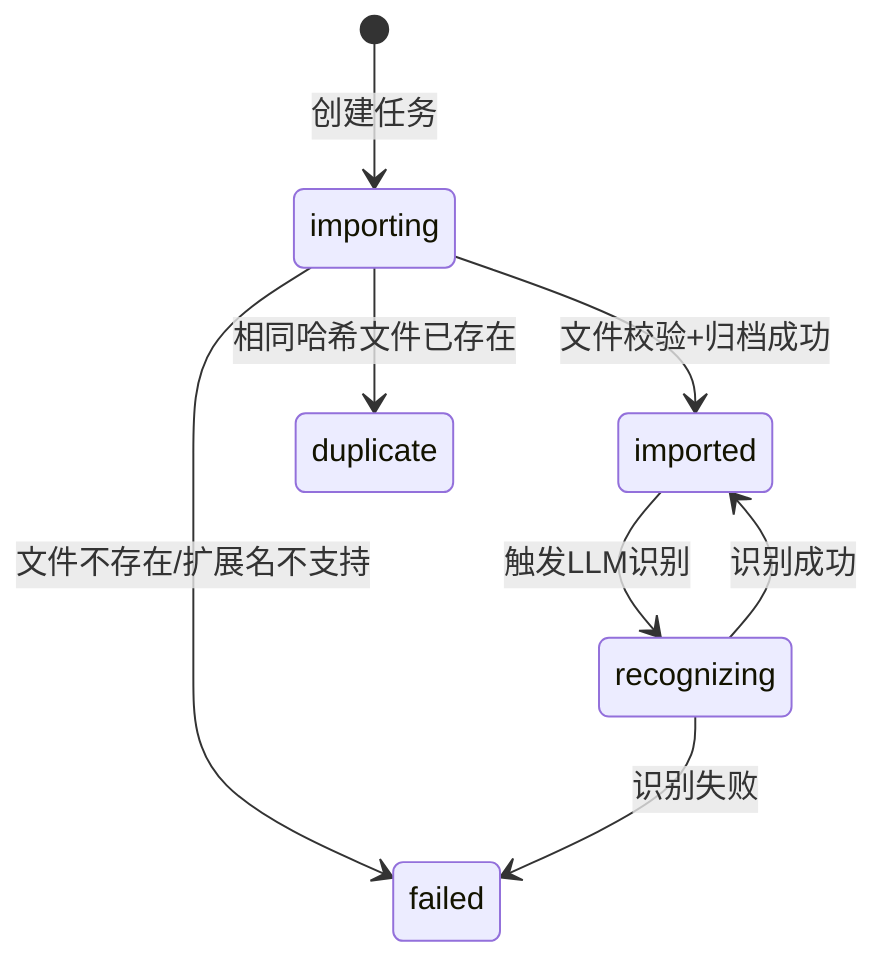

# 文件导入

文件导入是 InvoiceVault 的入口功能，负责将用户提供的发票文件（PDF、PNG、JPG/JPEG）接入系统，完成文件校验、哈希计算、原始文件归档，并创建导入任务记录。

## 导入流程总览



## 手动导入

### 拖拽导入

用户可以将发票文件直接拖拽到应用窗口的指定区域。Tauri 会触发 `drop` 事件，前端将文件数据通过 `import_dropped_file` 命令发送到后端：

```typescript
// 前端调用示例
const result = await invoke('import_dropped_file', {
  name: file.name,
  data: Array.from(fileBytes)
});
```

后端将文件写入临时目录后调用统一的 `import_files` 函数处理。

:::tip 防重复触发
Tauri 的拖拽事件可能对同一文件触发多次。系统通过检查 10 秒内是否有同一 `source_path` 的导入任务来避免重复记录（`has_recent_import_job`）。
:::

### 文件选择器导入

点击导入按钮会调用 `pick_invoice_files` 命令，打开操作系统原生文件对话框：

```rust
// 后端实现
app.dialog()
    .file()
    .add_filter("发票文件", &["pdf", "png", "jpg", "jpeg"])
    .pick_files(move |paths| { ... });
```

对话框预设了 `pdf`、`png`、`jpg`、`jpeg` 四种扩展名过滤器。选中的文件路径列表直接传入 `import_files` 进行批量导入。

### 批量导入

`import_files` 函数接受一个路径列表，逐个处理每个文件：

```rust
pub fn import_files(
    conn: &mut Connection,
    raw_dir: &Path,
    paths: Vec<String>,
    source_type: &str,  // "manual" | "watcher" | "email"
) -> Result<Vec<ImportJobSummary>, ImportError>
```

- `source_type` 标记导入来源，用于统计和审计
- 支持 `file://` URI 格式路径（自动解码百分号编码、处理跨平台路径差异）
- 每个文件独立处理，单个失败不影响其他文件

## 目录监听导入

目录监听器（Watcher）可以监控指定文件夹，当有新文件出现时自动导入。详见 [目录监听](./watcher.mdx) 章节。

监听器调用 `import_files` 时使用 `source_type = "watcher"`，导入成功后还会自动触发 LLM 识别。

## 文件校验

### 扩展名检查

系统只接受以下扩展名的文件：

| 扩展名 | MIME 类型 |
|--------|-----------|
| `pdf`  | `application/pdf` |
| `png`  | `image/png` |
| `jpg`  | `image/jpeg` |
| `jpeg` | `image/jpeg` |

不支持的扩展名会返回 `UnsupportedExtension` 错误，导入任务标记为 `failed`。

### 哈希计算

文件通过 `inspect_file` 函数进行校验，同时计算两种哈希值：

- **SHA256**：主哈希，用于数据库去重判断
- **MD5**：辅助哈希，存储在 `raw_files` 表中备用

计算过程使用 64KB 缓冲区逐块读取，适合处理大文件：

```rust
fn hash_file(source_path: &Path) -> Result<(String, String, u64), RawStoreError> {
    let mut sha256 = Sha256::new();
    let mut md5 = Md5::new();
    let mut buffer = [0_u8; 64 * 1024];
    // 逐块读取并更新哈希...
}
```

### 导入级去重

导入时通过 SHA256 哈希值查询数据库中是否已存在相同文件：



三种去重结果的含义：

| 状态 | 含义 |
|------|------|
| `imported` | 首次导入成功，或复用已有 raw_file |
| `duplicate` | 完全相同的文件已导入且已识别 |
| `failed` | 文件校验或存储失败 |

## RAW 文件归档

导入成功的文件会被复制到按年月组织的目录结构中：

```
raw/
  2026/
    01/
      invoice-001.pdf
      receipt-002.jpg
    02/
      ticket-003.png
```

归档逻辑在 `store_original_file` 中实现：

```rust
pub fn store_original_file(raw_dir: &Path, mut raw_file: RawFileInput) -> Result<RawFileInput, RawStoreError> {
    let now = Local::now();
    let month_dir = raw_dir
        .join(format!("{:04}", now.year()))
        .join(format!("{:02}", now.month()));
    fs::create_dir_all(&month_dir)?;

    let current_name = available_file_name(&month_dir, &raw_file.original_name);
    let storage_path = month_dir.join(&current_name);
    fs::copy(&raw_file.source_path, &storage_path)?;
    // ...
}
```

- 目录结构为 `raw/YYYY/MM/`，按导入时间归档
- 文件名冲突时自动添加数字后缀（如 `invoice-1.pdf`、`invoice-2.pdf`）
- 保留原始文件名和扩展名大小写

## 导入任务状态

每个导入文件都会创建一条 `import_jobs` 记录，追踪其生命周期：



:::info 中断恢复
如果应用在导入或识别过程中异常退出，下次启动时 `recover_interrupted_import_jobs` 会自动将中间状态的任务恢复：已关联发票的任务标记为 `imported`，其余标记为 `failed`。
:::

## 数据模型

### import_jobs 表

| 字段 | 类型 | 说明 |
|------|------|------|
| `id` | INTEGER | 主键 |
| `raw_file_id` | INTEGER | 关联的原始文件 ID |
| `source_path` | TEXT | 原始文件路径 |
| `status` | TEXT | 任务状态 |
| `error_message` | TEXT | 失败原因 |
| `source_type` | TEXT | 来源类型（manual/watcher/email） |
| `created_at` | TEXT | 创建时间戳（毫秒） |
| `updated_at` | TEXT | 更新时间戳（毫秒） |

### raw_files 表

| 字段 | 类型 | 说明 |
|------|------|------|
| `id` | INTEGER | 主键 |
| `sha256` | TEXT | SHA256 哈希值 |
| `md5` | TEXT | MD5 哈希值 |
| `original_name` | TEXT | 原始文件名 |
| `current_name` | TEXT | 归档后文件名 |
| `extension` | TEXT | 文件扩展名 |
| `mime_type` | TEXT | MIME 类型 |
| `byte_size` | INTEGER | 文件大小（字节） |
| `storage_path` | TEXT | 归档存储路径 |

## API 命令

| 命令 | 参数 | 说明 |
|------|------|------|
| `import_files` | `{ paths: string[] }` | 批量导入文件 |
| `import_dropped_file` | `{ name, data }` | 导入拖拽文件 |
| `pick_invoice_files` | 无 | 打开发票文件选择器 |
| `pick_any_files` | 无 | 打开通用文件选择器 |
| `list_import_jobs` | `{ page?, page_size? }` | 分页查询导入任务 |
| `poll_dropped_files` | 无 | 获取待处理的拖拽文件列表 |
