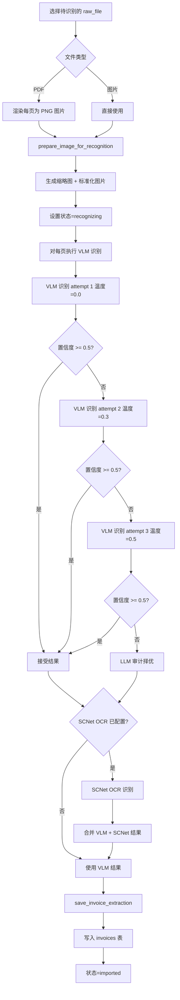
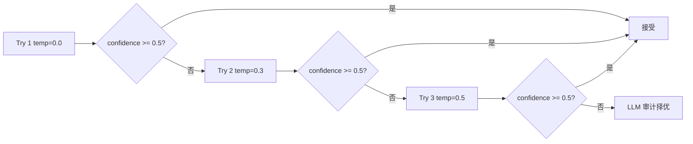
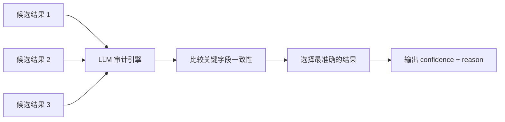
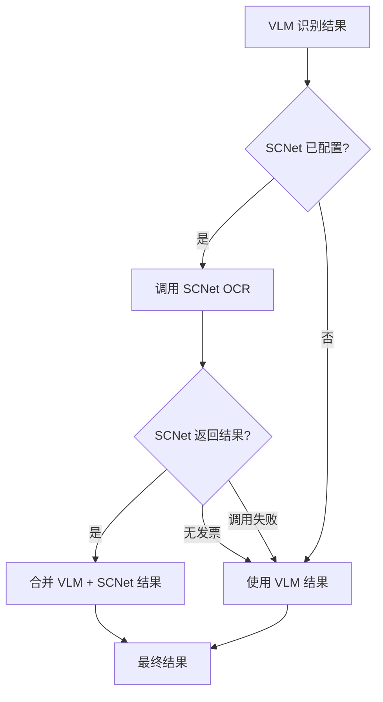
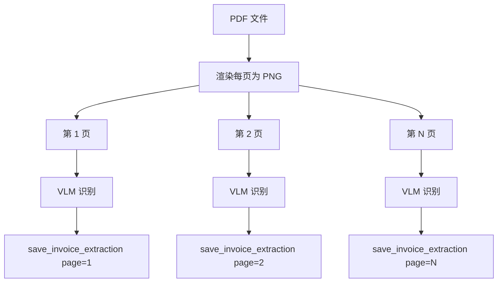

# 发票识别

InvoiceVault 使用大语言模型（LLM）的视觉能力来识别发票图片，提取结构化数据。识别流程包含多轮重试、温度调度、可选的 SCNet OCR 交叉验证以及 LLM 审计择优机制。

## 识别流程总览



## LLM 基础配置

系统通过 OpenAI 兼容的 Chat Completions API 与 LLM 交互，配置项包括：

| 配置项 | 说明 |
|--------|------|
| `base_url` | API 端点地址（如 `https://api.openai.com/v1`） |
| `api_key` | API 密钥 |
| `model` | 模型名称（如 `gpt-4o`） |
| `timeout_seconds` | 请求超时时间（默认 90 秒） |
| `scnet_ocr_api_key` | 可选的 SCNet OCR 密钥 |
| `recognition_max_tokens` | 识别响应最大 token 数（默认 16384） |

### 连接测试

配置 LLM 后可以通过 `test_llm_connection` 命令验证连接。系统会发送 "Reply with exactly: pong" 测试消息，确认 API 可用性、模型名称和响应延迟。

## 多模态视觉输入（VLM）

发票图片通过 base64 编码嵌入到 Vision Chat 请求中：

```rust
let image_data_url = format!("data:{mime_type};base64,{}", STANDARD.encode(image_bytes));

let request = VisionChatCompletionRequest {
    model,
    messages: vec![VisionChatMessage {
        role: "user".to_owned(),
        content: vec![
            VisionContent::Text { text: invoice_recognition_prompt() },
            VisionContent::ImageUrl { image_url: ImageUrlContent { url: image_data_url } },
        ],
    }],
    temperature,
    max_tokens: 16384,
};
```

- 支持 `image/png` 和 `image/jpeg` 两种图片格式
- PDF 文件会先渲染为 PNG 图片再进行识别
- 系统会自动准备标准化图片和缩略图

## 识别 Prompt 设计

系统使用精心设计的中文 prompt 指导 LLM 提取发票数据。Prompt 要求 LLM：

1. **只输出 JSON 对象**，不包含 Markdown 或解释文字
2. **判断是否为发票**：非发票图片返回 `{"is_invoice": false}`
3. **支持多种票据类型**：
   - 增值税电子普通/专用发票、全电发票
   - 通行费发票、出租车发票
   - 火车票/铁路电子客票、机票行程单
   - 微信/支付宝转账记录、银行转账回单
   - 定额发票、机动车销售发票等

4. **标准化输出 Schema**：

```json
{
  "is_invoice": true,
  "invoice_type": "增值税电子普通发票",
  "invoice_code": "011002100111",
  "invoice_number": "12345678",
  "issue_date": "2026-01-15",
  "seller": { "name": "...", "tax_id": "..." },
  "buyer": { "name": "...", "tax_id": "..." },
  "currency": "CNY",
  "amount_without_tax": 100.00,
  "tax_amount": 6.00,
  "total_amount": 106.00,
  "items": [...],
  "confidence": 0.9,
  "needs_review": false,
  "warnings": []
}
```

5. **特殊票据的 extra_fields**：

| 票据类型 | 必填额外字段 |
|----------|-------------|
| 火车票 | `train_number`, `departure`, `arrival`, `seat_class`, `passenger_name`, `departure_time` |
| 机票行程单 | `flight_number`, `departure`, `arrival`, `seat_class`, `passenger_name`, `departure_time`, `boarding_gate`, `baggage` |
| 通行费发票 | `toll_entry`, `toll_exit`, `license_plate` |
| 微信/支付宝转账 | `payment_platform`, `transaction_id`, `counterparty`, `transaction_type` |
| 机动车销售发票 | `vin`, `engine_number`, `vehicle_model` |

## 温度调度与重试

VLM 识别采用温度调度策略，最多尝试 3 次：

| 尝试次数 | 温度值 | 策略说明 |
|----------|--------|----------|
| 第 1 次 | 0.0 | 确定性输出，结果最稳定 |
| 第 2 次 | 0.3 | 适度随机，可能突破局部最优 |
| 第 3 次 | 0.5 | 较高随机性，尝试不同解读 |



每次尝试之间会等待递增的退避时间（1秒、2秒、3秒），避免触发速率限制。

### 单次请求重试

每次 VLM 调用内部还有最多 3 次网络级重试：

- **网络错误**（连接超时、DNS 失败等）：自动重试
- **HTTP 429**（速率限制）：自动重试
- **HTTP 5xx**（服务端错误）：自动重试
- **HTTP 4xx**（客户端错误，非 429）：不重试，直接失败
- **响应 JSON 解析失败**：自动重试

重试间隔为 `attempt * 2` 秒（2秒、4秒、6秒）。

## LLM 审计择优

当所有 3 次 VLM 尝试的置信度都低于阈值（0.5）时，系统会将所有候选结果交给 LLM 进行审计择优：



审计 Prompt 要求 LLM：

1. 比对发票号码、金额、购销方名称、日期的一致性
2. 多数结果一致时以多数为准
3. 选择字段最完整、数值最合理的结果
4. 输出 `selected_index`、`confidence` 和 `reason`

审计结果的置信度会被注入到最终 JSON 中，如果仍低于阈值则标记 `needs_review: true`。如果审计 LLM 调用本身失败，系统会回退到第一个候选结果。

## SCNet OCR 交叉验证

当配置了 SCNet OCR API 密钥时，系统会在 VLM 识别完成后额外调用 SCNet 高精度 OCR 进行交叉验证：



SCNet OCR 专门针对增值税发票优化，能够：
- 提供高精度的发票代码、号码识别
- 准确提取金额、税额等数值字段
- 与 VLM 结果互补，提高整体识别准确率

**合并策略**：SCNet 识别到的字段会覆盖 VLM 的对应字段，但 VLM 独有的字段（如备注、特殊票据字段）会保留。

## Schema 验证与字段提取

识别结果 JSON 通过 `extract_json_object` 函数从 LLM 响应中提取。该函数能够：

- 处理被 Markdown 代码块（` ```json ... ``` `）包裹的 JSON
- 正确处理字符串内的花括号（如备注中的 `}`）
- 处理嵌套 JSON 对象

提取后的 JSON 经过 `save_invoice_extraction` 函数解析并写入数据库：

1. **解析 JSON**：提取所有标准字段（发票类型、代码、号码、日期、购销方、金额等）
2. **提取明细项**：从 `items` 数组中解析商品/服务明细到 `invoice_items` 表
3. **存储额外字段**：将 `extra_fields` 中的特殊票据字段存储到专用表
4. **生成内容摘要**：自动拼接明细项名称作为 `content_summary`

## 置信度与 needs_review

每个识别结果都包含 `confidence`（0.0-1.0）和 `needs_review`（布尔值）字段：

| 场景 | confidence | needs_review |
|------|-----------|--------------|
| VLM 首次高置信识别 | >= 0.5 | false |
| VLM 重试后识别 | 由 LLM 返回 | 视值而定 |
| LLM 审计后结果 | 由审计 LLM 评估 | < 0.5 时为 true |
| 非发票图片 | 0 | true |

前端可以根据 `needs_review` 标记提示用户进行人工复核。

## PDF 多页处理

PDF 文件会被逐页渲染为图片，每页独立识别：



每页识别结果独立保存为一条发票记录，`source_page_range` 字段记录来源页码。识别完成后为每张发票生成缩略图。

## LLM 审计日志

每次 LLM 调用（包括连接测试、发票识别、OCR 交叉验证、审计择优）都会记录审计日志：

```json
{
  "timestamp": "2026-01-15T10:30:00Z",
  "request_timestamp": "2026-01-15T10:29:58Z",
  "operation": "invoice_recognition",
  "endpoint": "https://api.openai.com/v1/chat/completions",
  "model": "gpt-4o",
  "duration_ms": 3200,
  "status": 200,
  "request": { ... },
  "response": { ... },
  "error": null
}
```

- 日志以 JSONL 格式按日期存储：`llm-audit-YYYY-MM-DD.jsonl`
- `operation` 字段区分操作类型：`connection_test`、`invoice_recognition`、`scnet_ocr`、`agent_chat`
- 便于排查识别问题和审计 API 费用

## Token 用量统计

每次识别完成后，系统会记录 token 消耗到 `usage_log` 表：

- `prompt_tokens`：输入 token 数（含 base64 图片）
- `completion_tokens`：输出 token 数（识别结果 JSON）
- `total_tokens`：总 token 数

这些数据可在仪表盘页面查看累计消耗和月度统计，帮助用户了解 API 使用成本。

## API 命令

| 命令 | 参数 | 说明 |
|------|------|------|
| `recognize_raw_file` | `{ raw_file_id, config }` | 识别指定原始文件，返回识别结果和 token 用量 |
| `test_llm_connection` | `{ config }` | 测试 LLM 连接，返回模型名和延迟 |
