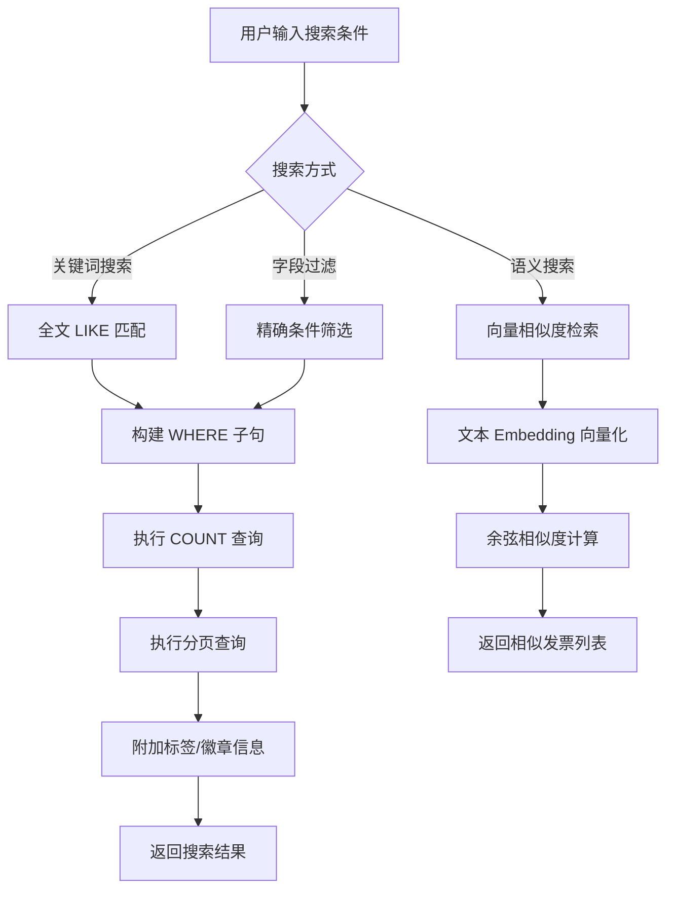
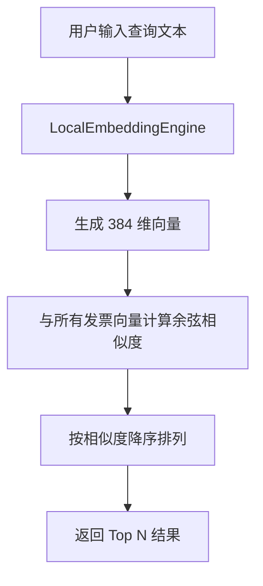

# 发票搜索

InvoiceVault 提供强大的多维度发票搜索能力，支持关键词全文搜索、字段精确过滤、分页排序以及基于向量相似度的语义搜索。

## 搜索流程



## 多维度搜索参数

`search_invoices` 命令接受丰富的搜索参数：

```typescript
interface InvoiceSearchParams {
  query?: string;           // 全文关键词
  invoice_type?: string;    // 发票类型
  seller_name?: string;     // 销售方名称（模糊匹配）
  buyer_name?: string;      // 购买方名称（模糊匹配）
  invoice_number?: string;  // 发票号码（模糊匹配）
  date_from?: string;       // 开始日期（YYYY-MM-DD）
  date_to?: string;         // 结束日期（YYYY-MM-DD）
  amount_min?: string;      // 最小金额
  amount_max?: string;      // 最大金额
  category?: string;        // 费用类别
  tag?: string;             // 标签
  status?: string;          // 识别状态
  duplicate_status?: string; // 重复状态
  sort_by?: string;         // 排序字段
  sort_order?: string;      // 排序方向（asc/desc）
  page?: number;            // 页码（从 1 开始）
  page_size?: number;       // 每页条数（最大 500）
}
```

所有参数都是可选的，可以自由组合。未指定的参数不做过滤。

## 全文搜索（关键词）

当提供 `query` 参数时，系统会在多个字段中执行 LIKE 模糊匹配：

```sql
WHERE (
    seller_name LIKE '%关键词%'
    OR buyer_name LIKE '%关键词%'
    OR invoice_number LIKE '%关键词%'
    OR invoice_code LIKE '%关键词%'
    OR invoice_type LIKE '%关键词%'
    OR category LIKE '%关键词%'
    OR remarks LIKE '%关键词%'
    OR content_summary LIKE '%关键词%'
    OR EXISTS (
        SELECT 1 FROM invoice_items item
        WHERE item.invoice_id = invoices.id
            AND (item.name LIKE '%关键词%' OR item.specification LIKE '%关键词%')
    )
)
```

全文搜索覆盖了发票的几乎所有文本字段，包括明细项名称和规格。

### 搜索示例

**搜索包含"餐饮"的发票：**

```typescript
const result = await invoke('search_invoices', {
  params: { query: '餐饮' }
});
```

这会匹配：
- 销售方名称包含"餐饮"的发票
- 费用类别为"餐饮"的发票
- 发票内容摘要包含"餐饮"的发票
- 明细项名称包含"餐饮"的发票

**搜索包含"华为"且金额大于 1000 的发票：**

```typescript
const result = await invoke('search_invoices', {
  params: {
    query: '华为',
    amount_min: '1000'
  }
});
```

## 字段精确过滤

除全文搜索外，每个字段都支持独立的精确过滤：

### 按发票类型过滤

```typescript
const result = await invoke('search_invoices', {
  params: { invoice_type: '增值税电子普通发票' }
});
```

### 按日期范围过滤

```typescript
const result = await invoke('search_invoices', {
  params: {
    date_from: '2026-01-01',
    date_to: '2026-06-30'
  }
});
```

### 按金额范围过滤

```typescript
const result = await invoke('search_invoices', {
  params: {
    amount_min: '100',
    amount_max: '5000'
  }
});
```

### 按销售方/购买方过滤

```typescript
const result = await invoke('search_invoices', {
  params: {
    seller_name: '京东',  // 模糊匹配，包含"京东"即可
    buyer_name: '张三'
  }
});
```

### 按重复状态过滤

```typescript
const result = await invoke('search_invoices', {
  params: { duplicate_status: 'probable_duplicate' }
});
```

可选的 `duplicate_status` 值：

| 值 | 含义 |
|----|------|
| `unique` | 无重复 |
| `possible_duplicate` | 可能重复 |
| `probable_duplicate` | 很可能重复 |
| `unknown` | 未检测 |

### 多条件组合

所有过滤条件之间是 AND 关系，可以任意组合：

```typescript
const result = await invoke('search_invoices', {
  params: {
    query: '技术服务',
    invoice_type: '增值税电子普通发票',
    seller_name: '科技',
    date_from: '2026-01-01',
    date_to: '2026-12-31',
    amount_min: '500',
    duplicate_status: 'unique',
    sort_by: 'total_amount',
    sort_order: 'desc',
    page: 1,
    page_size: 20
  }
});
```

## 分页与排序

### 分页

搜索结果默认分页返回：

```typescript
interface InvoiceSearchResult {
  invoices: InvoiceSummary[];  // 当前页的发票列表
  total_count: number;         // 总记录数
  page: number;                // 当前页码
  page_size: number;           // 每页条数
  total_pages: number;         // 总页数
}
```

- `page` 默认为 1，最小值为 1
- `page_size` 默认为 50，范围 1-500
- `total_pages` 由 `ceil(total_count / page_size)` 计算

### 排序

通过 `sort_by` 和 `sort_order` 控制排序：

| `sort_by` 值 | 排序字段 |
|---------------|---------|
| `issue_date` | 开票日期 |
| `total_amount` | 价税合计 |
| `created_at` | 创建时间 |
| `invoice_number` | 发票号码 |
| `seller_name` | 销售方名称 |
| `confidence` | 置信度 |

`sort_order` 取值 `asc`（升序）或 `desc`（降序），默认为降序。

## 语义搜索（向量相似度）

语义搜索基于文本 Embedding 向量的余弦相似度，能够理解搜索意图而非仅仅匹配字符。

### 工作原理



1. 用户输入的查询文本通过本地 BGE-small-zh-v1.5 模型转换为 384 维向量
2. 与数据库中所有发票的 Embedding 向量计算余弦相似度
3. 返回相似度最高的 N 条结果

### 使用示例

```typescript
// 搜索语义上与"出差打车费用"相似的发票
const results = await invoke('search_invoices_semantic', {
  query: '出差打车费用',
  limit: 10
});
```

返回结果包含 `invoice_id`、`similarity`（0.0-1.0）和 `metadata`。

:::info 需要 Embedding 功能
语义搜索需要先启用本地 Embedding 模型（设置 -> AI Provider -> 本地 Embedding）。
:::

### 适用场景

语义搜索适合以下场景：
- 模糊描述搜索：如"上个月的交通费"
- 概念匹配：如"办公用品"可能匹配到"打印纸"、"签字笔"等
- 跨字段关联：传统搜索难以覆盖的语义关联

### 局限性

- 语义搜索不支持分页和排序参数
- 语义搜索不支持组合过滤条件
- 相似度阈值需要根据业务场景调整
- 同模板的不同发票可能有较高的基础相似度

## 全文搜索 vs 语义搜索

| 特性 | 全文搜索 | 语义搜索 |
|------|---------|---------|
| 匹配方式 | LIKE 模糊匹配 | 向量余弦相似度 |
| 精确匹配 | 好（精确字符匹配） | 一般 |
| 模糊匹配 | 一般（需要包含关键词） | 好（理解语义） |
| 组合过滤 | 支持所有字段 | 不支持 |
| 分页排序 | 支持 | 不支持 |
| 性能 | 快（SQLite 索引） | 较慢（全量向量计算） |
| 适用场景 | 已知关键词的精确搜索 | 模糊描述的概念搜索 |

## 搜索结果结构

每条搜索结果包含以下字段：

```typescript
interface InvoiceSummary {
  id: number;
  raw_file_id: number;
  invoice_type?: string;
  invoice_code?: string;
  invoice_number?: string;
  issue_date?: string;
  seller_name?: string;
  buyer_name?: string;
  currency: string;
  total_amount?: string;
  category?: string;
  confidence?: number;
  status: string;
  duplicate_status: string;
  created_at: string;
  updated_at: string;
  viewed_at?: string;
  item_names?: string;        // 明细项名称（逗号分隔）
  content_summary?: string;   // 内容摘要
  badges: InvoiceBadgeSelection[]; // 关联的标签
}
```

## API 命令

| 命令 | 参数 | 说明 |
|------|------|------|
| `search_invoices` | `{ params: InvoiceSearchParams }` | 多维度搜索，支持分页排序 |
| `search_invoices_semantic` | `{ query, limit }` | 语义向量搜索 |
| `list_invoices` | 无 | 获取所有发票列表（无分页） |
| `get_invoice_detail` | `{ invoice_id }` | 获取单张发票完整详情 |
