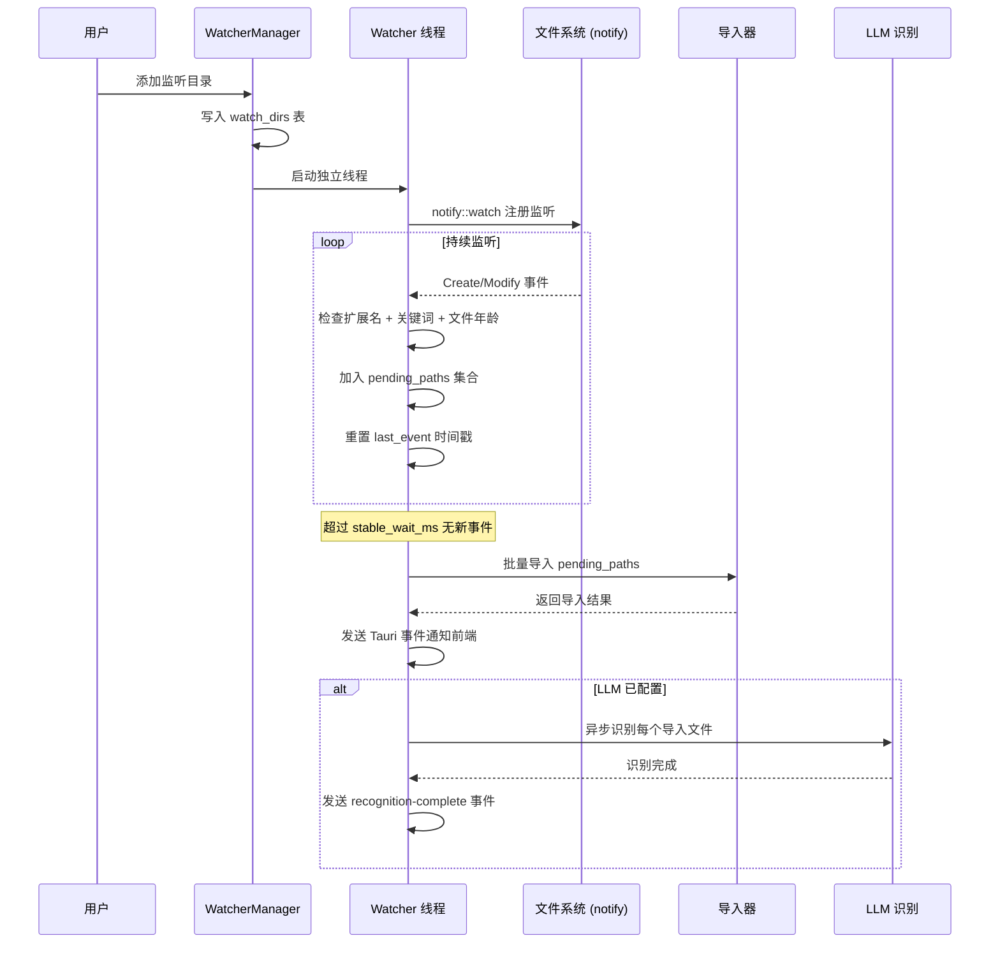
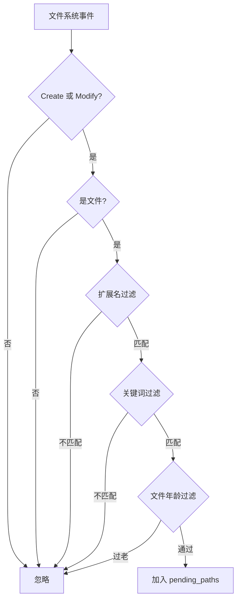
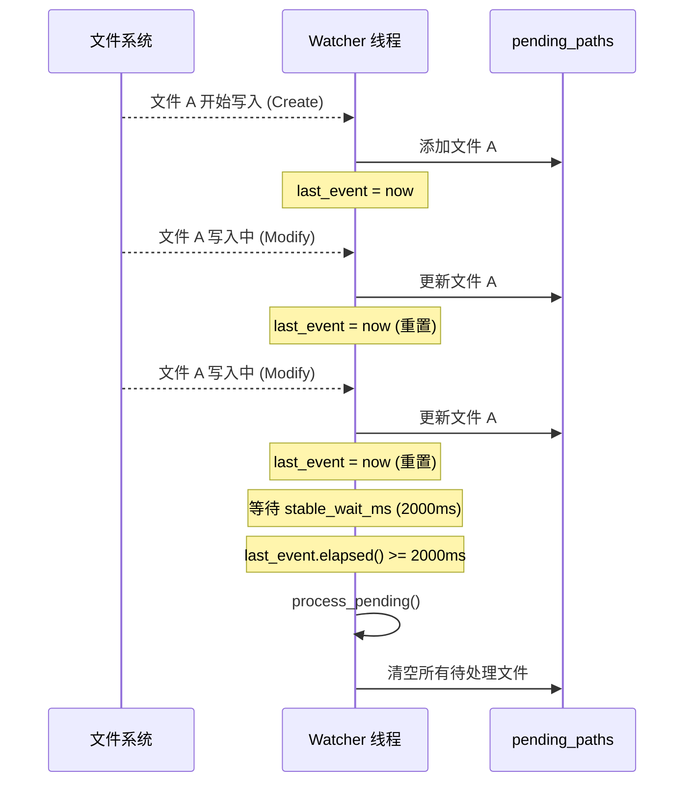
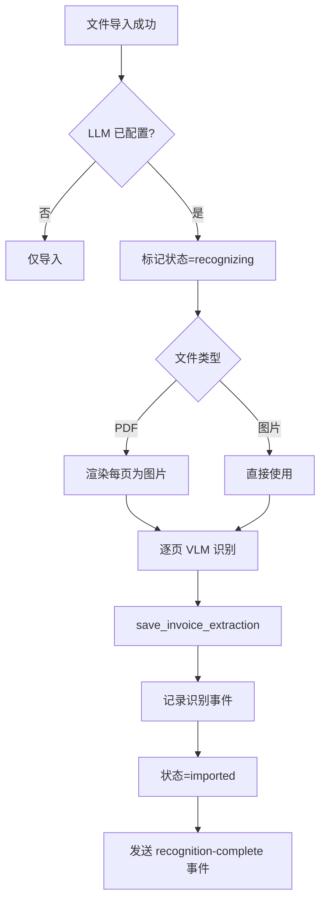

# 目录监听

目录监听器（Watcher）可以监控指定文件夹，当有新的发票文件出现时自动导入并触发 LLM 识别，实现全自动的发票采集流程。

## 工作原理



## 配置选项

每个监听目录有独立的配置：

| 选项 | 字段名 | 默认值 | 说明 |
|------|--------|--------|------|
| 监听路径 | `path` | 必填 | 要监控的目录路径 |
| 文件扩展名 | `extensions` | 空（全部） | 逗号分隔的扩展名列表，如 `pdf,png,jpg` |
| 递归监听 | `recursive` | `true` | 是否监控子目录 |
| 稳定等待 | `stable_wait_ms` | `2000` | 文件写入完成等待时间（毫秒） |
| 名称关键词 | `name_keywords` | 空（全部） | 文件名必须包含的关键词 |
| 最大文件年龄 | `max_file_age_days` | `0`（不限） | 只处理最近 N 天内修改的文件 |
| 导入后归档 | `archive_after_import` | `false` | 导入后是否移动到归档目录 |
| 归档路径 | `archive_path` | 无 | 归档目标目录 |
| 启用状态 | `enabled` | `true` | 是否启用监听 |

### 配置示例

```typescript
// 添加监听目录
const status = await invoke('add_watch_dir', {
  request: {
    path: '/Users/me/Downloads',
    extensions: 'pdf,png,jpg,jpeg',
    recursive: true,
    stable_wait_ms: 2000,
    name_keywords: '发票 invoice',
    max_file_age_days: 7
  }
});
```

## 文件过滤

Watcher 在处理文件系统事件时会进行多级过滤：



### 扩展名过滤

如果配置了 `extensions`（如 `pdf,png,jpg`），只有扩展名匹配的文件才会被处理。比较时不区分大小写。

### 关键词过滤

如果配置了 `name_keywords`（如 `发票 invoice`），文件名（不含路径）必须包含至少一个关键词才被处理。比较时转为小写。

### 文件年龄过滤

如果配置了 `max_file_age_days`（如 `7`），只有最近 7 天内修改过的文件才会被处理。基于文件的 `modified` 时间戳判断。

## 防抖动机制

文件写入可能需要一定时间（尤其是大文件或网络文件）。Watcher 使用防抖动策略确保文件写入完成后再导入：



### 防抖动参数

| 参数 | 值 | 说明 |
|------|-----|------|
| `WATCHER_DEFAULT_STABLE_WAIT_MS` | 2000ms | 默认稳定等待时间 |
| `WATCHER_STABILITY_CHECK_INTERVAL_MS` | 100ms | 检查间隔 |

工作流程：
1. 收到文件事件时将文件加入 `pending_paths` 集合并重置 `last_event`
2. 每 100ms 检查一次是否有待处理文件
3. 如果距上次事件已超过 `stable_wait_ms`（默认 2 秒），批量处理所有待处理文件
4. 使用 `HashSet` 自动去重，同一文件多次事件只处理一次

## 独立线程

每个监听目录运行在独立的操作系统线程中：

```rust
std::thread::Builder::new()
    .name(format!("watch-dir-{id}"))
    .spawn(move || {
        watch_loop(
            db, raw_dir, thumbnails_dir, llm_audit_dir,
            llm_config, llm_audit_enabled, app_handle,
            id, path, recursive, extensions, stable_wait_ms,
            name_keywords, max_file_age_days, stop_flag,
        );
    })
```

- 线程名格式为 `watch-dir-{id}`，便于调试
- 通过 `AtomicBool` stop_flag 控制线程停止
- 线程停止前会处理剩余的 `pending_paths`
- `WatcherManager` 的 `Drop` 实现会自动停止所有线程

## 自动识别

导入成功后，如果 LLM 已配置，Watcher 会自动触发识别：



自动识别与手动识别使用相同的识别流程（VLM + 温度调度 + 可选 SCNet OCR），确保一致性。

## 状态管理

### 启用/禁用

```typescript
// 启用监听
await invoke('toggle_watch_dir', { id: 1, enabled: true });

// 禁用监听
await invoke('toggle_watch_dir', { id: 1, enabled: false });
```

- 启用时启动 Watcher 线程
- 禁用时通过 stop_flag 停止线程
- 状态持久化到数据库，应用重启后 `resume_enabled` 自动恢复已启用的监听

### 更新配置

```typescript
await invoke('update_watch_dir', {
  id: 1,
  request: {
    extensions: 'pdf,png',
    stable_wait_ms: 3000
  }
});
```

更新配置时会：
1. 停止当前 Watcher 线程
2. 更新数据库配置
3. 如果目录已启用，重新启动 Watcher 线程

### 查看状态

```typescript
const dirs = await invoke('list_watch_dirs');
// 返回所有监听目录的配置和运行状态
```

返回结构：

```typescript
interface WatchDirStatus {
  id: number;
  path: string;
  extensions: string;
  recursive: boolean;
  enabled: boolean;
  stable_wait_ms: number;
  archive_after_import: boolean;
  archive_path?: string;
  name_keywords: string;
  max_file_age_days: number;
  running: boolean;     // 当前是否正在运行
  error?: string;       // 错误信息（如路径不存在）
  created_at: string;
  updated_at: string;
}
```

## 前端事件

Watcher 通过 Tauri 的事件系统通知前端：

| 事件名 | 数据 | 说明 |
|--------|------|------|
| `watcher-import` | `{ watch_dir_id, watch_dir_path, imported_count, jobs }` | 文件导入完成 |
| `recognition-complete` | 无 | 所有待识别文件识别完成 |

前端可以监听这些事件来更新 UI，显示导入进度和识别结果。

## 应用启动恢复

应用启动时，`WatcherManager::resume_enabled` 会从数据库读取所有已启用的监听目录，重新启动 Watcher 线程：

```rust
pub fn resume_enabled(&self) -> Result<(), WatcherError> {
    let db = self.db.lock().unwrap();
    let dirs = db.prepare(
        "SELECT id, path, extensions, recursive, stable_wait_ms FROM watch_dirs WHERE enabled = 1"
    )?;
    // 为每个目录启动 Watcher 线程...
}
```

这确保了监听状态的持久化：即使应用关闭重启，之前配置的监听目录会自动恢复监控。

## 数据模型

### watch_dirs 表

| 字段 | 类型 | 默认值 | 说明 |
|------|------|--------|------|
| `id` | INTEGER | 自增 | 主键 |
| `path` | TEXT | 必填 | 监听目录路径（UNIQUE） |
| `extensions` | TEXT | `""` | 扩展名过滤 |
| `recursive` | INTEGER | `1` | 是否递归 |
| `enabled` | INTEGER | `1` | 是否启用 |
| `stable_wait_ms` | INTEGER | `2000` | 稳定等待时间 |
| `archive_after_import` | INTEGER | `0` | 导入后是否归档 |
| `archive_path` | TEXT | NULL | 归档路径 |
| `name_keywords` | TEXT | `""` | 文件名关键词 |
| `max_file_age_days` | INTEGER | `0` | 最大文件年龄 |
| `created_at` | TEXT | CURRENT_TIMESTAMP | 创建时间 |
| `updated_at` | TEXT | CURRENT_TIMESTAMP | 更新时间 |

:::warning 路径唯一性
`path` 字段有 UNIQUE 约束，不能添加重复的监听路径。如果路径已存在，添加操作会失败。
:::

## API 命令

| 命令 | 参数 | 说明 |
|------|------|------|
| `add_watch_dir` | `{ request: AddWatchDirRequest }` | 添加监听目录 |
| `remove_watch_dir` | `{ id }` | 移除监听目录 |
| `update_watch_dir` | `{ id, request }` | 更新监听配置 |
| `toggle_watch_dir` | `{ id, enabled }` | 启用/禁用监听 |
| `list_watch_dirs` | 无 | 列出所有监听目录及状态 |
