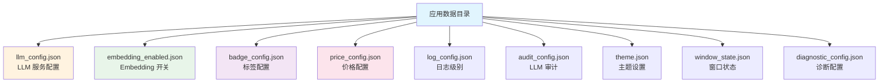
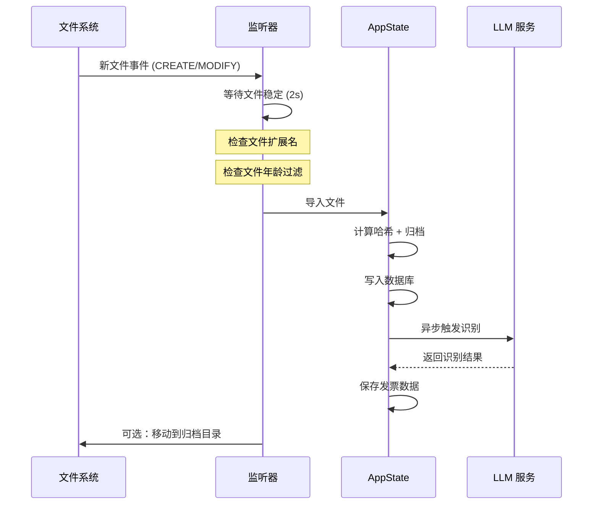

# 配置说明

票匣的所有配置都以 JSON 文件形式存储在应用数据目录下。本章详细说明每个配置项的用途和格式。

## 配置文件概览



| 配置文件 | 说明 | 管理方式 |
|---------|------|---------|
| `llm_config.json` | LLM 服务连接信息 | 设置页 > AI 提供商 |
| `embedding_enabled.json` | 本地 Embedding 开关 | 设置页 > AI 提供商 |
| `badge_config.json` | 自定义标签分组和选项 | 设置页 > 通用 |
| `price_config.json` | LLM 调用价格配置 | 设置页 > 高级 |
| `log_config.json` | 日志输出级别 | 设置页 > 高级 |
| `audit_config.json` | LLM 请求审计开关 | 设置页 > AI 提供商 |
| `theme.json` | 主题（亮色/暗色） | 设置页 > 通用 |
| `window_state.json` | 窗口尺寸记忆 | 自动管理 |
| `diagnostic_config.json` | LLM 诊断采样配置 | 设置页 > 高级 |

## LLM 服务配置

这是票匣最核心的配置，决定了 AI 识别和 Agent 对话使用的语言模型。

**配置文件**：`llm_config.json`

**管理路径**：设置 > AI 提供商

```json title="llm_config.json"
{
  "base_url": "https://api.deepseek.com/v1",
  "api_key": "sk-your-api-key",
  "model": "deepseek-chat",
  "timeout_seconds": 90,
  "scnet_ocr_api_key": null,
  "recognition_max_tokens": 16384,
  "agent_max_tokens": 8192
}
```

### 字段说明

| 字段 | 类型 | 必填 | 说明 |
|------|------|------|------|
| `base_url` | string | 是 | OpenAI 兼容 API 的基础 URL，不含 `/chat/completions` 路径 |
| `api_key` | string | 是 | API 认证密钥 |
| `model` | string | 是 | 模型名称，需支持多模态（图片输入） |
| `timeout_seconds` | number | 否 | 单次请求超时时间（秒），默认 90 |
| `scnet_ocr_api_key` | string | 否 | SCNet OCR 交叉验证 API 密钥，留空则不启用 |
| `recognition_max_tokens` | number | 否 | 识别响应最大 token 数，默认 16384 |
| `agent_max_tokens` | number | 否 | Agent 响应最大 token 数，默认 8192 |

### 常见 LLM 提供商配置

| 提供商 | Base URL | 推荐模型 | 备注 |
|--------|----------|---------|------|
| OpenAI | `https://api.openai.com/v1` | `gpt-4o`, `gpt-4o-mini` | 官方 API |
| DeepSeek | `https://api.deepseek.com/v1` | `deepseek-chat` | 性价比高 |
| 通义千问 | `https://dashscope.aliyuncs.com/compatible-mode/v1` | `qwen-vl-max` | 支持中文 |
| 本地 Ollama | `http://localhost:11434/v1` | `llava`, `qwen2.5-vl` | 完全离线 |

### 内置超时与重试策略

票匣对 LLM 调用有以下内置策略：

| 参数 | 值 | 说明 |
|------|---|------|
| 连接测试超时 | 30 秒 | 测试 LLM 连接的超时时间 |
| 识别请求超时 | 90 秒 | 单次识别请求的超时时间 |
| 最大重试次数 | 3 次 | 识别失败后的重试次数 |
| VLM 最大尝试 | 3 次 | 多模态识别的最大尝试次数 |
| 置信度阈值 | 0.5 | 低于此阈值的识别结果被拒绝 |
| VLM 温度调度 | 0.0, 0.3, 0.5 | 重试时依次使用的温度值 |

### LLM 请求审计

开启审计后，票匣会将每次 LLM 请求和响应保存为文件，便于调试和问题排查。

**管理路径**：设置 > AI 提供商 > LLM 审计

审计文件保存在 `llm_audit/` 目录下，以时间戳命名。可以在设置中随时开启或关闭。

## Embedding 配置

本地 Embedding 功能用于语义搜索，使用 ONNX Runtime 在本地运行 `bge-small-zh-v1.5` 模型。

**配置文件**：`embedding_enabled.json`

**管理路径**：设置 > AI 提供商 > 本地 Embedding

```json title="embedding_enabled.json"
{
  "enabled": true
}
```

| 字段 | 类型 | 说明 |
|------|------|------|
| `enabled` | boolean | 是否启用本地 Embedding |

### Embedding 模型参数

| 参数 | 值 | 说明 |
|------|---|------|
| 模型仓库 | `Xenova/bge-small-zh-v1.5` | HuggingFace 上的模型 |
| 向量维度 | 384 | 每个 Embedding 向量的维度 |
| 最大 Token | 512 | 输入文本的最大 token 长度 |
| 量化格式 | Q4 ONNX | 4-bit 量化，减小模型体积 |
| 模型大小 | 约 50MB | 含 tokenizer 和 ONNX 模型 |

### 模型文件位置

```
models/
└── bge-small-zh-v1.5/
    ├── onnx/
    │   └── model_q4.onnx    # 量化后的 ONNX 模型
    └── tokenizer.json        # 分词器配置
```

首次启用时会自动从 HuggingFace 下载模型。下载完成后可在断网环境下使用。

## 标签（Badge）配置

标签系统允许你为发票添加自定义分类，每个标签由一个"分组"和多个"选项"组成。

**配置文件**：`badge_config.json`

**管理路径**：设置 > 通用 > 标签管理

```json title="badge_config.json"
{
  "groups": [
    {
      "name": "消费类型",
      "options": ["差旅", "办公用品", "餐饮", "交通", "技术服务"]
    },
    {
      "name": "报销状态",
      "options": ["未报销", "已提交", "已报销", "已拒绝"]
    },
    {
      "name": "优先级",
      "options": ["普通", "紧急", "待处理"]
    }
  ]
}
```

### 字段说明

| 字段 | 类型 | 说明 |
|------|------|------|
| `groups` | array | 标签分组列表 |
| `groups[].name` | string | 分组名称，不可为空或重复 |
| `groups[].options` | string[] | 该分组下的选项列表，不可有空值或重复值 |

### 标签配置规则

票匣会自动清理标签配置：
- 去除空白名称的分组
- 去除空白选项
- 去除重复的选项
- 去除重复的分组名称

## 价格配置

价格配置用于仪表盘中的 LLM 调用成本统计。

**配置文件**：`price_config.json`

**管理路径**：设置 > 高级 > 价格配置

```json title="price_config.json"
{
  "llm_input_price_per_1k": 0.0008,
  "llm_output_price_per_1k": 0.002,
  "embedding_input_price_per_1k": 0.0007,
  "embedding_output_price_per_1k": 0.0007
}
```

| 字段 | 类型 | 默认值 | 说明 |
|------|------|--------|------|
| `llm_input_price_per_1k` | number | 0.0008 | LLM 输入 token 价格（元/千 token） |
| `llm_output_price_per_1k` | number | 0.002 | LLM 输出 token 价格（元/千 token） |
| `embedding_input_price_per_1k` | number | 0.0007 | Embedding 输入 token 价格（元/千 token） |
| `embedding_output_price_per_1k` | number | 0.0007 | Embedding 输出 token 价格（元/千 token） |

配置后，仪表盘会自动计算并展示 LLM 调用的累计费用。

## 目录监听配置

目录监听功能让票匣自动监控指定目录中的新文件并导入识别。

**管理路径**：设置 > 通用 > 目录监听

每个监听目录有以下配置：

| 字段 | 说明 |
|------|------|
| 目录路径 | 要监控的本地目录路径 |
| 文件扩展名 | 过滤的文件扩展名（默认 pdf, png, jpg, jpeg） |
| 递归监控 | 是否包含子目录 |
| 启用/禁用 | 是否激活该监听 |
| 稳定等待时间 | 文件写入完成后等待多久再导入（默认 2 秒） |
| 导入后归档 | 导入成功后是否移动到归档目录 |
| 归档路径 | 归档目标目录 |

### 监听流程



## 主题配置

**配置文件**：`theme.json`

**管理路径**：设置 > 通用 > 外观

支持"亮色"和"暗色"两种主题，也可以设置为"跟随系统"。

## 日志配置

**配置文件**：`log_config.json`

**管理路径**：设置 > 高级 > 日志级别

```json title="log_config.json"
{
  "level": "info"
}
```

可选的日志级别（从详细到简略）：

| 级别 | 说明 |
|------|------|
| `trace` | 最详细的追踪信息，用于深度调试 |
| `debug` | 调试信息，开发时使用 |
| `info` | 一般运行信息（默认值） |
| `warn` | 警告信息，仅显示潜在问题 |
| `error` | 错误信息，仅显示错误 |

日志文件保存在 `logs/` 目录下，按天滚动，文件名格式为 `invoicevault.YYYY-MM-DD`。

:::tip 调试建议
遇到问题时，可将日志级别设为 `debug`，复现问题后导出日志（设置 > 高级 > 导出日志），日志 ZIP 包含数据库、配置文件和运行日志，便于问题排查。
:::

## 诊断配置

**配置文件**：`diagnostic_config.json`

**管理路径**：设置 > 高级 > LLM 诊断

用于 LLM 连接诊断的采样配置，可在遇到识别问题时运行诊断来排查原因。

## 应用数据目录

所有配置文件和数据都存储在以下目录中：

| 平台 | 路径 |
|------|------|
| Windows | `%APPDATA%/com.invoicevault.desktop/` |
| Linux | `~/.local/share/com.invoicevault.desktop/` |
| macOS | `~/Library/Application Support/com.invoicevault.desktop/` |

## 通过 Agent 查询配置

你也可以通过 Agent 对话来查看和修改部分配置：

> "帮我检查一下 LLM 连接是否正常"
> "把日志级别改成 debug"
> "查看当前的标签配置"
