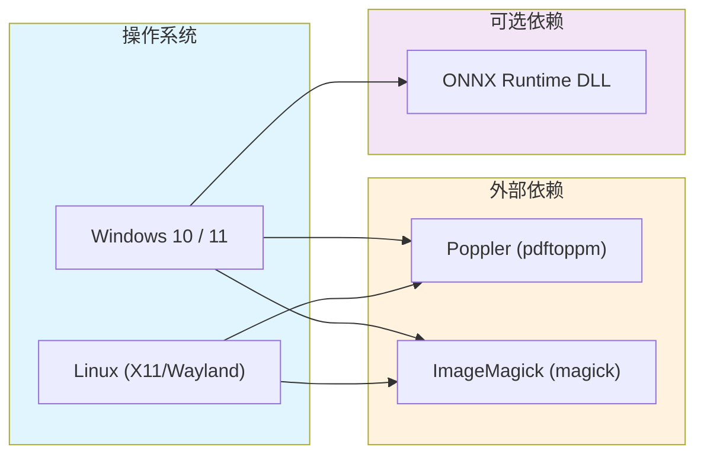
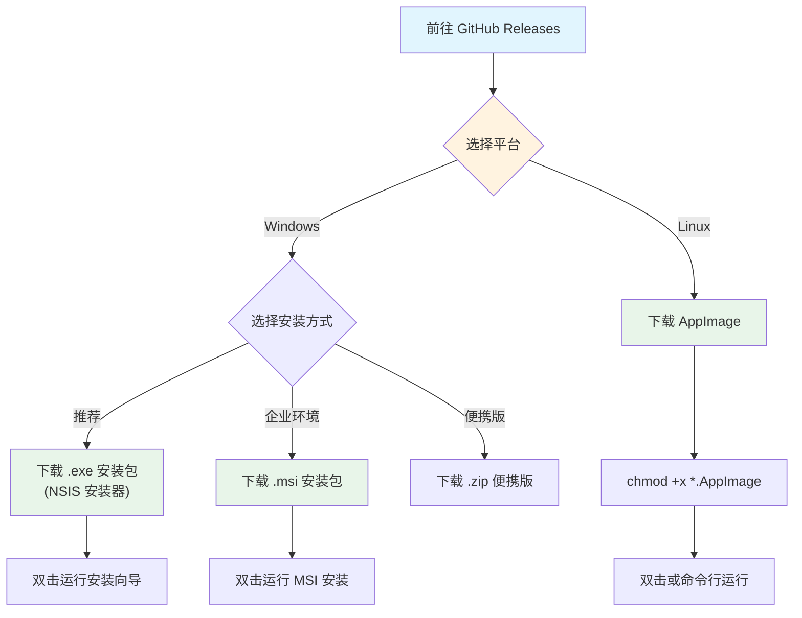
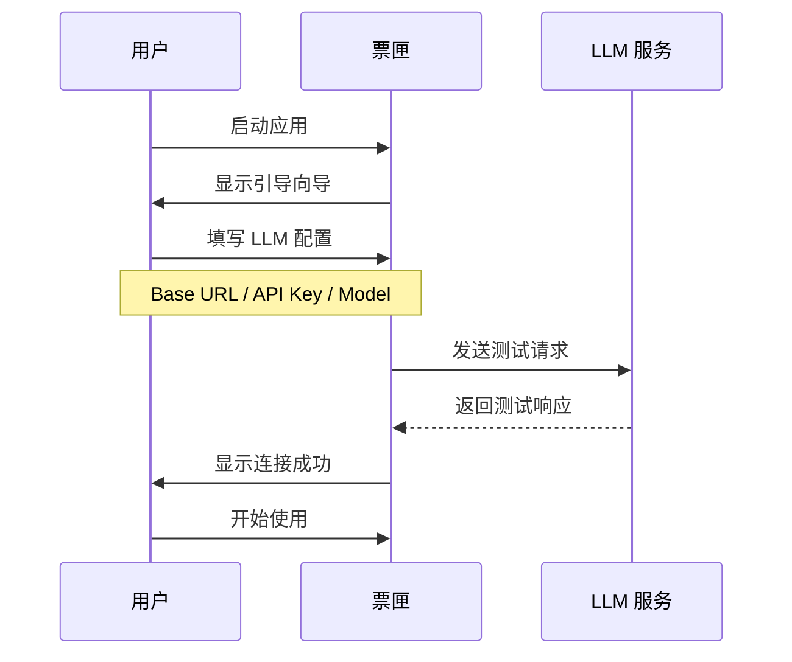

# 安装指南

本章将引导你完成 InvoiceVault（票匣）的安装和首次启动配置。

## 系统要求



### 操作系统

| 操作系统 | 最低版本 | 说明 |
|---------|---------|------|
| Windows | 10 (1809+) | 推荐 Windows 11，使用 WebView2 渲染 |
| Linux | 任意现代发行版 | 使用 WebKitGTK 渲染，需 X11 或 Wayland |

### 外部依赖

票匣需要两个外部命令行工具来处理 PDF 和图片：

| 依赖 | 用途 | 对应命令 |
|------|------|---------|
| **Poppler** | 将 PDF 文件渲染为图片 | `pdftoppm` |
| **ImageMagick** | 图片格式标准化与缩放 | `magick` |

:::warning 重要
这两个依赖是**必需**的。没有它们，PDF 发票将无法识别，图片处理也会失败。
:::

## 安装外部依赖

### Windows

在 Windows 上，票匣的安装包**已内置** Poppler 和 ImageMagick 的预编译二进制文件，存放在应用资源目录的 `win-x86_64/` 子目录中。应用启动时会自动配置 `PATH` 环境变量，因此**通常不需要手动安装**。

如果你使用的是便携版（非 NSIS/MSI 安装包），或者内置版本有问题，可以手动安装：

1. **Poppler for Windows**
   - 从 [oschwartz10612/poppler-windows](https://github.com/oschwartz10612/poppler-windows/releases) 下载最新版
   - 解压到任意目录（如 `C:\poppler`）
   - 将 `C:\poppler\Library\bin` 添加到系统 `PATH`

2. **ImageMagick**
   - 从 [ImageMagick 官网](https://imagemagick.org/script/download.php#windows) 下载 Windows 版安装包
   - 安装时勾选 "Add application directory to your system path"
   - 安装完成后打开命令行验证：
     ```powershell
     magick --version
     ```

### Linux

在 Linux 上，使用系统包管理器安装：

**Ubuntu / Debian：**

```bash
sudo apt update
sudo apt install poppler-utils imagemagick
```

**Fedora：**

```bash
sudo dnf install poppler-utils ImageMagick
```

**Arch Linux：**

```bash
sudo pacman -S poppler imagemagick
```

安装完成后验证：

```bash
pdftoppm -v
magick --version
```

## 下载安装

### 从 GitHub Releases 下载

前往 [GitHub Releases 页面](https://github.com/XUranus/InvoiceVault/releases) 下载最新版本。



### Windows 安装

#### 方式一：NSIS 安装器（推荐）

下载 `.exe` 安装包（如 `InvoiceVault_0.1.0_x64-setup.exe`），双击运行：

1. 阅读并同意许可协议
2. 选择安装目录（默认 `C:\Program Files\InvoiceVault`）
3. 点击"安装"完成安装
4. 安装完成后，桌面和开始菜单会出现"票匣"快捷方式

NSIS 安装器会自动：
- 安装应用主程序
- 创建桌面和开始菜单快捷方式
- 内置 Poppler 和 ImageMagick 依赖
- 配置 ONNX Runtime DLL 路径

#### 方式二：MSI 安装包

下载 `.msi` 安装包，双击运行标准 MSI 安装向导。适合企业环境通过组策略批量部署。

#### 方式三：便携版

下载 `.zip` 便携版，解压到任意目录即可运行，无需安装。

### Linux 安装

下载 `.AppImage` 文件后：

```bash
# 添加可执行权限
chmod +x InvoiceVault_*.AppImage

# 直接运行
./InvoiceVault_*.AppImage
```

:::tip AppImage 集成
推荐使用 [AppImageLauncher](https://github.com/TheAssassin/AppImageLauncher) 来管理 AppImage 文件，它会自动将 AppImage 集成到系统应用菜单中。
:::

## 首次启动配置

首次启动票匣后，会弹出**引导向导（Onboarding Dialog）**，引导你完成基本配置。

### 配置 LLM 服务

这是最关键的一步。票匣需要一个 OpenAI 兼容的 LLM API 来进行发票识别和 Agent 对话。



在**设置 > AI 提供商**页面中填写以下信息：

| 配置项 | 说明 | 示例 |
|--------|------|------|
| **Base URL** | LLM API 的基础地址 | `https://api.openai.com/v1` |
| **API Key** | 认证密钥 | `sk-...` |
| **Model** | 模型名称 | `gpt-4o` |

常见的 LLM 提供商配置：

| 提供商 | Base URL | 推荐模型 |
|--------|----------|---------|
| OpenAI | `https://api.openai.com/v1` | `gpt-4o`, `gpt-4o-mini` |
| DeepSeek | `https://api.deepseek.com/v1` | `deepseek-chat` |
| 通义千问 | `https://dashscope.aliyuncs.com/compatible-mode/v1` | `qwen-vl-max` |
| 本地 Ollama | `http://localhost:11434/v1` | `llava`, `qwen2.5-vl` |

填写完成后点击**测试连接**，确认服务可用后即可开始使用。

### 配置本地 Embedding（可选）

如果需要使用**语义搜索**功能，可以在设置中启用本地 Embedding：

1. 进入 **设置 > AI 提供商**
2. 开启"本地 Embedding"开关
3. 首次启用时会自动下载 `bge-small-zh-v1.5` 模型（约 50MB）
4. 下载完成后即可使用语义搜索

:::note
本地 Embedding 使用 ONNX Runtime 进行推理，模型文件存储在 `models/bge-small-zh-v1.5/` 目录下。如果网络不佳，模型下载可能需要几分钟。
:::

## 常见安装问题

### Windows

**问题：应用启动后白屏或闪退**

可能原因：WebView2 运行时未安装。

解决方案：Windows 10 1809+ 通常已内置 WebView2。如果缺失，从 [Microsoft WebView2](https://developer.microsoft.com/en-us/microsoft-edge/webview2/) 下载安装。

**问题：PDF 识别报错 "pdftoppm was not found"**

可能原因：内置的 Poppler 未正确加载。

解决方案：
1. 确认应用安装目录下存在 `win-x86_64/poppler/` 目录
2. 如果不存在，手动安装 Poppler 并添加到 PATH
3. 在命令行运行 `pdftoppm -v` 验证

**问题：DPI 缩放显示异常**

票匣已内置高 DPI 缩放适配。如果在高分辨率屏幕上显示异常，可以尝试：
1. 右键点击应用快捷方式 > 属性 > 兼容性
2. 点击"更改高 DPI 设置"
3. 勾选"替代高 DPI 缩放行为"

### Linux

**问题：AppImage 无法启动**

可能原因：缺少 WebKitGTK 依赖。

解决方案：
```bash
# Ubuntu / Debian
sudo apt install libwebkit2gtk-4.1-0 libgtk-3-0

# Fedora
sudo dnf install webkit2gtk4.1 gtk3

# Arch Linux
sudo pacman -S webkit2gtk-4.1 gtk3
```

**问题：应用界面冻结无响应**

可能原因：WebKitGTK 的合成线程与某些 GPU 驱动不兼容（常见于 aarch64 + Mesa 驱动）。

票匣已内置 workaround（设置 `WEBKIT_DISABLE_COMPOSITING_MODE=1`），如果仍然冻结，可尝试：
```bash
WEBKIT_DISABLE_DMABUF_RENDERER=1 ./InvoiceVault_*.AppImage
```

## 下一步

安装完成后，前往[快速上手](./quick-start.mdx)开始使用票匣。
