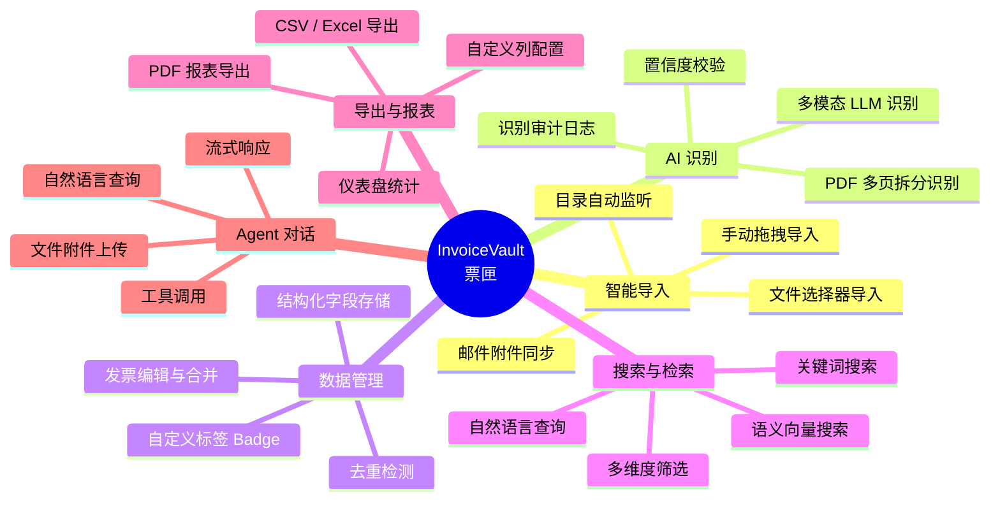
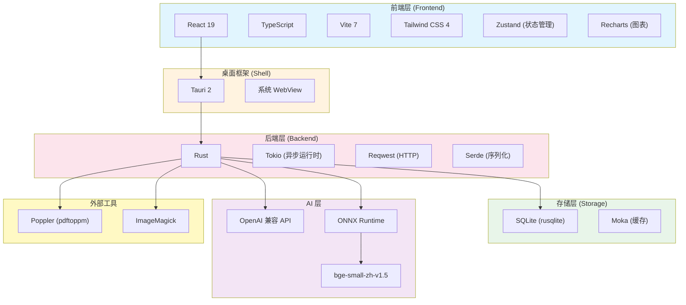

# 什么是 InvoiceVault（票匣）

**InvoiceVault（票匣）** 是一个**本地优先**的跨平台桌面端发票处理 Agent。它将 PDF/图片发票导入本地归档，通过多模态 AI 模型识别为结构化数据，支持去重、语义检索、统计分析、批量导出和自然语言对话。

所有数据存储在本地 SQLite 数据库中，发票原件按年月目录归档，**无需联网即可使用基本的浏览和搜索功能**。AI 识别、语义搜索和 Agent 对话则通过对接 OpenAI 兼容 API 完成。



## 核心功能

### 智能导入

票匣支持多种发票导入方式：

- **手动导入**：通过文件选择器或拖拽文件到窗口，支持 PDF、PNG、JPG、JPEG 格式
- **目录监听**：配置监听目录后，新文件自动导入并触发识别
- **邮件同步**：配置 IMAP/POP3 邮件源，自动下载并导入发票附件

导入时自动计算文件 SHA256 哈希值，按年月目录结构归档原件，避免重复存储。

### AI 识别

票匣调用多模态大语言模型（VLM）对发票图片进行结构化识别：

- 支持任意 OpenAI 兼容 API（如 OpenAI、DeepSeek、通义千问等）
- PDF 文件自动拆页渲染为图片后逐页识别
- 识别结果包括：发票类型、发票号码、开票日期、销售方/购买方、金额、明细行等
- 内置置信度校验机制，低置信度结果会被拒绝并提示重试
- 可选 SCNet OCR 交叉验证

### 去重检测

双重去重策略保障数据唯一性：

1. **字段级精确匹配**：基于发票代码 + 发票号码组合判断
2. **语义相似度检测**：基于加权字段（号码、金额、日期、销售方）的模糊匹配

发现重复时用户可以确认保留、忽略或合并。

### 语义搜索

基于向量嵌入的语义搜索，让您可以使用自然语言描述来查找发票：

- 本地 ONNX Runtime 推理，无需联网
- 使用 `bge-small-zh-v1.5` 模型生成 384 维向量
- 向量存储在 SQLite 中，支持余弦相似度查询

### Agent 对话

内置智能 Agent，可通过自然语言与发票数据交互：

- 多轮对话，自动调用工具完成查询、统计、导出等操作
- 支持上传 xlsx/csv 附件，Agent 可读取并分析内容
- 流式响应，实时展示思考和工具调用过程
- 安全确认机制：写操作需要用户确认后才执行

### 导出与统计

- **CSV / Excel 导出**：灵活的列配置，支持批量导出
- **PDF 报表**：生成格式化的 PDF 发票报表
- **仪表盘统计**：月度趋势、类型分布、供应商排名、金额分布等可视化图表

## 技术栈



| 层级 | 技术选型 | 说明 |
|------|---------|------|
| 桌面框架 | **Tauri 2** | 跨平台桌面应用框架，使用系统 WebView |
| 后端语言 | **Rust** | 高性能、内存安全的系统语言 |
| 前端框架 | **React 19 + TypeScript** | 现代前端 UI 开发 |
| 构建工具 | **Vite 7** | 极速 HMR 开发体验 |
| 样式方案 | **Tailwind CSS 4** | 原子化 CSS 框架 |
| 状态管理 | **Zustand** | 轻量级 React 状态管理 |
| 数据库 | **SQLite (rusqlite)** | 本地嵌入式数据库 |
| 向量存储 | **SQLite + 余弦相似度** | 发票 Embedding 向量存储 |
| AI 推理 | **ONNX Runtime** | 本地 Embedding 模型推理 |
| Embedding 模型 | **bge-small-zh-v1.5** | 中文语义向量模型，384 维 |
| HTTP 客户端 | **Reqwest** | 调用 OpenAI 兼容 API |
| 缓存 | **Moka** | 高性能 TTL 缓存 |
| 日志 | **tracing** | 结构化日志框架 |
| PDF 渲染 | **Poppler (pdftoppm)** | PDF 转图片的外部工具 |
| 图片处理 | **ImageMagick + image crate** | 图片标准化与缩放 |

## 适用人群

票匣适合以下用户：

- **财务人员**：需要管理大量发票，希望通过 AI 自动识别和结构化存储
- **小微企业**：需要简单的发票管理系统，不想依赖云端服务
- **开发者**：对 Tauri + Rust + React 技术栈感兴趣，希望学习桌面应用开发
- **AI 爱好者**：希望了解多模态 LLM、Agent 工具调用、向量搜索等技术的实际应用

## 数据存储位置

票匣的所有数据存储在本地：

| 平台 | 数据目录路径 |
|------|-------------|
| Windows | `%APPDATA%/com.invoicevault.desktop/` |
| Linux | `~/.local/share/com.invoicevault.desktop/` |

数据目录结构：

```
com.invoicevault.desktop/
├── invoicevault.sqlite3      # 主数据库
├── llm_config.json           # LLM 配置
├── badge_config.json         # 标签配置
├── price_config.json         # 价格配置
├── embedding_enabled.json    # Embedding 开关
├── audit_config.json         # 审计配置
├── log_config.json           # 日志级别配置
├── window_state.json         # 窗口大小
├── raw/                      # 原始文件归档（按年月）
│   ├── 2026/01/
│   └── 2026/06/
├── thumbnails/               # 缩略图与预处理图片
│   ├── previews/
│   ├── normalized/
│   └── pdf-pages/
├── models/                   # Embedding 模型文件
├── logs/                     # 运行日志
├── llm_audit/                # LLM 请求审计记录
├── agent_uploads/            # Agent 附件上传
└── sessions/                 # Agent 会话临时文件
```

## 下一步

- [安装指南](./installation.mdx) - 下载并安装票匣
- [快速上手](./quick-start.mdx) - 5 分钟快速体验
- [配置说明](./configuration.mdx) - 详细配置参考
