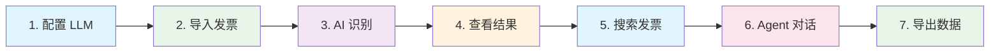
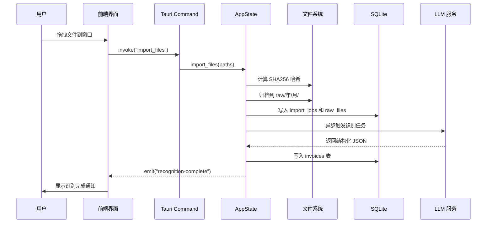
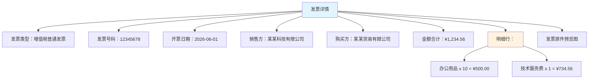
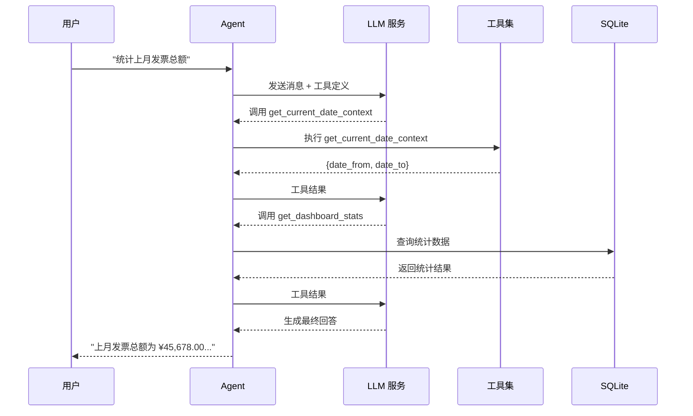
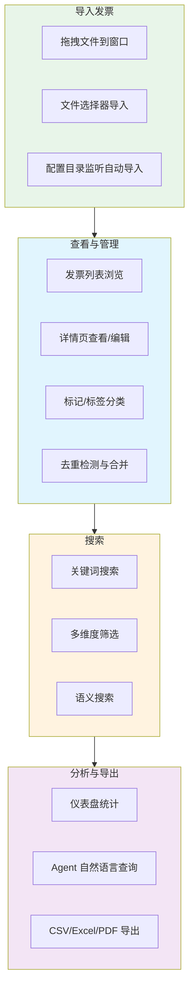

# 快速上手

本教程将带你完成票匣的核心工作流程：从导入第一张发票到导出数据。整个过程约 5 分钟。

## 整体流程

## 第 1 步：配置 LLM 服务

在使用票匣之前，必须先配置一个 LLM（大语言模型）服务，用于发票识别和 Agent 对话。

1. 启动票匣，如果首次运行会自动弹出引导向导
2. 点击左侧导航栏的 **设置**（齿轮图标）
3. 进入 **AI 提供商** 页面
4. 填写以下信息：

| 字段 | 说明 | 示例值 |
|------|------|--------|
| Base URL | API 服务地址 | `https://api.deepseek.com/v1` |
| API Key | 认证密钥 | `sk-your-api-key-here` |
| Model | 模型名称 | `deepseek-chat` |

5. 点击 **测试连接** 按钮，确认显示"连接成功"
6. 点击 **保存**

:::tip 推荐
对于入门体验，推荐使用 DeepSeek API，价格低廉且识别效果好。如果希望完全离线，可以使用 Ollama 搭配本地模型。
:::

## 第 2 步：导入第一张发票

票匣支持两种导入方式：

### 方式一：拖拽导入

1. 在操作系统文件管理器中找到你的发票文件（PDF、PNG 或 JPG）
2. 将文件直接拖拽到票匣窗口中
3. 松开鼠标，文件开始导入

### 方式二：文件选择器导入

1. 点击左侧导航栏的 **导入** 页面
2. 点击 **选择文件** 按钮
3. 在弹出的文件选择器中选择一个或多个发票文件
4. 点击确认，文件开始导入

导入过程中，你会在导入页面看到每条导入任务的状态：
- **imported**：文件已成功导入，等待识别
- **recognizing**：正在进行 AI 识别
- **failed**：导入或识别失败
- **duplicate**：文件重复（SHA256 相同）

## 第 3 步：查看识别结果

文件导入成功后，票匣会自动调用 LLM 进行发票识别。识别完成后：

1. 点击左侧导航栏的 **发票** 页面
2. 你会看到刚导入的发票出现在列表中
3. 点击发票卡片，进入详情页
4. 在详情页中查看识别出的结构化数据：

5. 如果识别结果有误，可以直接在详情页编辑修正
6. 确认无误后，点击"标记为已查看"

## 第 4 步：搜索发票

票匣提供强大的搜索功能：

### 关键词搜索

1. 点击左侧导航栏的 **发票** 页面
2. 在顶部搜索栏中输入关键词（如公司名称、发票号码）
3. 按 Enter 键搜索
4. 结果会实时更新

### 高级筛选

在发票列表页面，你可以使用多个筛选条件：

| 筛选维度 | 说明 |
|---------|------|
| 发票类型 | 增值税普通发票、增值税专用发票等 |
| 销售方/购买方 | 按公司名称筛选 |
| 日期范围 | 按开票日期筛选 |
| 金额范围 | 按金额区间筛选 |
| 状态 | 待确认、已识别、已审核、已标记 |
| 标签 | 自定义标签筛选 |

### 语义搜索（需启用 Embedding）

如果你在设置中启用了本地 Embedding，还可以使用语义搜索：

1. 在搜索栏中输入自然语言描述，如"上个月买电脑的发票"
2. 切换到"语义搜索"模式
3. 票匣会基于向量相似度返回最相关的发票

## 第 5 步：使用 Agent 对话

Agent 是票匣最强大的功能之一，让你可以用自然语言与发票数据交互。

1. 点击左侧导航栏的 **Agent** 页面
2. 点击 **新建对话** 创建一个新会话
3. 在输入框中输入你的问题，例如：

:::info 示例对话
- "帮我查一下上个月所有的差旅发票"
- "统计一下今年每个季度的发票总额"
- "找出金额超过 5000 元的发票并导出为 Excel"
- "对比一下 A 公司和 B 公司的发票金额"
:::

Agent 会自动：
- 理解你的意图
- 调用合适的工具（搜索、统计、导出等）
- 以流式方式返回结果
- 对于写操作（如导出），会先请求你确认

## 第 6 步：导出数据

将发票数据导出为 Excel 或 CSV：

1. 在 **发票** 页面，选中需要导出的发票（或使用筛选条件）
2. 点击顶部的 **导出** 按钮
3. 选择导出格式（CSV 或 Excel）
4. 配置导出列（可选择需要的字段）
5. 选择保存路径
6. 点击确认导出

你也可以通过 Agent 对话来导出：

> "把上个月所有发票导出到 Excel，包含发票号码、日期、金额和销售方"

## 常用操作速查

| 操作 | 快捷方式 |
|------|---------|
| 导入文件 | 拖拽文件到任意页面 |
| 搜索发票 | 在发票页面顶部搜索栏输入 |
| 新建 Agent 对话 | Agent 页面点击"新建对话" |
| 打开设置 | 左侧导航栏齿轮图标 |
| 导出数据 | 发票页面顶部"导出"按钮 |

## 下一步

- [配置说明](./configuration.mdx) - 了解所有可配置项
- [架构概览](../architecture/overview.mdx) - 了解票匣的技术架构
- [Agent 模块](../agent/overview.mdx) - 深入了解 Agent 功能
