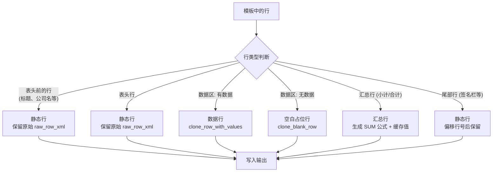
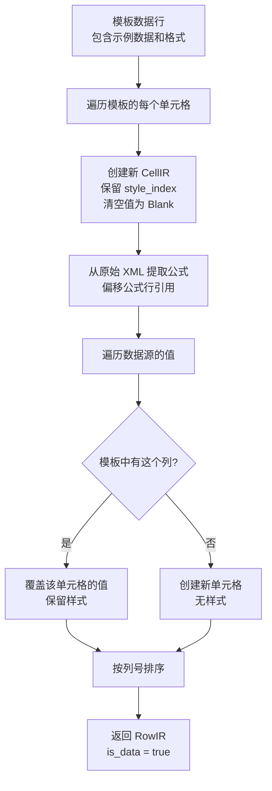
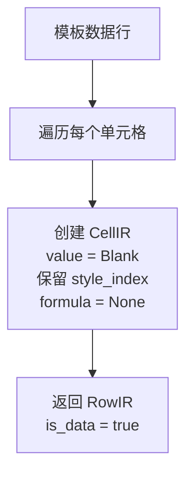
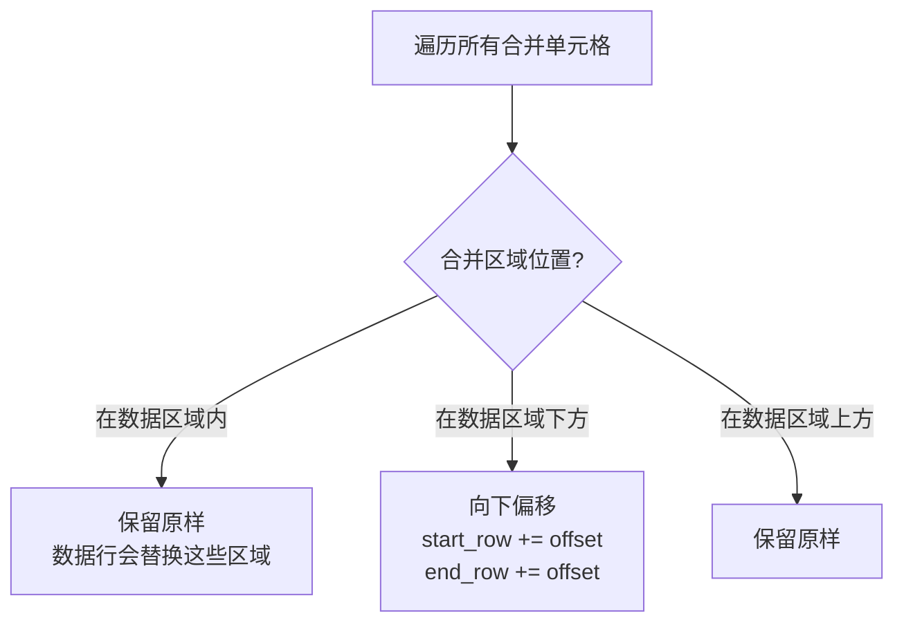
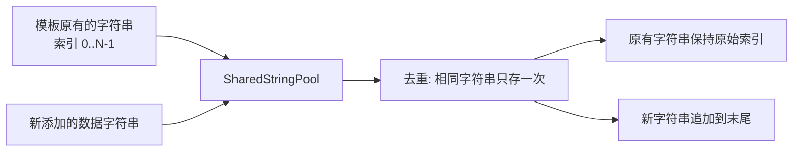
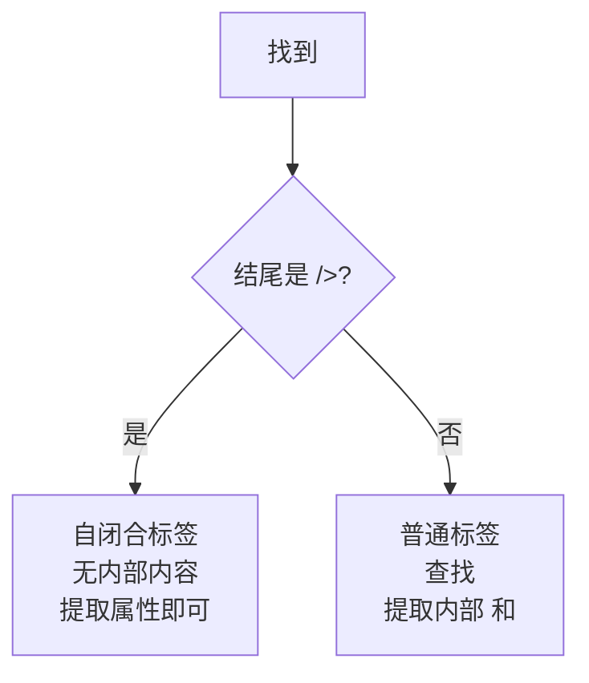
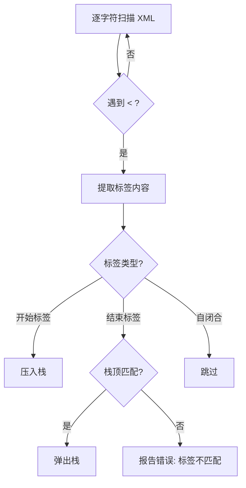

# 格式保持机制

## 概述

模板引擎最核心的设计目标是**格式零损失**。用户精心制作的 Excel 模板包含大量格式信息（字体、颜色、边框、合并单元格、行高、列宽、公式等），这些信息在导出过程中必须完整保留。

## 行处理策略总览



## 静态行的保留

### 什么是静态行

静态行是不需要填充数据的行，包括：
- 标题行（如"XX公司发票登记表"）
- 表头行（如"开具时间 | 发票代码 | 发票号码 | ..."）
- 签名栏（如"项目负责人 | 移交人 | 接收人 | 日期"）
- 页脚信息

### 保留方式

静态行使用**原始 XML 保留**策略。`build_static_row` 函数将行的所有信息封装到 `RowIR` 中：

```rust
RowIR {
    row_num: row.row_num,
    cells: vec![
        CellIR {
            value: CellValue::Preserve(cell_ast),  // 保留原始 CellAst
            style_index: cell.style_index,
            // ...
        }
    ],
    raw_row_xml: Some(raw_xml),  // 完整的原始行 XML
    is_data: false,
}
```

写入时，如果行号没有偏移，`render_row_xml` 直接返回 `raw_row_xml`，实现**字节级保留**：

```rust
// 行号未变化时，直接返回原始 XML
if original_num == row.row_num {
    return raw.clone();  // 字节级完全一致
}
```

### 行号偏移时的处理

当数据行数与模板容量不一致时，汇总行和尾部行需要偏移。此时不能直接使用原始 XML（因为行号不匹配），而是：

1. 从原始 XML 提取行头（`<row r="N" spans="..." ht="...">`）
2. 替换行号为新的行号
3. 逐个渲染单元格，更新单元格引用（如 `A26` → `A28`）
4. 如果单元格包含公式，偏移公式中的行引用

## 数据行的克隆

### clone_row_with_values

这是最核心的函数。它以模板数据行为基准，生成一行新的数据行：



关键设计：
- **样式继承**：每个单元格的 `style_index` 从模板行复制，确保字体、边框、对齐等格式一致
- **公式保留**：如果模板单元格包含公式（如引用其他单元格），公式会被保留并偏移行号
- **值替换**：数据源的值覆盖模板中的示例数据，但样式保持不变

### clone_blank_row

当数据行数少于模板容量时，多余的行以空白占位行填充：



空白占位行的特点：
- **保留所有样式**：字体、边框、背景色等全部保留
- **清空所有值**：不显示任何数据，也不显示模板中的示例数据
- **清空所有公式**：防止公式引用错误的数据

这样做的好处是，导出的文件和模板在视觉上"看起来一样"——数据区域的格式保持一致，只是没有数据。

## 合并单元格处理

### 问题

合并单元格引用了具体的行号范围（如 `A26:C26`）。当数据行数变化导致行号偏移时，合并单元格的引用也需要更新。

### 解决方案

`shift_merges` 函数根据偏移量调整合并单元格的引用：



写入时，`render_sheet_xml` 重新生成完整的 `<mergeCells>` 区域：

```xml
<mergeCells count="9">
  <mergeCell ref="A1:C1"/>
  <mergeCell ref="D26:F26"/>   <!-- 偏移后的合并区域 -->
  ...
</mergeCells>
```

## 汇总公式生成

### 自动检测数值列

引擎分析数据源，自动识别哪些列是数值类型：

```rust
fn is_numeric_column(&self, col_key: &str) -> bool {
    (0..self.row_count()).any(|row_index| {
        matches!(self.cell_value(row_index, col_key), Some(DataValue::Number(_)))
    })
}
```

### SUM 公式生成

对于汇总行中的数值列，引擎生成 `SUM` 公式：

```
SUM(H5:H25)    -- H 列，从第 5 行到第 25 行
```

公式中的范围根据实际数据区域计算：
- 起始行 = 数据区域的起始行
- 结束行 = 数据区域的起始行 + 数据行数 - 1

### 缓存值

除了公式，引擎还会写入**缓存值**（即实际计算出的合计）。这样在不支持公式的查看器（如某些手机 App）中也能正确显示数值：

```xml
<c r="H26" s="5">
  <f>SUM(H5:H7)</f>
  <v>3955</v>           <!-- 缓存值 -->
</c>
```

## 共享字符串管理

### 问题

Excel 使用共享字符串表来存储文本。当引擎添加新的文本值（如发票的销售方名称）时，需要将其添加到共享字符串表中，并在单元格中引用新的索引。

### SharedStringPool

`SharedStringPool` 实现了智能的字符串管理：



关键特性：
- **索引稳定性**：原有字符串的索引不变，保证模板中的文本引用不被破坏
- **去重**：`get_or_insert` 方法先查找已有字符串，找到则返回已有索引
- **扩展检测**：`is_extended()` 方法判断是否需要重新生成 `sharedStrings.xml`

### XML 转义

写入共享字符串时，特殊字符会被转义：

| 字符 | 转义后 |
|------|--------|
| `&` | `&amp;` |
| `<` | `&lt;` |
| `>` | `&gt;` |
| `"` | `&quot;` |

生成的 XML 带有 `xml:space="preserve"` 属性，确保首尾空格不被 Excel 剥离：

```xml
<si><t xml:space="preserve">测试供应商 A</t></si>
```

## 自闭合标签处理

### 空单元格的 XML 表示

没有值的单元格使用自闭合标签，只保留样式信息：

```xml
<c r="A5" s="3"/>
```

这与有值的单元格形成对比：

```xml
<c r="A5" s="3"><v>123.45</v></c>
```

### 解析器的处理

解析器在解析单元格时，需要区分自闭合标签和普通标签：



写入器在渲染 `Blank` 类型的单元格时，也使用自闭合标签格式，确保生成的 XML 简洁且符合 Excel 规范。

## 行头属性保留

模板中每行的 `<row>` 标签可能包含丰富的属性：

```xml
<row r="26" customFormat="false" ht="21.75" spans="1:12">
```

| 属性 | 说明 |
|------|------|
| `r` | 行号 |
| `customFormat` | 是否自定义格式 |
| `ht` | 行高 |
| `spans` | 列跨度 |

引擎在克隆数据行时，使用 `template_row_header` 保留这些属性，只替换行号：

```xml
<row r="5" customFormat="false" ht="21.75" spans="1:12">
```

这确保了数据行的行高、跨度等属性与模板一致。

## XLSX 验证

导出完成后，Agent 会调用 `validate_xlsx` 验证输出文件的 XML 结构是否合法。验证器检查：

1. **标签嵌套**：开始标签和结束标签是否匹配
2. **多余结束标签**：是否有未匹配的 `</tag>`
3. **未闭合标签**：是否有未关闭的 `<tag>`

验证基于简单的字符串扫描，逐字符追踪标签栈：


