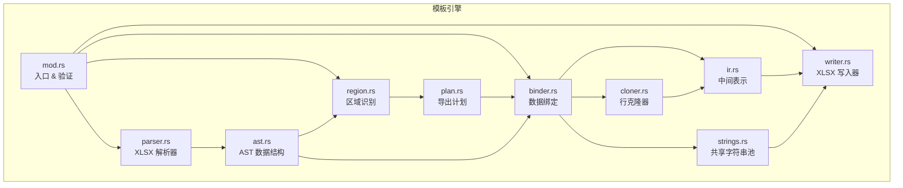
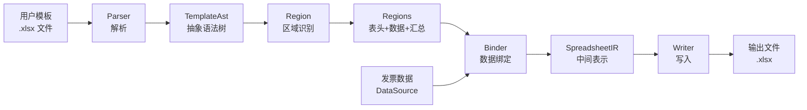

# 模板引擎概览

## 什么是模板引擎

InvoiceVault 的模板引擎是一个**将发票数据填充到用户提供的 Excel 模板中**的系统。用户只需提供一个已格式化的 Excel 表格（如公司内部的发票登记表），引擎就能自动识别表头列、匹配数据字段、将发票数据填入对应位置，同时**完整保留模板的所有格式和样式**。

### 使用场景

假设财务部门有一个固定的"普票移交登记表"模板，表头包含"开具时间"、"发票代码"、"发票号码"、"价税合计"等列，并且已经有了格式设置（边框、字体、合并单元格、SUM 公式等）。用户只需：

1. 上传这个 Excel 模板到 Agent 对话中
2. 告诉 Agent "按这个模板导出本月的发票"
3. Agent 调用模板引擎，自动生成填充好数据的 Excel 文件

生成的文件**看起来和原始模板一模一样**，只是数据区域被发票数据替换。

## 核心特性

### 保留模板格式

这是模板引擎最重要的特性。引擎不会创建一个新的 Excel 文件，而是：

1. **复制模板文件**到输出路径
2. **解析**模板的 XML 结构
3. **只修改数据区域**的内容
4. **其他所有部分原样保留**

这意味着：
- 字体、颜色、边框、对齐方式全部保留
- 合并单元格保持不变
- 页眉、页脚、签名栏保持原位
- 列宽、行高保持不变
- SUM 公式自动调整范围

### 智能区域识别

引擎使用**启发式算法**自动识别模板中的三个区域：

| 区域 | 说明 | 识别方式 |
|------|------|----------|
| **表头区域** | 包含列标题的行 | 匹配已知的发票字段名称 |
| **数据区域** | 填充数据的行范围 | 表头下方到汇总行之间的区域 |
| **汇总区域** | 小计、合计等行 | 包含"小计"、"合计"等关键词的行 |

### 序列号自动填充

如果模板数据区域的第一列是序号（值为 `1`），引擎会自动为每一行生成递增的序列号（1, 2, 3, ...）。

## 模块结构

模板引擎由 10 个源文件组成，各司其职：



### 文件职责

| 文件 | 职责 | 关键类型/函数 |
|------|------|--------------|
| `mod.rs` | 模块入口，编排完整流水线，XLSX 验证 | `TemplateEngine::export`, `validate_xlsx` |
| `ast.rs` | 定义解析后的模板抽象语法树 | `TemplateAst`, `SheetAst`, `RowAst`, `CellAst` |
| `parser.rs` | 将 XLSX ZIP 文件解析为 AST | `parse_xlsx`, `parse_shared_strings` |
| `region.rs` | 识别模板中的表头、数据、汇总区域 | `recognize_regions`, `Region`, `RegionKind` |
| `plan.rs` | 定义和验证导出计划（字段映射） | `TemplatePlan`, `validate_plan` |
| `ir.rs` | 定义数据绑定后的中间表示 | `SpreadsheetIR`, `SheetIR`, `RowIR`, `CellIR` |
| `binder.rs` | 将数据源绑定到模板，生成 IR | `bind`, `DataSource` trait |
| `cloner.rs` | 克隆模板行样式，生成新数据行 | `clone_row_with_values`, `clone_blank_row` |
| `strings.rs` | 管理共享字符串池（去重） | `SharedStringPool` |
| `writer.rs` | 将 IR 写回 XLSX ZIP 文件 | `write_xlsx`, `render_sheet_xml` |

## 数据流



## XLSX 文件结构简介

要理解模板引擎的工作原理，需要先了解 XLSX 文件的基本结构。XLSX 文件本质上是一个 **ZIP 压缩包**，里面包含多个 XML 文件：

```
template.xlsx (ZIP)
├── [Content_Types].xml      # 内容类型定义
├── _rels/.rels              # 关系文件
├── xl/
│   ├── workbook.xml         # 工作簿定义（工作表列表）
│   ├── _rels/
│   │   └── workbook.xml.rels  # 工作表文件映射
│   ├── sharedStrings.xml    # 共享字符串表
│   ├── styles.xml           # 样式定义
│   ├── theme/               # 主题文件
│   └── worksheets/
│       ├── sheet1.xml       # 第一个工作表
│       └── sheet2.xml       # 第二个工作表
└── docProps/                # 文档属性
```

模板引擎主要操作 `xl/worksheets/sheet*.xml`（工作表数据）和 `xl/sharedStrings.xml`（共享字符串），其他文件（样式、主题等）保持原样不动。

### 工作表 XML 结构

一个典型的工作表 XML 结构如下：

```xml
<worksheet>
  <dimension ref="A1:L30"/>
  <sheetData>
    <row r="1" spans="1:12" ht="30">
      <c r="A1" t="s"><v>0</v></c>       <!-- 共享字符串索引 0 -->
      <c r="B1"><v>123.45</v></c>          <!-- 数值 -->
    </row>
    <row r="2">
      <c r="A2" s="1"><v>1</v></c>         <!-- 带样式索引 -->
    </row>
  </sheetData>
  <mergeCells count="1">
    <mergeCell ref="A1:C1"/>               <!-- 合并单元格 -->
  </mergeCells>
</worksheet>
```

模板引擎会精确操作这些 XML 结构，在保留格式的同时替换数据内容。

## 使用方式

### Agent 模板导出

```
用户：用这个模板导出上个月的发票
Agent：[调用 generate_template_plan] → [调用 export_invoices_with_template]
```

### 手动导出

在发票列表中选择发票 → 导出 → 选择模板文件
