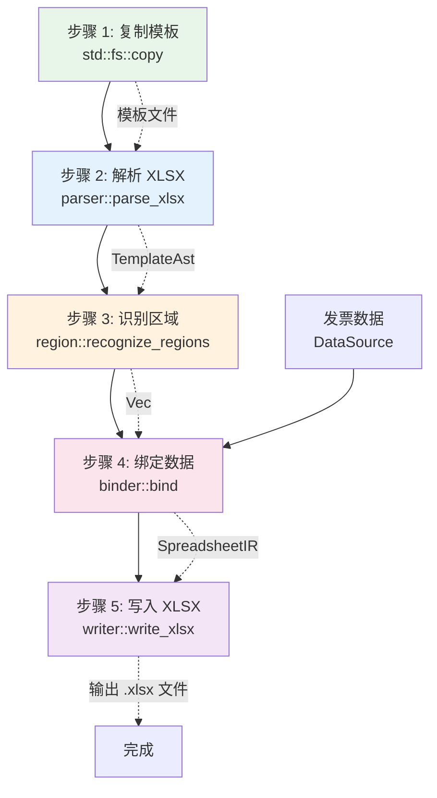
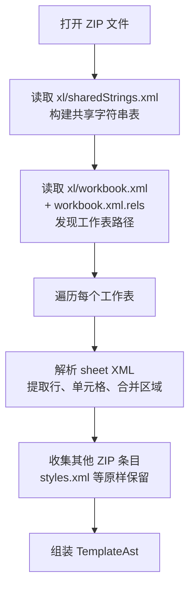
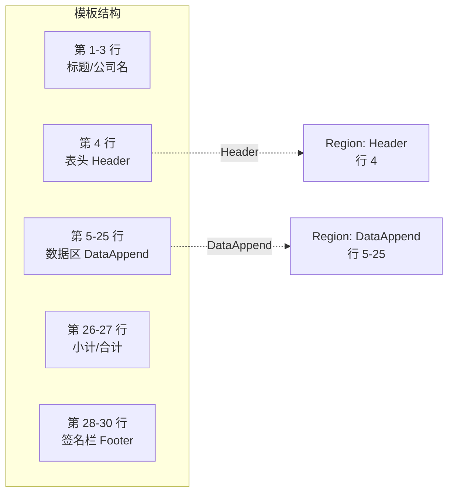
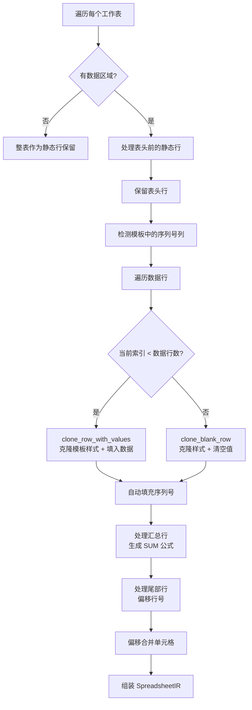
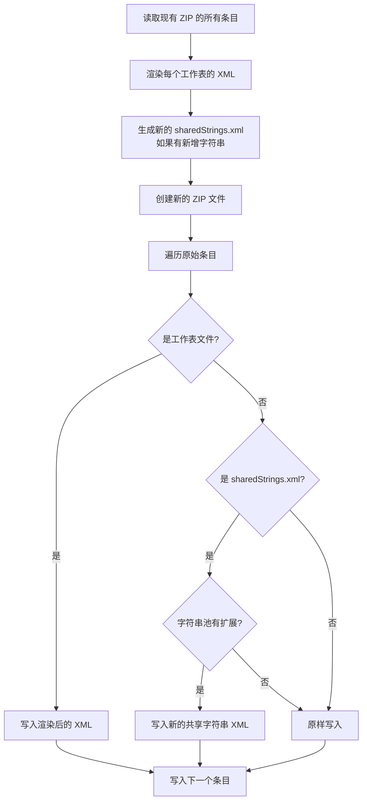

# 导出流水线

模板引擎的核心是一个**五步流水线**，从读取模板文件到输出最终的 Excel 文件。每一步都有明确的输入和输出，形成一条清晰的数据处理链。

## 流水线总览



## 步骤 1：复制模板

**入口**：`TemplateEngine::export` 函数的第一行

```rust
std::fs::copy(template_path, output_path)?;
```

### 原理

模板文件被**逐字节复制**到输出路径。后续所有操作都在副本上进行，原始模板永远不会被修改。

### 为什么先复制

- **安全性**：用户可能反复使用同一个模板导出不同数据
- **原子性**：如果后续步骤失败，原始模板不受影响
- **效率**：避免在内存中维护完整的 ZIP 文件内容

## 步骤 2：解析 XLSX

**入口**：`parser::parse_xlsx(output_path)`

**输出**：`TemplateAst` — 模板的抽象语法树

### 解析过程

XLSX 文件是一个 ZIP 压缩包。解析器按以下顺序读取：



### 共享字符串表 (Shared Strings)

Excel 中的文本内容通常不直接存储在单元格里，而是存储在一个共享字符串表中，单元格只保存索引号。例如：

```xml
<!-- xl/sharedStrings.xml -->
<sst>
  <si><t>开具时间</t></si>    <!-- 索引 0 -->
  <si><t>发票代码</t></si>    <!-- 索引 1 -->
  <si><t>发票号码</t></si>    <!-- 索引 2 -->
</sst>
```

```xml
<!-- sheet1.xml 中的单元格 -->
<c r="B4" t="s"><v>0</v></c>   <!-- t="s" 表示共享字符串，v=0 即 "开具时间" -->
```

解析器会将这些索引解析为实际的文本值，方便后续的区域识别和数据匹配。

### 行和单元格解析

每个工作表的 `<sheetData>` 包含多个 `<row>` 元素，每个 `<row>` 包含多个 `<c>`（cell）元素。

解析器提取的关键信息：

| 属性 | 说明 | 示例 |
|------|------|------|
| `r` | 单元格引用 | `"B3"` → 列 1, 行 3 |
| `t` | 单元格类型 | `"s"`=共享字符串, `"n"`=数字, 无=默认数字 |
| `s` | 样式索引 | `"1"` → styles.xml 中的第 1 个样式 |
| `<v>` | 值 | 数字或共享字符串索引 |
| `<f>` | 公式 | `SUM(H5:H25)` |

解析器同时保留每个单元格的**原始 XML 片段**（`raw_xml`），用于后续的格式保留。

### 合并单元格解析

合并单元格信息从 `<mergeCells>` 区域解析：

```xml
<mergeCells count="3">
  <mergeCell ref="A1:C1"/>   <!-- 从 A1 到 C1 -->
  <mergeCell ref="D2:D5"/>   <!-- 从 D2 到 D5 -->
</mergeCells>
```

每个合并单元格记录为 `MergeCell { start_row, end_row, start_col, end_col }`。

## 步骤 3：识别区域

**入口**：`region::recognize_regions(&ast, label_matcher)`

**输出**：`Vec<Region>` — 识别出的表头区域和数据区域

### 区域类型



### 表头识别算法

表头识别是整个引擎最关键的部分。算法遍历模板的每一行，用 `label_matcher` 函数评分：

1. 提取行中每个单元格的文本值
2. 将文本列表传给 `label_matcher`
3. `label_matcher` 返回匹配到的 `(列索引, 字段key)` 列表
4. 匹配数最多的行被选为表头行
5. 至少需要匹配 2 列才认为有效

`label_matcher` 由调用方提供（在 `app_core/template_adapter.rs` 中实现），它将中文列名映射为内部字段 key：

| 中文列名 | 字段 key | 数据类型 |
|----------|----------|----------|
| 开具时间 | `issue_date` | 文本 |
| 发票代码 | `invoice_code` | 文本 |
| 发票号码 | `invoice_number` | 文本 |
| 销售方 | `seller_name` | 文本 |
| 价税合计 | `total_amount` | 数字 |
| 金额 | `amount_without_tax` | 数字 |
| 税额 | `tax_amount` | 数字 |

### 汇总行识别

引擎通过检测预定义的关键词来识别汇总行：

```rust
const SUMMARY_MARKERS: &[&str] = &[
    "小 计", "小计", "合 计", "合计", "总计", "总 计", "汇总", "小  计", "合  计",
];
```

注意关键词中可能包含空格（如"小 计"），这是为了匹配 Excel 中常见的带空格格式。

## 步骤 4：绑定数据

**入口**：`binder::bind(&ast, &regions, source)`

**输出**：`SpreadsheetIR` — 数据绑定后的中间表示

### 绑定过程

这是最复杂的一步。绑定器将发票数据填入模板，同时处理各种边界情况：



### 数据行处理

对于每一行数据：

1. **有数据的行**：调用 `clone_row_with_values`
   - 以模板数据行为基准，克隆所有单元格的样式
   - 清空样例数据
   - 从 `DataSource` 获取实际值并填入
   - 如果是序列号列，自动填入递增数字

2. **空占位行**（数据行数 < 模板容量时）：调用 `clone_blank_row`
   - 保留模板行的样式和格式
   - 清空所有值和公式
   - 这样导出的文件和模板"看起来一样"，只是数据区域是空的

### 汇总行处理

汇总行保持在原始位置（行号可能因数据行数变化而偏移）。对于数值列，引擎自动生成 SUM 公式：

```
SUM(H5:H25)    -- 对 H 列第 5 到 25 行求和
```

同时写入缓存值（即实际计算出的合计），这样在不支持公式的查看器中也能正确显示。

### 行号偏移

当数据行数与模板容量不一致时，汇总行和尾部行需要向下偏移：

```
偏移量 = 实际数据行数 - 模板数据容量
```

例如模板有 21 行数据区域，但只有 3 行数据，则偏移量为 -18。汇总行会向上移动 18 行。

## 步骤 5：写入 XLSX

**入口**：`writer::write_xlsx(output_path, &mut ir)`

### 写入过程



### 工作表 XML 渲染

`render_sheet_xml` 函数将 IR 转换回 XML：

1. **更新 dimension**：根据最大行号和列号更新 `<dimension ref="A1:L30"/>`
2. **渲染 `<sheetData>`**：遍历每个 `RowIR`，渲染为 `<row>` XML
3. **渲染合并单元格**：重新生成 `<mergeCells>` 区域
4. **拼接**：`xml_before_sheet_data` + `<sheetData>...</sheetData>` + mergeCells + `xml_after_sheet_data`

### 行和单元格的渲染策略

对于不同的行类型，渲染策略不同：

| 行类型 | 渲染方式 |
|--------|----------|
| 静态行（行号未偏移） | 直接使用原始 `raw_row_xml`（字节级保留） |
| 静态行（行号已偏移） | 从原始 XML 提取行头，更新行号，重建单元格引用 |
| 数据行 | 使用模板行头（保留高度、跨度等属性），逐个渲染单元格 |

对于单元格：

| 单元格类型 | 渲染方式 |
|-----------|----------|
| `Preserve`（静态） | 使用原始 `raw_xml`，必要时更新引用和偏移公式 |
| `String` | 写入共享字符串池获取索引，生成 `<c t="s"><v>索引</v></c>` |
| `Number` | 直接生成 `<c><v>数值</v></c>` |
| `Blank` | 生成 `<c r="..." s="样式"/>`（自闭合标签） |
| 有公式 | 生成 `<c><f>公式</f><v>缓存值</v></c>` |

### 共享字符串管理

`SharedStringPool` 维护模板原有的字符串，并在数据绑定过程中添加新字符串：

- **原有字符串**：保持原始索引不变（保证模板中的文本引用不被破坏）
- **新增字符串**：追加到池末尾，返回新索引
- **去重**：相同字符串只存储一次

只有当字符串池有扩展时，才会重新生成 `sharedStrings.xml`。
